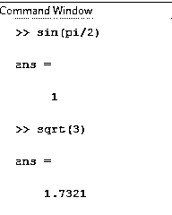
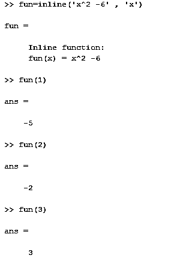
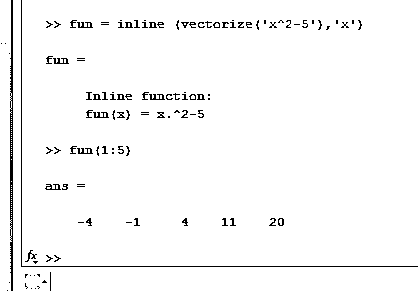

# Matlab 中的内联函数

> 原文：<https://www.educba.com/inline-functions-in-matlab/>

## Matlab 中的内联函数介绍

Matlab 中的内联函数有两类，一类是内置函数，另一类是用户创建的自定义函数。

### 内置功能

Matlab 有很多内置函数平方根，sin，cos，tan，指数，log 等。它还有更复杂和特殊的数学函数，如伽马函数和贝塞尔函数。它还有一些内置常数 pi，I(复数)和无穷大。

<small>Hadoop、数据科学、统计学&其他</small>

**举例:**

`sin ( pi / 2 )`

它给出的输出为 1。

在这个例子中，我们甚至没有提到圆周率的值，圆周率自动取值 3.14。

`sqrt (3)`

它给出输出 1.73。

如果编写程序语句 sqrt ( -1)，它将给出 ans 为 0.00 + i

### 用户定义的函数

这个关键字用来定义我们自己的函数是“inline ”,现在让我们看看如何使用它

假设我想创建一个函数 fun = x ^ 2–6

**Matlab 命令将被**

`Fun = inline ( ‘ x ^ 2 – 6 ’ , ’ x ’ )  . . . . . . . . . . (1)   function declaration and defination
Fun =
inline function :`

乐趣=–6。......(1)的输出

`Fun ( 1 ) (2) giving value x=1`

Ans =

-5....(2)的输出

`Fun ( 2 ) ....(3) giving value x=2`

Ans =

-2 ...(3)的输出

`Fun ( 3 )                  .  . . . . . . . . . . . . . . .  . . . . (2)  giving value x=3`

Ans=

3.......(3)的输出

*   [Matlab 函数](https://www.educba.com/matlab-functions/)对标量和矢量进行操作
*   为了让内联函数获胜，在函数定义中使用了“矢量化”关键字。
*   在上面的例子中，假设我想创建矢量函数“fun ”,那么命令将是

`Fun  = inline ( vectorize ( ‘ x ^ 2  –  5 ’ , ’ x ’ )`

它将创造矢量乐趣。

`Fun ( 1 : 5 )
And evolution will take values of x as  1 , 2 , 3 , 4 and 5`

该程序的输出将是

-4 -1 4 11 和 20

其中，第一个值针对 x = 1，第二个值针对 x = 2，第三个值针对 x = 3，第四个值针对 x = 4，第五个值针对 x = 5。

### 内联函数的语法

它分为三个部分:

**1。函数定义:**在这里，我们写函数串，定义自变量。

`Function name = inline ( ‘ function ’ , ’ independent variable ’ )
Fun = inline ( ‘ x ^ 2 – 5 ’ , ’ x ’ )`

**2。函数演化:**在这里，我们通过给自变量取任意值来评估函数。

`Function name (variable value )
Fun ( 1 )`

**3。矢量化函数:**该函数创建给定函数的向量。

`Function name = inline ( vectorize( ‘ function string ’ ) , ’ independent variable ’ )
Y = inline ( vectorize ( ‘ x ^ 2 – 1 ’ ) , ’ x ’ )`

### 例子

下面的例子如下

#### 示例#1

让我们考虑一个函数

`Z = x3 - 56`

为了在 Matlab 中求解上述方程，我们需要为 z 创建一个内联函数，并需要分配一个独立变量。

**Matlab 代码:**

`>>
z =
Inline function :
Z ( x ) = x . ^ 3 - 56
>> z ( 0 )`

Ans = 4

`>> z ( 1 0 )`

Ans = 996

`>> z ( -1 )`

Ans = 5

#### 实施例 2

`Z = x ^ 3 + 23 x - 9`

**例 2 的 Matlab 代码**

`Z = inline ( vectorize ( ' x .^3 + 23*x – 9 ' ) ,' x ' )
z =
Inline function :
Z ( x ) = x . ^ 3 + 23 * x - 9
>> z ( 1 : 10 )`

Ans =第 1 栏至第 3 栏

15          45          87

第 4 栏至第 6 栏

147         231         345

第 7 栏至第 9 栏

495         687         927

第 10 栏

One thousand two hundred and twenty-one

`>> z ( 1 : 0.5 : 5 )`

Ans =第 1 栏至第 4 栏

15.0000   28.8750   45.0000   64.1250

第 5 栏至第 8 栏

87.0000 114.3750 147.0000  185.6250

第 9 栏

231.0000

### 结论 Matlab 中的内联函数

内联函数是全局的，但它从不占用 Matlab 工作空间的任何空间。它的工作方式类似于匿名函数，但它们不是匿名函数，因为匿名函数在函数创建时会占用空间。通过处理数组和矩阵的系统，内联函数只返回一个值。

### 推荐文章

这是 Matlab 中内联函数的指南。这里我们讨论 Matlab 中的内联函数、语法和例子。您也可以浏览我们的其他相关文章，了解更多信息-

1.  [什么是 Matlab？](https://www.educba.com/what-is-matlab/)
2.  [Matlab 简介](https://www.educba.com/introduction-to-matlab/)
3.  [Matlab 命令](https://www.educba.com/matlab-commands/)
4.  [MATLAB 职业生涯](https://www.educba.com/career-in-matlab/)
5.  [Matlab 编译器| Matlab 编译器的应用](https://www.educba.com/matlab-compiler/)
6.  [Python 内置函数的例子](https://www.educba.com/python-built-in-functions/)

