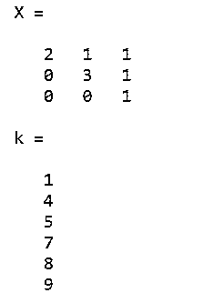
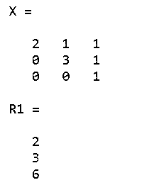
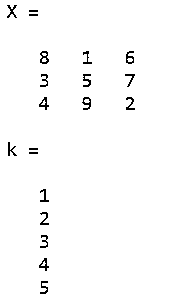
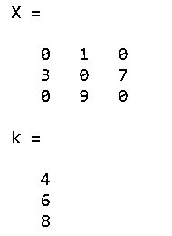
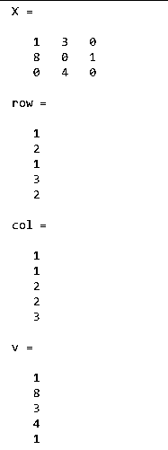

# Matlab 查找函数

> 原文：<https://www.educba.com/find-function-matlab/>

## Matlab 函数查找简介

MATLAB 为它的用户提供了一篮子函数，在本文中我们将了解一个强大的函数叫做“查找”。最简单的形式是，find 函数将返回指向非零元素的数组 X 的索引。如果没有找到，该函数将返回一个空矩阵。

**查找函数的语法:**

<small>Hadoop、数据科学、统计学&其他</small>

1.  `R = find(X)`
2.  `R = find (X, n)`
3.  `R = find (X, n,direction)`
4.  `[row, col] = find ()`
5.  `[row, col, v] = find ()`

### Matlab 中查找的描述

下面将相应地学习 Matlab 中的所有 Find 函数:

#### 1.R =查找(A)

*   这里 A 是一个数组，这个函数将返回一个包含 A 中每个非零元素的线性索引的向量。
*   假设 A 是一个向量，那么 R 将返回一个向量，它的方向和 x 相同。
*   如果 A 是一个多维数组，R 将返回一个包含线性索引的列向量。
*   如果 A 全是 0 或空值，那么 R 会给我们一个空数组。

现在让我们用一个例子来理解这个概念:

这里，X 是一个 3 x 3 的矩阵:

**代码:**

`X = [2 1 1; 0 3 1; 0 0 1] k = find(X)`

下面是控制台的外观:

**输出:**

让我们用一个逻辑运算符~来定位零值。

**代码:**

`X = [2 1 1; 0 3 1; 0 0 1] R1 = find(~X)\`

**输出:**

#### 2.R = find (X，n)

此函数将返回 x 中非零值的前 n 个索引。下面是理解此查找函数的示例:

x 是一个 3 x 3 的矩阵:

**代码:**

`X=[8 1 6;3 5 7;4 9 2] k = find(X < 10, 5)`

**输出:**

#### 3.R =查找(X，n，方向)

该函数将返回函数中指定的最后一个或第一个方向上非零元素的 n 个索引。下面是一个理解该查找功能的示例:

**代码:**

x 是一个 3 x 3 的矩阵:

`X=[0 1 0;3 0 7;0 9 0] k = find (X, 3, last)`

**输出:**

#### 4.[行，列] =查找()

这个函数将为上面提到的任何函数返回数组 X 的非零元素的行和列下标。下面是一个理解该查找功能的示例:

**代码:**

x 是一个 3 x 3 的矩阵:

`X=[1 3 1;8 0 1;5 4 6] [row, col] = find(X>0 & X<5, 3)`

**输出:**

![[row, col] = find()](img/77626c025d6d87c520cf96d4de1f55bc.png)

#### 5 .[row，col，v] = find()

这个函数将返回向量“v ”,除了数组 X 的非零元素的行下标和列下标之外，还会返回上述任何一个函数。下面是一个理解该查找功能的示例:

**代码:**

x 是一个 3 x 3 的矩阵:

`X=[1 3 0;8 0 1;0 4 0] [row, col, v] = find(X)`

**输出:**

### 结论

我们可以找到满足特定条件的数组元素。为了实现这一点，我们需要使用 find 函数和一个关系表达式。所以，find(A <4) will return linear indices of the elements of A which are less than 4\. We can also directly find elements in A that fulfill the given condition like A<5\. For this, we simply use A(A<5). Here we can avoid making calls to function like A(find(A<5)) When we execute find function with any relational operation like A> 1，我们必须记住，在这里，结果将是 1 & 0 的矩阵。示例:[row，col，A] = find(A>1)将返回具有逻辑真值的列向量。

### 推荐文章

这是一个 Matlab 函数查找指南。这里我们讨论 Matlab 中 find 的介绍和描述，以及适当的代码和输出。您也可以浏览我们的其他相关文章，了解更多信息——

1.  [Matlab 创建函数](https://www.educba.com/matlab-create-function/)
2.  [Matlab 逻辑运算符](https://www.educba.com/matlab-logical-operators/)
3.  [MATLAB 函数](https://www.educba.com/matlab-functions/)
4.  [Matlab 中的分段函数](https://www.educba.com/piecewise-function-in-matlab/)
5.  [如何在 Matlab 中使用 Comet()方法](https://www.educba.com/matlab-comet/)

