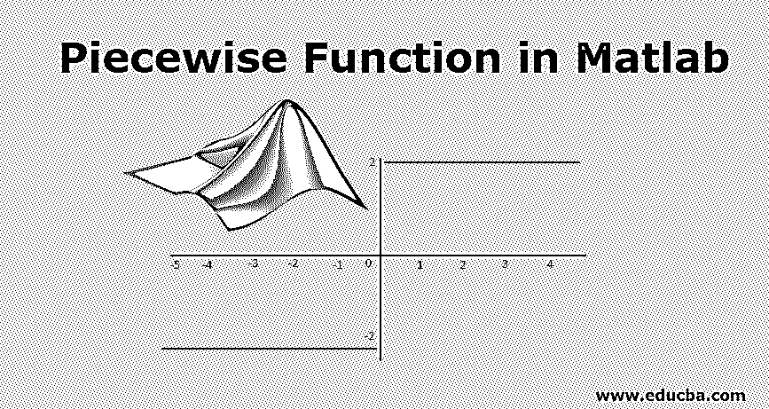
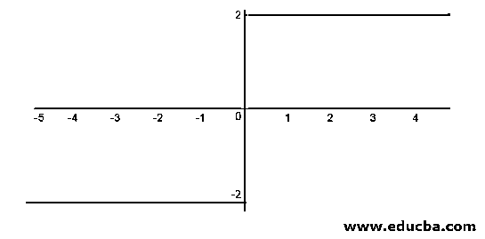

# Matlab 中的分段函数

> 原文：<https://www.educba.com/piecewise-function-in-matlab/>

## Matlab 中的分段函数介绍

分段函数是由各种多元函数定义的函数。在这种情况下，多个函数用于应用于主函数的特定区间。分段函数也用来描述任何方程或函数的性质。它代表函数或方程中的各种条件。在这个主题中，我们将学习 Matlab 中的分段函数。

它可以通过两种方式实现，一种是使用循环(if-else 语句和 switch 语句)，另一种是不使用循环。在循环法中，使用了胜利法。正如我们所看到的，有两种方法，有循环和没有循环。

<small>Hadoop、数据科学、统计学&其他</small>

在第一种方法中也有两种方法

1.通过使用 if-else 方法

2.通过使用 switch 语句

在第二种方法中，函数以矢量化的方式表示

3.矢量化方法

### 通过使用 If-Else 语句

这是实现分段函数的基本术语之一，但这不是实现分段函数的好方法。

**语法:**

`If  condition1
Statement 1 ;
else
statement 2;
end
plot ( input variable , output variable )
function output variable = piecewise ( input variable )`

**例#1**

现在让我们考虑一个例子

`f ( x ) =  - 2   for x < 0
2  for  x > 0`

为了在 Matlab 中实现上述函数，我们首先需要创建一个带有关键字“分段”的函数

`> > function f x = piecewise ( x )`

在上述语句中，“f x”是输出变量的名称，“分段”是用于上述函数的关键字，“x”是输入变量。

声明函数后，现在我们需要定义输入变量“x”范围的条件。

`>> If x < = 0
>> fx = -2
>> else
>> fx = 2`

在上面的语句中，if-else 语句用于定义范围。它表明，如果 x 的值小于或等于“0”，则输出将为“–2”，如果“x”的值大于“0”，则输出将为“2”。

**Matlab 程序:**

`If x < = 0
f x = -2 ;
else
f x = 2 ;
end
plot ( x , f  x  )
function f x = piecewise ( x )`

**输出:**

#### 转换情况语句

循环中的第二种方法由 switch-case 语句驱动。在这种方法中，我们用不同的方法表示不同的情况，我们可以在一个开关循环中指定多个情况。

**例 2**

让我们假设上面的例子，

`f  x =  - 2   for x <= 0
2  for  x > 0`

在这个例子中，函数 f x 中有两个条件，一个小于等于“0”，另一个大于“0”。

为了首先使用 switch-case 语句实现上面的例子，我们需要声明 function 语句(分段函数)。

`>>  function f x = piecewise (x )`

上述语句表明 f x 是关于输入变量‘x’的分段函数，在声明该函数后，我们将从 switch 语句开始。

`>> switch (x)`

上述语句是用于改变变量“x”值的 switch case 的关键字。现在，在交换机内部，将会有不同的情况，我们的要求只是情况，所以我们将编写 2 个情况。

`Case 1: x < = 0
F  x = - 2 ;
Case 2 :  x > 0
F x = 2 ;`

上述陈述代表 x 的范围和各自的预期函数值。

#### Matlab 程序

`function F x = piecewise (x )
switch ( x )
Case 1 :  x < = 0
F x=-2 ;
Case 2 : x > 0
F x  = 2 ;
end
Plot ( F x , x )`

**输出:**

### 矢量化方法

这种方法是不使用循环的分段函数的第二种方法。在这种方法中，输入是序列(条件)的完整向量，并且我们可以使用' & '运算符来组合两个条件。这是分段函数中最常用的方法。

让我们假设同样的例子；

`f x=-2   … x<=0
2  …   x  >  0`

现在我们将使用矢量化方法来说明上面的示例，首先，我们需要像上面的示例一样声明分段函数。

`function f x = piecewise (x)`

声明分段函数后，我们将定义输入变量“x”的范围。在上面的例子中，我们知道有两个条件，因此，我们需要定义两个范围。

`fx (x<=0)=-2 ;
and
fx (x>0)=2;`

现在，由于范围是已知的，我们需要声明输入变量“x”的总范围。

x =–5:1:5

这表明 x 将取–5 到+ 5 之间的值。

#### Matlab 程序

`function f x = piecewise ( x )
fx(x<= 0) = - 2 ;
fx(x>0) = 2 ;
x = - 5 : 1 : 5
f x = piecewise ( x )
plot (f x , x )`

**输出:**

### 结论–Matlab 中的分段函数

分段函数主要用于表示在不同条件下具有不同输入范围的函数。正如我们上面看到的，有三种方法来表示分段函数。但是，if-else(循环)方法不用于实时实现。以及在许多应用中使用的矢量化方法。

### 推荐文章

这是一个 Matlab 中分段函数的指南。这里我们用各种语句和例子来讨论在 Matlab 中使用分段函数的方法。您也可以阅读以下文章，了解更多信息——

1.  [MATLAB 版本](https://www.educba.com/matlab-version/)
2.  [Matlab 中的向量](https://www.educba.com/vectors-in-matlab/)
3.  [Matlab 中的矩阵](https://www.educba.com/matrix-in-matlab/)
4.  [什么是 Matlab？](https://www.educba.com/what-is-matlab/)
5.  [不同类型的回路及其优点](https://www.educba.com/vb-dot-net-loops/)
6.  [Matlab 编译器| Matlab 编译器的应用](https://www.educba.com/matlab-compiler/)
7.  [R 中向量的例子](https://www.educba.com/vectors-in-r/)

