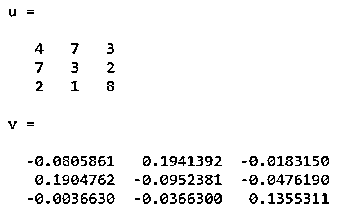
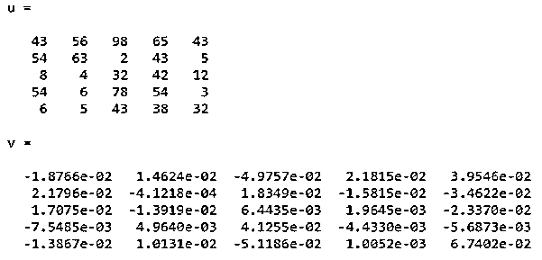

# Matlab 反函数

> 原文：<https://www.educba.com/matlab-inverse-function/>

## Matlab 反函数介绍

在 Matlab 中，反函数是通过应用“finverse”命令获得的。这个命令返回给定函数变量的值。在 finverse 中，f 代表 function，在 finverse 之后，根据需要，括号内会有参数或自变量列表。如果函数只依赖于一个变量，那么在括号中会有一个参数，如果函数(f)和函数依赖于两个参数，那么在括号中会有两个参数。

**语法:**

<small>Hadoop、数据科学、统计学&其他</small>

有两种语法，它根据变量的依赖性而变化。

`Y = finverse (f)`

如果函数中有多个变量，则使用该命令。

`Y = finverse (f, var)`

如果函数中只有一个因变量，则使用该命令。

### Matlab 反函数示例

Matlab 反函数示例如下:

#### 1.cos x 的倒数

`sym x ;
Y ( x )  =
Cos ( x )
z = finverse ( y )
Z ( x ) =
a cos ( x  )`

| **输入程序** | **命令窗口** | **评论** |
| > > sym x； |  | 输入 x |
| > > y ( x ) = cos ( x) | y(x) =
cos ( x) | “y”相对于独立变量“x”的倒数 |
| > > z = finverse ( y) | Z ( x ) =
a cos( x) | “y”的反相输出 |

#### 2.1/tan(x)的倒数

`sym x ;
y ( x ) = 1 / tan ( x )
Y ( x ) =
1 / tan ( x )
z = finverse ( y )
Z ( x ) =
a tan ( 1 / x )</code`

| **输入程序** | **命令窗口** | **评论** |
| > > sym x； |  | 输入“x” |
| > > y ( x ) = 1 / tan ( x) | Y ( x ) =
1 / tan ( x) | y 相对于独立变量 x 的倒数 |
| > > z = finverse ( y) | Z ( x ) =
a tan ( 1 / x) | “y”的反相输出 |

#### 3.指数的倒数(x–5y)

`syms  x  y
finverse ( exp ( x - 5 * y) , x )
ans  =
5 * y + log ( x )`

| **输入代码** | **命令窗口** | **评论** |
| 符号 x y |  | 输入参数“x”和“y” |
| finverse(exp(x–5 * y)，x) | ans =5 * y+对数(x) | 关于两个变量的函数的输出 |

#### 4.对数的倒数(x-y)

`syms  x  y
finverse ( log ( x – y ), y )
ans =
x – exp ( y )`

| **输入代码** | **命令窗口** | **评论** |
| 符号 x y |  | 输入参数“x”和“y” |
| finverse(日志(x-y)，y) | ans =
x–exp(y) | 关于两个变量的函数的输出 |

### 矩阵的逆矩阵

要找到任何矩阵的逆矩阵，使用“inv”命令。独立考虑两个变量 u 和 v。其中 v 是输出变量，u 是输入变量。那么求逆的命令将是 v = inv ( u)。这里 u^-1 几乎等于 inv(u)。

**1。Matlab 代码，求上述矩阵的逆矩阵；**

考虑矩阵 u；

| U = | Four | Seven | Three |
| Seven | Three | Two |
| Two | One | Eight |

u =[4 7 3；7 3 2;2 1 8]

v=inv(u)

要获得矩阵的逆矩阵，有一个条件，输入矩阵必须是“方阵”。否则，它会给出错误。让我们看一个奇数矩阵(矩形矩阵)的例子。

**2。Matlab 代码求逆**

考虑矩阵 U，

| U = | Six | Six | Eight |
| Four | Four | Six |
| Two | Three | Four |
| Nine | One | Two |

u =[6 4 2 9；6 4 3 1;8 6 4 2]

v=inv(u)

**3。Matlab 代码求逆；**

现在考虑一下，

| U = | Forty-three | Fifty-four | Eight | Fifty-four | Six |
| Fifty-six | Sixty-three | Four | Six | Five |
| Ninety-eight | Two | Thirty-two | Seventy-eight | Forty-three |
| Sixty-five | Forty-three | Forty-two | Fifty-four | Thirty-eight |
| Forty-three | Five | Twelve | Three | Thirty-two |

u =[43 56 98 65 43；54 63 2 43 5;8 4 32 42 12;54 6 78 54 3;6 5 43 38 32]

v=inv(u)

### 结论

函数逆是数学中复杂的理论之一，但通过 Matlab，我们可以很容易地找到任何函数的逆，只要给出一个自变量列表。一个简单的语法被用来找出 inverse，即“finverse ”,后跟变量说明。

### 推荐文章

这是一个 Matlab 反函数的指南。这里我们讨论矩阵的逆矩阵以及 Matlab 反函数的例子。您也可以浏览我们推荐的其他文章，了解更多信息——

1.  [Matlab 中的矩阵](https://www.educba.com/matrix-in-matlab/)
2.  [Matlab 命令](https://www.educba.com/matlab-commands/)
3.  [Java 中的数学函数](https://www.educba.com/math-functions-in-java/)
4.  [如何安装 MATLAB](https://www.educba.com/install-matlab/)

