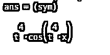
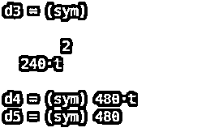
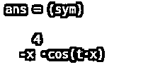

# 函数的 MATLAB 导数

> 原文：<https://www.educba.com/matlab-derivative-of-function/>

## 函数求导的 MATLAB 介绍

MATLAB 包含各种命令和函数，有许多实用程序。这篇文章的重点是了解如何 MATLAB 命令' diff '可以用来计算一个函数的导数。MATLAB 中的 diff 命令用于计算符号导数。在其最简单的形式中，我们希望计算其导数的函数作为参数传递给 diff 命令。

**对微分或导数的理解**

<small>Hadoop、数据科学、统计学&其他</small>

微分是一种基本的微积分工具，它表示数量上相当小的变化。微分是函数随其中一个变量变化的速率。它计算输出值相对于其输入值变化的敏感度。

例如，一个物体的速度是该运动物体的位置对时间的导数。这里的速度导数显示了当时间移动时，物体的位置变化有多快。用数学术语可以表示为 dx，dy，dz 等。可以写成 f(x)/dy，其中 dy 将代表 f(x)相对于 x 的微小变化。

既然我们已经更新了微分的概念，现在让我们了解它是如何在 MATLAB 中计算的。

**导数的语法:**

1.  差异(f)
2.  diff (f，var)
3.  差分(f，n)
4.  diff (f、var、n)

### MATLAB 中函数求导的例子

现在我们将借助各种例子来理解上面的语法

#### 1.差异(f)

diff (f)将用 symvar (f，1)标识的变量来区分“f”

下面是一个使用 diff (f)计算函数微分的例子:

让我们将正弦函数定义为:

罪恶(x ^ 3)

**代码:**

`syms f(x)
f(x) = sin (x ^ 3);
df = diff (f, x)`

**输出:**

该函数将返回函数 sin (x ^ 3)的微分值:

3 x^2 cos (x ^ 3)

#### 2\. diff (f，var)

diff (f，var)将区分作为参数传递的变量(在命令中称为“var”)。

下面是一个使用 diff (f，var)计算函数微分的例子:

让我们将一个正弦函数定义为:

罪恶(x * t ^ 4)

**代码:**

`syms x t
diff (sin (x* t ^ 4))`

**输出:**

该函数将返回函数 sin (x * t ^ 4)的微分值:

`t ^ 4 cos(t ^ 4 x)`

正如我们所注意到的，这个函数是关于 t 't '的微分

#### 3.差分(f，n)

diff (f，n)将计算函数“f”对使用 symvar 确定的变量的 n 阶导数(如参数中传递的)。

下面是一个使用 diff (f，n)计算函数微分的例子:

让我们把一个函数定义为:

4t ^ 5

我们将计算我们函数的 3 次、4 次和 5 次导数。

**代码:**

`syms t
d3 = diff (4 * t ^ 5, 3)
d4 = diff (4 * t ^ 5, 4)
d5 = diff (4 * t ^ 5, 5)`

**输出:**

该函数将返回函数 4t ^ 5 的 3 个 rd ，4 个thT6】5 个 th 导数，如下所示:

d3 = 240 吨^ 2
d4 = 480 吨
d5 = 480

#### 4\. diff (f、var、n)

diff(f，var，n)将计算给定函数“f”对参数中传递的变量的第 n 阶导数(在语法中称为“var”)。

下面是一个使用 diff (f，var，n)计算函数微分的例子:

让我们把一个函数定义为:

x * sin (x * t)

**代码:**

`syms x t
diff (x * sin(x * t), t, 3)`

**输出:**

该函数将返回函数 x * sin (x * t)的 3 个 rd 导数，对 w.r.t 't '的微分如下:

-x^4 公司

正如我们所注意到的，我们的函数是对 w.r.t. 't '求导的，我们已经得到了 3 rd 导数(根据我们的论点)。因此，正如我们所了解的，在 MATLAB 中可以使用“diff”命令来计算函数的导数。我们还可以通过将‘n’(n 阶导数)作为参数来控制我们想要计算的导数的次数。

### 推荐文章

这是一个 MATLAB 函数求导指南。在这里，我们讨论了介绍，微分或导数的理解，语法和 MATLAB 中的例子。您也可以浏览我们推荐的其他文章，了解更多信息——

1.  [Matlab 梯度](https://www.educba.com/matlab-gradient/)
2.  [Matlab 保存变量](https://www.educba.com/matlab-save-variable/)
3.  [Matlab 中的多项式](https://www.educba.com/polynomial-in-matlab/)

5.  [Matlab stem()完全指南](https://www.educba.com/matlab-stem/)

