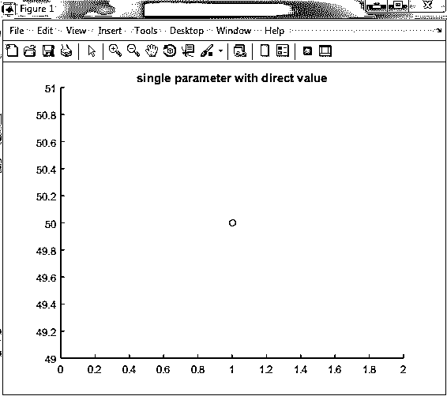
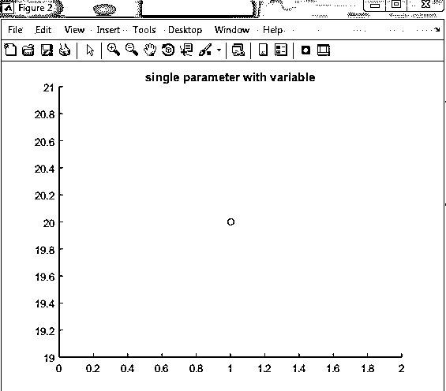
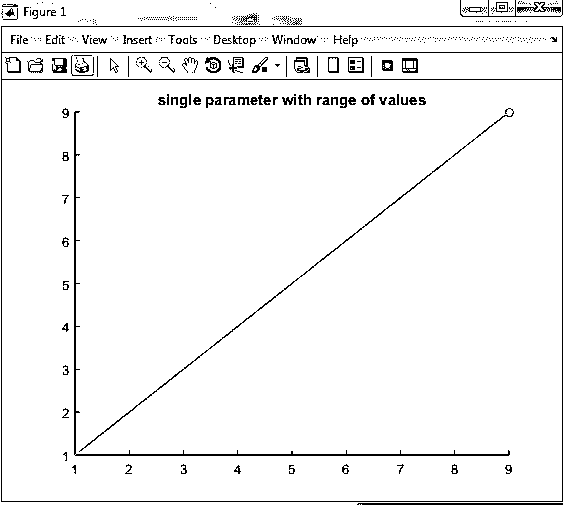
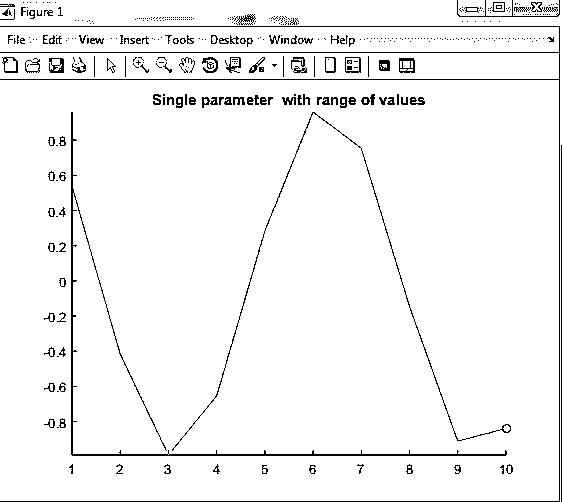
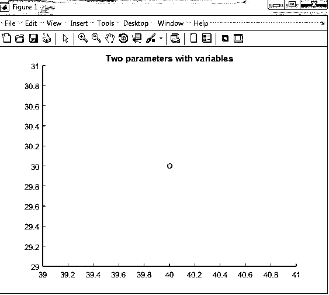
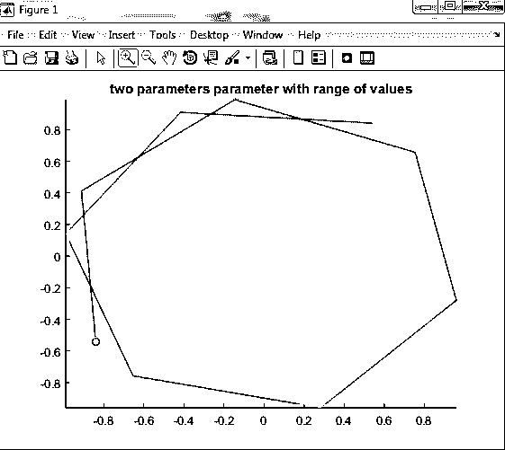

# Matlab 彗星()

> 原文：<https://www.educba.com/matlab-comet/>

## Matlab 彗星介绍()

Comet 是 Matlab 中用来绘制图形的函数。Matlab 绘图函数也用于绘制图形，但 comet 提供了比绘图函数更有效的可视化。它是输入功能的动画图形视图。它包含两个参数 head 和 tail。头部是一个代表图形起点的小圆圈，尾部是一条描绘整个函数的单线。Comet 函数需要输入参数来操作特定的问题，在这里我们可以添加图形中所需的各种输入选项。Comet 函数最常用于输入，也是需要用户输入的函数之一。

### Comet()在 Matlab 中是如何工作的？

编写 comet 函数有多种方式，如单参数 comet、双参数 comet、包含条件的三参数 comet 和多参数 comet。

<small>Hadoop、数据科学、统计学&其他</small>

**使用 Comet()函数的步骤:**

*   接受输入参数
*   应用 comet 函数(comet())
*   显示输出

### Matlab 中 Comet()函数的使用方法

下面详细介绍 Comet()函数的使用方法。

#### 1.彗星(50)

**语法:**

`comet (single parameter)`

**说明:**上例中，只有一个参数。这里我们直接使用括号内的参数的-value。否则，我们也可以声明任何变量，然后将值 50 赋给该变量，本例的输出是唯一的圆，在值处会有两个跟踪的尾部。在表 1.2 中，我们首先声明一个变量“ip1”，然后将值赋给变量 ip1。本例的输出是一个圆形的唯一头部位置，不会有函数跟踪。表 1.3 显示了一系列值的 Matlab 代码，在此输入中，ip1 的值为 1 至 9，本例的输出是从 1 号到 9 号的尾部跟踪。表 1.4 中的输入是 cos 函数。在本例中，我们首先声明角度值为 1 到 10，然后对值 1 到 10 应用 cos 函数，然后对 cos 应用 comet 函数。此示例的输出是 cos 函数从值 cos (1)到 cos (10)的跟踪。

**表 1.1:**

| **Matlab 编辑器** | **命令窗口** |
| 彗星(50)
标题('具有直接值的单参数') | – – |

下面是带有直接值的表 1.1 单参数的输出。

**输出:**

**表 1.2:**

| **Matlab 编辑器** | **命令窗口** |
| x = 20
comet(x)title('单参数带变量') | >>无标题
x = 20 |

表 1.2 的输出如下:

**输出:**

**表 1.3:**

| **Matlab 编辑器** | **命令窗口** |
| ip1=1:9
comet(ip1)
title('具有值范围的单个参数') | >>无标题
ip1 = 1 2 3 4 5 6 7 8 9 |

表 1.3 的输出是:

**输出:**

**表 1.4:**

| **Matlab 编辑器** | **命令窗口** |
| angle = 1:10
ip1 = cos(angle)’
彗星(ip1)
标题(‘单参数与数值范围’) | >>无标题
角度= 12345678910
ip1 = 0.5403
-0.4161
-0.9900
-0.6536
0.2837
0.9602
0.7539
-0.1455
-0.9111
-0.8391 |

表 1.4 Cos 函数的输出具有一系列值。

**输出:**

#### 2.彗星(40，30)

**语法:**

`comet (first parameter, second parameter)`

Comet 函数大多只用这种格式。在这个类型中，comet 括号内有两个参数。这两个参数是函数的输入。在第一个例子表 2.1 中，我们直接给出了函数的值 40 和 30。表 2.1 的输出只是一个圆形的头部位置，没有跟踪功能。在第二个表 2.2 中，首先，我们声明两个变量 ip1 和 ip2，然后我们给变量赋值，这意味着 ip1 是 40，ip2 是 30。这个例子的输出仅仅是头部位置(ip1 相对于 ip2 ),这是一个圆，没有函数跟踪。

表 2.3 中的输入参数也是函数。两个函数 cos 和 sin 被用作 comet 的输入，但是 cos 和 sin 也需要自己的输入，因此输入被给定一个值范围，在这个例子中被表示为角度。因此，输出图是 cos 函数相对于 sin 函数的轨迹。

**表 2.1:**

| **Matlab 编辑器** | **命令窗口** |
| comet (40，30 )
标题('具有直接值的两个参数' ) | n– |

表 2.1 的输出:

**输出:**

**表 2.2:**

| **Matlab 编辑器** | **命令窗口** |
| ip1 = 40
ip2 = 30
彗星(ip1，ip2)
标题('两个带变量的参数') | >>无标题
ip1 = 40
ip2 = 30 |

表 2.2 输出两个带变量的参数。

**输出:**

**表 2.3:**

| **Matlab 编辑器** | **命令窗口** |
| angle = 1:10
ip1 = cos(angle)
ip2 = sin(angle)
彗星(ip1，ip2)
标题('具有值范围的两个参数参数') | 角度= 1 2 3 4 5 6 7 8 9 10
ip1 =
0.5403
-0.4161
-0.9900
-0.6536
0.2837
0.9602
0.7539
-0.1455
-0.9111
-0.8391
ip2 =【中 |

表 2.3 的输出:

**输出:**

### 结论

在 Matlab 中，plot 函数用于绘制图形，但 plot 函数有一些限制，这就是为什么 comet 函数用于函数的图形表示。在上面的例子中，我们已经看到了编写彗星函数的各种方法，以及关于头部位置和尾部追踪的函数在图中的表示。

### 推荐文章

这是一个 Matlab Comet()的指南。这里我们讨论 comet()在 Matlab 中的介绍和工作原理，以及使用 Comet()函数的步骤和方法。您也可以阅读以下文章，了解更多信息——

1.  Matlab 中使用哪些类型的颜色代码？
2.  [Matlab 中的 Simulink 示例](https://www.educba.com/what-is-simulink-in-matlab/)
3.  [Matlab 中的分段函数](https://www.educba.com/piecewise-function-in-matlab/)
4.  [如何在 MATLAB 中创建热图？](https://www.educba.com/heatmap-in-matlab/)

