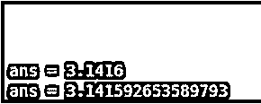
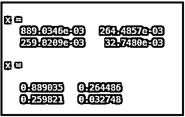
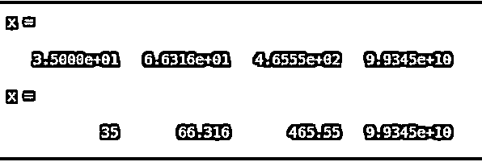

# Matlab 格式

> 原文：<https://www.educba.com/matlab-format/>

## Matlab 格式的定义

Matlab 格式功能用于输出显示格式的外观变化。Matlab 格式函数只影响数字在输出窗口中的显示方式。Matlab 格式样式用于将命令窗口中的输出显示格式更改为样式指定的格式。默认情况下，Matlab format 函数将输出格式重置为 short，这用于浮点记数法的固定十进制格式和所有输出行的松散行间距。在数字格式中，Matlab format 函数只影响数字在命令窗口或输出窗口中的显示方式。

**语法:**

<small>Hadoop、数据科学、统计学&其他</small>

Matlab 格式函数的语法如下

*   格式样式
*   版式

### Matlab 中的 Format 函数是如何工作的？

Matlab 格式函数只影响数字在输出窗口中的显示方式。format 函数将命令窗口或输出窗口中出现的数字更改为 style 指定的格式。有不同的风格，像短，长，短 e，鳄龙，短 g，长 g，短 eng。龙英等。输出行有不同的行距，如紧凑和松散。

如何格式化函数的步骤如下

*   **第一步:**将数据放入变量或数组中。
*   **第二步:**之后，使用 Matlab format 函数和适当的语法选择合适的样式。
*   **第三步:**之后，使用 Matlab format 函数和适当的语法为输出行选择合适的行距。
*   **第四步:**执行 Matlab 代码得到输出。

下面是一些例子:

#### 示例#1

在这个例子中，我们看到了如何在 Matlab 中为 pi 设置不同的输出格式并显示 pi 的值。在 matlab 中设置输出格式，我们使用了 Matlab 的 format 函数。在这个例子中，我们看到 pi 的不同格式样式和不同输出格式。这里我们使用的是用于定标定点格式的 short，有 5 个数字。之后，显示圆周率的值。然后我们使用松散格式的格式样式 long。Style long 包含定标的定点格式，后面有 15 个数字为 double，执行 matlab 代码以在命令窗口显示 pi 的值。

**代码:**

`clc;
close all;
clear all;
format short
format compact
pi
format long
format loose
pi`

**输出-****命令窗口**

执行 matlab 代码后，我们在命令窗口中得到 pi 值的不同输出格式。

#### 实施例 2

在本例中，我们将了解如何使用紧凑行距格式设置短工程格式输出格式。为此，我们首先使用具有适当语法的 matlab 格式函数，设置具有紧凑行距格式的短工程格式。“格式 shortEng 和格式 compact”这一行用紧凑的行距格式设置短工程格式，然后我们在变量 x 中取随机值。默认情况下，格式是 short，它是定标定点格式，有 5 个数字，短工程格式是浮点格式，有 5 个数字。因此，当我们只使用格式功能时，它会将数据格式从简短的工程格式更改为简短的格式。

**代码:**

`clc;
close all;
clear all;
format shortEng
format compact
x = rand(2)
format
x`

**输出-****命令窗口**

在执行 matlab 代码后，我们在命令窗口中得到具有紧凑行间距格式的短工程格式输出格式。

#### 实施例 3

在本例中，我们创建了一个变量，并以 short 格式和 shortG 格式显示输出，所有输出行的行距都很宽松。这里我们有一个随机输出的 x 变量，以 shortG 格式和 short 格式显示输出。x =[35 66.31566 465.55435 99344899999]'他的行返回带有值的 x 变量。这里 35，66.31566，465.55435 和 99344899999 这是赋给变量 x 的数据，然后我们使用 matlab format 函数以短格式显示输出。之后，我们使用“format shortG”这种 matlab 格式的语法，以 shortG 格式显示输出，所有输出行都有宽松的行间距

**代码:**

`clc;
close all;
clear all;
x = [35 66.31566 465.55435 99344899999];
format short
x
format shortG
format      loose
x`

**输出-** **命令窗口**

执行完 matlab 代码后，我们得到了命令窗口中所有输出行的 short 格式和 shortG 格式的显示输出。

### 结论

在本文中，我们看到了 Matlab 格式函数的概念。基本上，该格式功能用于改变命令窗口中的输出显示格式。然后我们看到了相关的语法和它是如何工作的。Matlab 的 Format 函数在改变格式和样式方面发挥了重要作用。

### 推荐文章

这是一个 Matlab 格式的指南。在这里，我们还将讨论格式函数的定义以及它在 Matlab 中是如何工作的？以及不同的示例及其代码实现。您也可以看看以下文章，了解更多信息–

1.  [点积 MATLAB](https://www.educba.com/dot-product-matlab/)
2.  [卷积 Matlab](https://www.educba.com/convolution-matlab/)
3.  [Matlab 2 cell Matlab](https://www.educba.com/mat2cell-matlab/)
4.  [Ceil Matlab](https://www.educba.com/ceil-matlab/)

