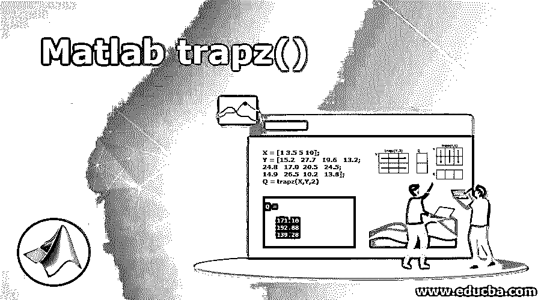
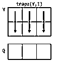
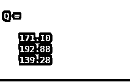
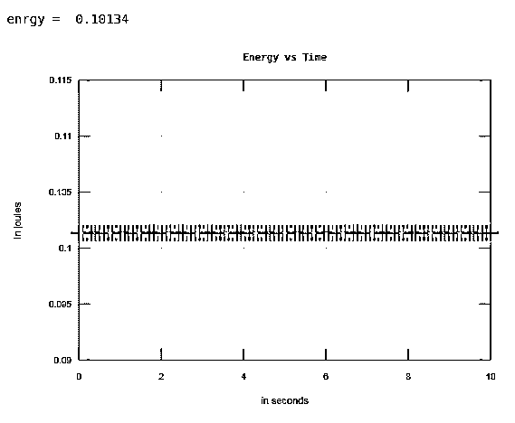

# matlab trapz()

> 原文：<https://www.educba.com/matlab-trapz/>

## Matlab trapz()简介

MATLAB 结合了函数 trapz，使用遵循梯形规则的单位间距来处理数值积分。该规则被定义为通过将图下的区域划分为小的梯形来近似一个确定时间范围内的数值积分。它有助于形成容易计算的区域。该函数返回标量类型的单个返回值，这是积分的最终值。

优选地，trapz 被推荐用于离散型数据集的数值积分。

<small>Hadoop、数据科学、统计学&其他</small>

### 句法

这个集成函数 trapz 接受不同的输入参数来决定集成函数的行为，分别使用不同的语法。

它们是:

| **语法** | **描述** |
| **Q = trapz(Y)** | 此语法以单位间距计算“Y”的近似整数值，其中积分的维数基于“Y”的大小来确定。 |
| **Q = trapz(X，Y)** | 此语法使用“X”指定的标量间距计算“Y”的近似整数值，其中积分的维数根据“Y”的大小确定。 |
| **Q =梯形(__，标注)** | 此语法计算输入的近似整数值，其中积分的维数为“dim”。 |

对函数 *trapz* 的不同语法有贡献的输入参数可以解释如下:

| **数字数据-Y** | 

*   调用 trapz 函数进行数值积分运算的输入数据。
*   根据“Y”的性质，积分操作以不同方式进行，例如:

1.Y 作为向量à输出是“Y”的近似积分结果2.Y as matrixà输出是对每列执行积分运算的结果，表示为积分运算值的行向量。

3.Y as multi-dimensional arrayà运算发生在第一个非单位大小的维度“Y”上，并导致该维度值 1 的大小，而其他维度的大小保持不变。

*   “Y”支持的数据类型有:

单/双/复数

 |
| **点间距-X** | 

*   决定要形成的梯形数量的指定点间距值。
*   不同性质 X 值需要遵循如下所述的条件:

1.X as vector à坐标向量的长度必须等于数值输入“Y”的第一个非单位尺寸的尺寸。2.x 为标量，它满足以下条件trapz(Y，X) = X*trapz(Y)

*   “X”的默认值为“1”。
*   “X”支持的数据类型是单精度/双精度

 |
| **操作尺寸-dim** | 

*   决定执行积分操作的方向。
*   trapz 工作的不同维度如下:

1.trapz(Y，1):它对包含“Y”列的元素进行操作，返回一个行向量作为输出。

2.trapz(Y，2):它对带有“Y”行的元素进行操作，返回一个列向量作为输出。

*   值 dim 必须是正整数。

 |

### Matlab trapz()示例

下面举几个例子:

#### 例 1–单位间距的数值积分

这个操作可以通过在 MATLAB 代码的 trapz 函数实现中应用语法 Q = trapz(Y)来执行。

**代码**:

下面的代码片段编写为对输入数值“y”执行 trapz 运算，因为 f(x)= 10*2^x.

`Y = [10 20 40 80 160 320];
Q = trapz(Y)`

**输出**:

#### 例 2–非单位间距的数值积分

这个操作可以通过在 MATLAB 代码的 trapz 函数实现中应用语法 Q = trapz(Y，X)来执行。

**代码**:

编写以下代码，以对点间距值为 pi/10 的输入数字数据“Y”调用 trapz 函数。

`X = 0: pi/10:2*pi;
Y = cos(X);
Q = trapz(X,Y)`

**输出**:

#### 例 3–非均匀间距的数值积分

这个操作可以通过在 MATLAB 代码的 trapz 函数实现中应用语法 Q = trapz(Y，X，dim)来执行。

**代码**:

编写以下代码，对输入数值数据“Y”调用 trapz 函数，该数据具有由“X”定义的非均匀点间距值，值“dim”为“2”。

通过矩阵“X”获得点间距，这表明梯形是不均匀形成的。

输入数字数据“Y”中的行是从 3 次不同试验中获得的速度数据中获得的。

`X = [1 3.5 5 10];
Y = [15.2   27.7   19.6   13.2;
24.8   17.0  20.5   24.5;
14.9   26.5  10.2   13.8];
Q = trapz(X,Y,2)`

**输出**:

当“dim”的值设置为 2 时，Trapz 在输入数字“Y”的每一行上执行。结果输出是一个列向量，每一行都有一个积分结果。

#### 例 4–多重数值积分

积分函数 trapz 也可用于执行二重积分，即以下格式的积分:

为了对二重积分表达式执行 trapz 函数，在嵌套循环中调用该函数，如下例所示:

**代码**:

`p = -5:.1:5;
q = -3:.1:3;
[P,Q] = meshgrid(p,q);
F = P.^2 + Q.^2;
I = trapz(q,trapz(p,F,2))`

**输出**:

#### 示例 5–trapz 的实时应用

MATLAB 中的 trapz 在实时应用的积分计算中起着至关重要的作用。

**代码**:

Trapz 可用于计算电机表现出的平均能量，其 v-i 非线性关系设计为:

`The instantaneous voltage v(t)= sin(3t).`

在下面的代码片段中，点间距由“时间”定义，它是值为“10”的非单位均匀间距。

`The instantaneous power is calculated as p = f(i,v) = v*i.`

平均能量(enrgy)通过应用 trapz 函数来计算。

`time=linspace (0,10,100);
volt=sin (3\. *time); i=0.1*(exp (0.2.*volt)-1); p=volt.*i;
enrgy=trapz (time, p), plot (time, enrgy, '+'); grid; title ('Energy vs Time'); ...
xlabel('in seconds'); ylabel('in joules')`

**输出**:

### 附加说明

1.  积分函数 trapz 类似于 cumtrapz，不同之处在于它将维度大小减少到 1，并返回单个值，而不返回任何积分的中间值。
2.  如果输入数值数据“Y”本质上是多维数组，它将在第一个非单例维上工作，而其他维的大小不受影响。
3.  它类似于 integral()，不同之处在于支持的输入数据类型。函数 trapz 处理离散值，而 integral()严格处理函数(表达式)积分运算。

### 推荐文章

这是一个 Matlab trapz()的指南。在这里，我们讨论了 Matlab trapz()的不同介绍，以及相应的语法和示例。您也可以看看以下文章，了解更多信息–

1.  [MATLAB 索引](https://www.educba.com/matlab-indexing/)
2.  [Matlab 中的直方图](https://www.educba.com/histogram-in-matlab/)
3.  [优化的 Matlab](https://www.educba.com/optimset-matlab/)
4.  [高斯拟合 Matlab](https://www.educba.com/gaussian-fit-matlab/)

