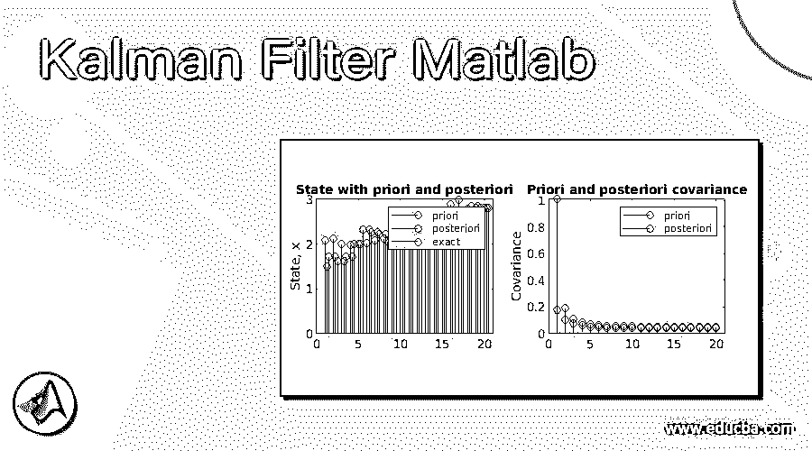
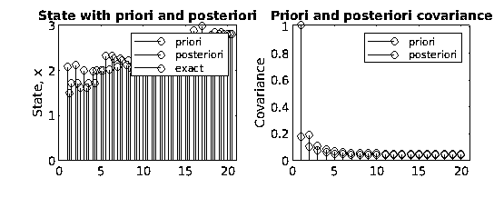

# 卡尔曼滤波器 Matlab

> 原文：<https://www.educba.com/kalman-filter-matlab/>

## 卡尔曼滤波器 Matlab 简介

MATLAB 提供了各种具有现实意义的功能。这篇文章涵盖了一个非常重要的 MATLAB 功能，称为卡尔曼滤波器。我们使用卡尔曼滤波器从测量数据中估计给定系统的状态。一旦完成了这一步，估算的细化也就完成了。我们先来了解一下什么是卡尔曼滤波器。

### 什么是卡尔曼滤波器？

卡尔曼滤波器主要是由工程师 Rudolf Kalman 先生开发的，是一种利用测量数据估计给定系统状态的算法。卡尔曼滤波器的算法是一个两步过程。在第一步中，预测系统的状态，在第二步中，使用噪声测量来改进系统状态的估计。卡尔曼滤波器随着时间的推移已经发展了很多，现在它的几个变种是可用的。卡尔曼滤波器用于涉及估计的应用，如计算机视觉、导航和制导系统、信号处理和计量经济学。

<small>Hadoop、数据科学、统计学&其他</small>

**制导、导航&控制**

卡尔曼滤波器用于制导、导航和控制系统。这些滤波器在传感器融合中合成位置和速度信号。这是通过融合 GPS 和 IMU 测量值(惯性测量单元)实现的。卡尔曼滤波器通常用于估计无法测量的信号值。例如飞机发动机或涡轮内部的温度，因为温度传感器在这种情况下会失效。这些滤波器也通常与 LQR 补偿器(线性二次调节器)一起用于 LQG 控制(线性二次高斯)。

现在我们已经刷新了对卡尔曼滤波的理解，让我们看一个详细的例子来理解 MATLAB 中的卡尔曼滤波

### 在 Matlab 中实现卡尔曼滤波器的步骤

以下是用户在 MATLAB 中实现卡尔曼滤波器需要遵循的步骤。还提供了 MATLAB 代码和步骤:

**1。**我们将定义模拟长度:

`simulen = 30`

**2。**现在让我们来定义系统

`b = 1
c = 4`

(对于常数系统，我们使用 b = 1；你可以使用|b| < 1 for a system of 1 st order)

**3。**接下来，我们将宣布噪声的协方差

`Q=0.02;
R=3;`

**4。**我们现在将为阵列预分配内存。请记住，进行预分配并不是必须的，我们这样做只是为了加快 MATLAB 中的处理速度。

`x=zeros(1,nlen);
z=zeros(1,nlen);`

**5。**接下来，我们将定义“状态”和误差(“先验误差”)的初始估计

`inpriori=zeros(1,nlen);
inposteriori=zeros(1,nlen);
residual=zeros(1,nlen);
rapriori=ones(1,nlen);
raposteriori=ones(1,nlen);
k=zeros(1,nlen);`

**6。**接下来，我们将计算过程噪声和测量噪声

`w=randn(1, nlen);
v1=randn(1,nlen);w=w1*sqrt(Q);
v=v1*sqrt(R);`

为了更好的比较，我们在这里取百分比

7 .**。**现在让我们定义 x 上的初始条件以及后验协方差和状态的初始估计

`x_0= 2.0;
inposteriori_0=1.5;
raposteriori_0=1;`

**8。**接下来，我们将计算所有值的第一次猜测。这将基于状态的初始估计以及随后的后验协方差来完成。下一步将在循环计算状态下计算&输出:

`x(1)= b *x_0+w(1);
z(1)= c *x(1)+v(1);`

*   **我们的预测方程是:**

`inpriori(1)= b*inposteriori_0;
residual(1)=z(1) – c *inpriori(1);
rapriori(1)= b*b*raposteriori_0+Q;`

*   **校正器方程将为:**

`k(1)= c *rapriori(1)/ (c * c *rapriori(1)+R);
raposteriori(1)=rapriori(1)*(1 – h*k(1));
inposteriori(1)=inpriori(1)+k(1)*residual(1);`

*   **计算剩余值:**

`for p =2:nlen,
x(p) = b * x(p -1)+w(p);
z(p) = c *x(p)+v(p);
inpriori(p)= b *inposteriori(p-1);
residual(p)=z(p) – c *inpriori(p);
rapriori(p)= b * b *raposteriori(p -1)+Q;
k(p)= c *rapriori(p)/(c * c *rapriori(p)+R);
raposteriori(p)=rapriori(p)*(1 – c *k(p));
inposteriori(p)=inpriori(p)+k(p)* residual(p);
end
p =1:nlen;`

**9** 。咱们现在剧情状态&他们估计

`subplot(221);
h1=stem(p +0.25,inpriori,'b');
hold on
h2= stem(p +0.5,inposteriori,'g');
h3=stem(p,x,'r');
hold offlegend([h1(1) h2(1) h3(1)], ‘priori', 'posteriori','exact');
title(‘State with priori and posteriori’);
ylabel('State, x');
xlim=[0 length(p)+1];
set(gca,'XLim',xlim);`

10。让我们也画出协方差

`subplot(222);
h1= stem(p,rapriori,'b');
hold on;
h2=stem(p,raposteriori,'g');
hold off
legend([h1(1) h2(1)], 'priori', 'posteriori');
title(‘Priori and posteriori covariance’);
ylabel('Covariance');
set(gca,'XLim',xlim);`

在实现上面的代码时，下面是我们在 MATLAB 中的输出:

### 结论

卡尔曼滤波器非常适合那些**持续变化**的系统。这些过滤器的优点是占用的内存少，因为它们不需要保留除先前状态之外的任何历史信息。卡尔曼滤波器也非常快，这使它们成为嵌入式系统和实时问题的伟大工具。

### 推荐文章

这是一个卡尔曼滤波的 Matlab 指南。这里我们分别讨论介绍，语法，什么是卡尔曼滤波器，以及实现卡尔曼滤波器的步骤。您也可以看看以下文章，了解更多信息–

1.  [Matlab 绘图标题](https://www.educba.com/matlab-plot-title/)
2.  [Matlab fplot()](https://www.educba.com/matlab-fplot/)
3.  [Matlab 堆积条形图](https://www.educba.com/matlab-stacked-bar/)
4.  [Matlab 排序](https://www.educba.com/matlab-sort/)

