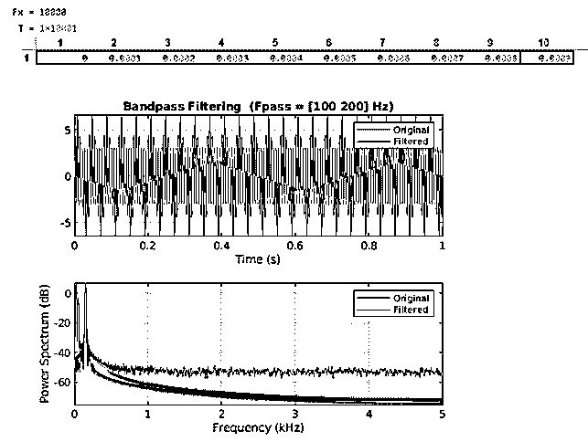
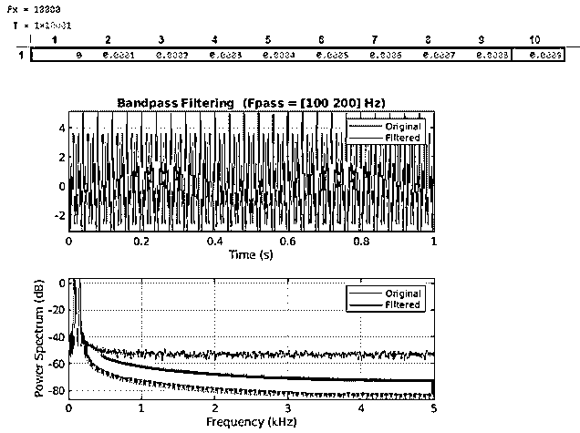
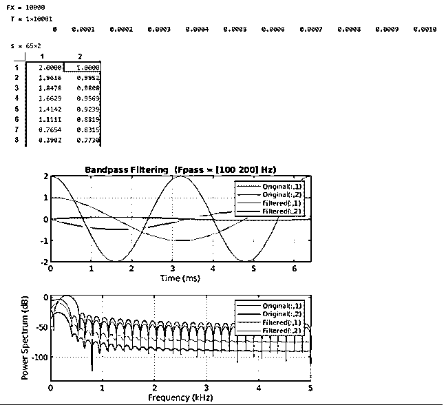

# 带通滤波器 Matlab

> 原文：<https://www.educba.com/bandpass-filter-matlab/>

## 带通滤波器 Matlab 简介

带通滤波器用于过滤或隔离特定范围内的某些频率。这些滤波器可用于音频放大器或扬声器电路(分频滤波器)或前置放大器中的音调控制等应用。在这些应用中，只需要让特定范围的频率通过，这些频率不是从 DC (0HZ)开始，就是在一个较高的频率点结束，而是在一个特定的范围内，可以宽也可以窄。

**语法:**

<small>Hadoop、数据科学、统计学&其他</small>

`F = bandpass (s, wp)`

`F = bandpass (s, fp, Fx)`

**描述:**

*   F =带通(s，wp)用于过滤具有由 2 元向量“wp”提供的通带频率范围的信号“s”。如果输入“s”是一个矩阵，带通函数将独立过滤“s”的每一列
*   F =带通(s，fp，Fx)用于指定以“Fx”HZ 的速率对信号“s”进行采样。2 元向量“fp”给出了通带频率

### 带通滤波器 Matlab 示例

现在让我们借助各种示例来理解 MATLAB 中的“带通滤波器”代码:

#### 示例#1

在本例中，我们将创建一个正弦信号，该信号以 10000Hz 的频率采样 1 秒钟，然后通过一个带通滤波器。

以下是需要遵循的步骤:

*   定义采样率。
*   定义信号的音调。
*   将低频和高频音保持在三倍于中间音的水平。
*   通过设置允许的频率，使上述信号通过带通滤波器。

**代码:**

`Fx = 1e4
T = 0:1/Fx:1`

[Defining the sampling rate]

`s = [3 1 3]*sin(pi*[50 100 300]'.*T) + randn(size(T))/20;`

[Creating the signal with 3 tones, 50 Hz, 100 Hz and 300 Hz]

`bandpass(s, [100 200], Fx)`

[Passing the input signal to bandpass filter and setting the allowed frequency range as 100 to 200] [Bandpass filter will allow frequencies of 100 & 200 Hz. In the output, we will get the original & filtered signals along with their spectra]

**输入:**

`Fx = 1e4
T = 0:1/Fx:1
s = [3 1 3]*sin(pi*[50 100 300]'.*T) + randn(size(T))/20;
bandpass(s, [100 200], Fx)`

**输出:**

正如我们在输出中看到的，我们已经获得了原始和滤波信号及其频谱。带通滤波器已经去除了低于低通频率的频率和高于高通频率的频率。

#### 实施例 2

本例中，我们将创建一个 cos 信号，该信号以 10000Hz 的频率采样 1 秒钟，然后通过一个带通滤波器。

以下是需要遵循的步骤:

*   定义采样率。
*   定义信号的音调。
*   将低频和高频音保持在两倍于中间音的水平。
*   通过设置允许的频率，使上述信号通过带通滤波器。

**代码:**

`Fx = 1e4
T = 0:1/Fx:1`

[Defining the sampling rate]

`s = [2 1 2]*cos(pi*[150 200 300]'.*T) + randn(size(T))/20;`

[Creating the cos signal with 3 tones, 150 Hz, 200 Hz and 300 Hz]

`bandpass(s, [100 200], Fx)`

[Passing the input signal to bandpass filter and setting the allowed frequency range as 100 to 200] [Bandpass filter will allow frequencies of 100 & 200 Hz. In the output, we will get the original & filtered signals along with their spectra]

**输入:**

`Fx = 1e4
T = 0:1/Fx:1
s = [2 1 2]*cos(pi*[150 200 300]'.*T) + randn(size(T))/20;
bandpass(s, [100 200], Fx)`

**输出** **:**

正如我们在输出中看到的，我们已经获得了输入 cos 信号的原始和滤波信号及其频谱。带通滤波器已经去除了低于低通频率的频率和高于高通频率的频率。

#### 实施例 3

在上面的两个例子中，我们使用了一个三通道信号，在这个例子中，我们将使用一个二通道信号，并将它通过一个带通滤波器。

以下是需要遵循的步骤:

*   定义采样率。
*   定义信号的音调。
*   保持高频两倍于低频。
*   通过设置允许的频率，使上述信号通过带通滤波器。

**代码:**

`Fx = 1e4
T = 0:1/Fx:1`

[Defining the sampling rate]

`s = [2 1].*cos(2*pi*(0:64)'./[32 64])`

[Creating the 2-channel cos signal]

`bandpass(s, [100 200], Fx)`

[Passing the input signal to bandpass filter and setting the allowed frequency range as 100 to 200] [Bandpass filter will allow frequencies of 100 & 200 Hz. In the output, we will get the original & filtered signals along with their spectra]

**输入:**

`Fx = 1e4
T = 0:1/Fx:1
s = [2 1].*cos(2*pi*(0:64)'./[32 64])
bandpass(s, [100 200], Fx)`

**输出:**

正如我们在输出中看到的，我们已经获得了输入 cos 信号的原始和滤波信号及其频谱。带通滤波器已经去除了低于低通频率的频率和高于高通频率的频率。

### 结论

*   带通滤波器用于获取特定范围内的频率。
*   我们使用 MATLAB 中的带通函数来实现带通滤波器。
*   MATLAB 中的带通函数提供原始信号和滤波信号作为输出。
*   该功能还提供输出信号的频谱。

### 推荐文章

这是一个带通滤波器的 Matlab 指南。在这里，我们还讨论了带通滤波器 matlab 的介绍和语法，以及一个不同的例子及其代码实现。您也可以看看以下文章，了解更多信息–

1.  [Matlab 格式](https://www.educba.com/matlab-format/)
2.  [移动平均线 Matlab](https://www.educba.com/moving-average-matlab/)
3.  [卷积 Matlab](https://www.educba.com/convolution-matlab/)
4.  [震级 Matlab](https://www.educba.com/magnitude-matlab/)

