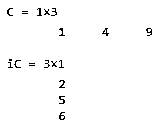

# MATLAB 独特

> 原文：<https://www.educba.com/matlab-unique/>

## MATLAB Unique 简介

MATLAB 是一个交互式的编程环境，用于科学计算。它广泛应用于许多需要解决问题、数据分析、算法开发和实验的技术领域。特定学科的软件广泛使用 MATLAB 编写。这些被组织成称为工具箱的库。MATLAB 在技术教育领域也有广泛的应用。在那里它被用作在计算实验室中工作的基础。

MATLAB 为我们提供了很多数学函数，在各种计算问题中很有用。在本文中，我们将研究一个强大的 MATLAB 函数，名为“unique ”,顾名思义，unique 函数可以帮助我们获得数组中的“Unique”值。

<small>Hadoop、数据科学、统计学&其他</small>

**语法:**

让我们了解一下 MATLAB 中唯一函数的语法。

1.  U =唯一(c)
2.  U = unique(c，setOrder)
3.  U =唯一(c，出现)

现在让我们借助不同的例子来逐一理解这一切。

### MATLAB 中的独特函数

以下是 MATLAB 中的函数:

#### 1.U =唯一(c)

*   如果输入数组中有一些重复的值，这个函数将产生一个唯一值的数组
*   此外，unique 函数将对输出数组进行排序。
*   如果 C 是一个表，唯一函数将产生 C 的所有唯一行

**让我们通过几个例子来理解 unique(c):**

这是一个简单的例子，没有任何负面价值

`c = [1 2 1 6];`

**这个数字数组然后作为参数传递给我们的函数 unique(c)**

`U= unique(c)`

我们得到的输出将是一个 1×3 的数组。

这是我们的输入和输出在 MATLAB 控制台中的样子:

**代码:**

`c = [1 2 1 6];
U= unique(c)`

**输出:**

从输出中我们可以清楚地看到，我们的 unique 函数只从输入数组中选择唯一的值。

现在让我们举一个负值的例子，看看我们的函数是否如预期的那样工作。

`c = [-1 -5 -1 6];`

这个由正数和负数组成的数组然后作为参数传递给我们的函数 unique(c)

`U= unique(c)`

我们得到的输出将是一个 1×3 的数组。

这是我们的输入和输出在 MATLAB 控制台中的样子:

**代码:**

`c = [-1 -5 -1 6];
U= unique(c)`

**输出:**

**

** 

在上面两个例子中要注意的一点是，获得的输出是排序的。正如我们在“unique”函数的描述中所看到的，它不仅帮助我们找到数组中的唯一值，还对获得的输出进行排序。

#### 2.U = unique(c，setorder)

*   这里“setorder”可以将值作为“稳定的”或“排序的”，“排序的”是默认顺序
*   如果我们保持“setorder”为“稳定”，输出将为“c”的数量级。即排序不会由“唯一”功能执行。

**让我们用一个例子来理解这一点:**

`A = [1 5 1 2];`

在本例中，我们将保持“setorder”为“稳定”。

然后，这个数字数组作为参数传递给我们的函数 unique(c，stable)。

`C = unique(A,'stable')`

输出将是一个 1×3 的数组。

这是我们的输入和输出在 MATLAB 控制台中的样子:

**代码:**

`A = [1 5 1 2];
C = unique(A,'stable')`

**输出:**

正如我们在输出中看到的，获得的值没有排序，而是具有默认的顺序。

在下一个例子中，我们将保持“setorder”为“sorted ”,输入数组与上面的例子相同。

**代码:**

`A = [1 5 1 2];
[C] = unique(A, 'sorted')`

输出将是一个 1×3 维的数组

这是我们的输入和输出在 MATLAB 控制台中的样子:

**输出:**

我们可以清楚地观察到这里的区别。本例中的值按预期排序。

#### 3.U =唯一(c，出现)

*   这个函数将帮助我们获得输入数组中重复值的索引。
*   “出现”可以有两个值，“第一个”或“最后一个”
*   “第一个”是默认值，将返回重复值的“第一个”索引
*   “最后”将返回重复值的“最后”索引

**让我们用一个例子来理解这一点:**

`C= [1 1 4 4  4  9]; is our input array`

这是我们的输入和输出在 MATLAB 控制台中的样子:

**输入:**

`[C, iC] = unique([1 1 4 4 4 9], ‘last’)`

**输出:**

正如我们可以从输出中观察到的，我们不仅获得了输入数组中的唯一值，还获得了唯一值的索引。这里请仔细观察，由于我们已经将' last '作为参数传递，对于重复值，得到的索引是重复值的' last '索引。

### 结论

因此，在本文中，我们学习了 MATLAB 中的 unique 函数是如何工作的。我们可以使用一个唯一的函数来获得输入数组中的唯一值。作为一个额外的功能，一个独特的功能也排序输出。虽然，正如我们所学的，我们可以控制 unique 函数的排序行为。

### 推荐文章

这是一个独特的 Matlab 指南。这里我们讨论 Matlab Unique 的介绍和它的不同例子以及它的代码和输出。您也可以浏览我们推荐的文章，了解更多信息——

1.  [Matlab 中的 Switch 语句是什么？](https://www.educba.com/switch-statement-in-matlab/)
2.  [绘图矢量 Matlab](https://www.educba.com/plot-vector-matlab/)
3.  [Matlab sphere() |语法和示例](https://www.educba.com/matlab-sphere/)
4.  [Matlab 图示例](https://www.educba.com/matlab-figure/)

