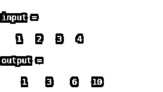
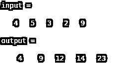
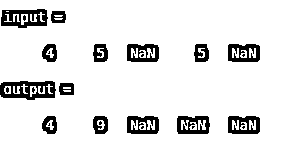
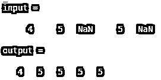
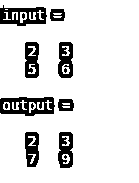
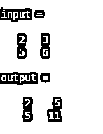
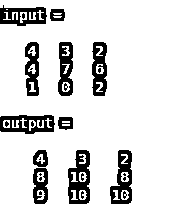

# MATLAB 总和

> 原文：<https://www.educba.com/cumsum-matlab/>

## Cumsum MATLAB 简介

Cumsum 代表元素的累积和。它通过一个数组或一组元素给出元素的总体相加。它用于一系列数字或一组随机数。累计和的输出完全取决于输入元素的性质。如果输入数字是矢量形式的，那么它只给出矢量形式的输出。如果输入数字是矩阵形式，那么它给出矩阵形式的输出。如果输入是多维形式的，那么它以多维矩阵的形式给出输出。cumsum 有三个属性，如 dim、direction 和 nanfflag，cummax 用于从输入中消除 Nan 值。

**语法**

<small>Hadoop、数据科学、统计学&其他</small>

*   **输出** =累计和(输入)输出变量名=累计和(输入变量名)
*   **输出** = cummax(输入)输出变量名= cummax(输入变量名)
*   **输出** = cumsum(输入矩阵，2)输出变量名= cumsum(多维输入，维度)
*   **输出** = cumsum(输入，反向)输出变量名(输入，方向)，方向可以是正向或反向。

### 我们为什么要用 Cumsum MATLAB？

Cumsum 是 Matlab 中一个非常有效的命令，用来做给定元素或数字的累加求和。有限元素的相加很容易，但是如果数据很大，元素很复杂，那么累计就很重要。它主要用于统计。它优于均值、平均值、方差等统计运算。

### 实现 Cumsum MATLAB 的例子

下面是提到的例子:

#### 示例#1

让我们考虑一个向量的简单例子。向量被初始化为变量输入。这里的输入值范围是从 1 到 4。由于输入是矢量的形式，那么输出也将仅仅是矢量的形式。在 output 中，output (1)的值是 input (1)，output (2)的值是 input (1)和 input (2)的相加，output (3)的值是 input (1)、input (2)和 input (3)的相加，同样，output (4)的值是 input (1)、input (2)、input (3)和 input (4)的相加。例 1 的 Matlab 程序如下。

**代码:**

`clc ;
clear all ;
input = 1 : 4
output = cumsum (input)`

**输出:**

#### 实施例 2

在这个例子中，我们考虑了向量“输入”中的一些随机值，它们是 4、5、3、2 和 9。在前面的例子中，输入值是线性的，但这些值是非线性的，cumsum 仍然执行相同的操作。由于输入是矢量的形式，那么输出也将是矢量。例 2 的 Matlab 程序如下。

**代码:**

`clc ;
clear all ;
input=[4 5 3 2 9] output = cumsum (input)`

**输出:**

#### 实施例 3

让我们考虑一个具有 NaN 值的向量。假设输入向量是 4，5，Nan，5 和 Nan，这意味着输入中总共有五个元素，因此它将显示 Nan 是 Nan 的加法，这在逻辑上是错误的。因此，我们需要忽略所有的 Nan 值。要忽略 Nan 值，有两种方法，一种是使用命令“omitnan”，另一种是使用命令“cummax”。示例 3 展示了 Matlab 中的两种实现。

**代码–不忽略 Nan 值**

`clc ;
clear all ;
input = [ 4 5 NaN 5 NaN ] output = cumsum (input)`

**输出:**

**代码–忽略 Nan 值**

`clc ;
clear all ;
input = [ 4 5 NaN 5 NaN ] output = cummax (input)`

**输出:**

#### 实施例 4

现在让我们考虑输入是矩阵的形式。假设输入是两个两个的矩阵，那么显然输出将以矩阵的形式出现，也就是多维数据。在这种情况下，我们需要再给出一个参数，该参数是 1 或 2 的维度，如果维度是 1，则矩阵加法将是列方式的(如示例 4 (a)所示)，如果维度是 2，则矩阵加法将是行方式的(如示例 4 (b)所示)。如果我们在输入时不给出任何维度，那么加法将只能是列方式的。(如实施例 4(c)所示)

**代码#1**

`clc ;
clear all ;
input = [2 3 ; 5 6] output = cumsum(input,1)`

**输出:**

**代码#2**

`clc ;
clear all ;
input = [ 2 3 ; 5 6 ] output = cumsum ( input, 2 )`

**输出:**

**代码#3**

`clc ;
clear all ;
input = [ 4 3 2 ; 4 7 6 ; 1 0 2 ] output = cumsum ( input,1 )`

**输出:**

### 结论

在本文中，我们已经看到了 cumsum 命令及其特性，如 cummax、dimensions 和 direction。Cumsum 命令接受所有类型的输入，访问输入没有限制，它接受单值、数组、向量、多维值和 Nan 值。

### 推荐文章

这是一个 Cumsum MATLAB 的指南。这里我们讨论一下 Cumsum MATLAB 的简介，语法，它是如何用例子来实现的。您也可以浏览我们的其他相关文章，了解更多信息——

1.  [Matlab 命令](https://www.educba.com/matlab-commands/)
2.  [MATLAB 中的数据类型](https://www.educba.com/data-types-in-matlab/)
3.  [Matlab 运算符](https://www.educba.com/matlab-operators/)
4.  [Matlab 逻辑运算符](https://www.educba.com/matlab-logical-operators/)

