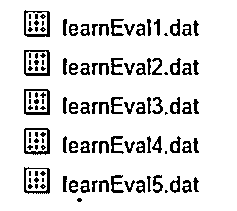
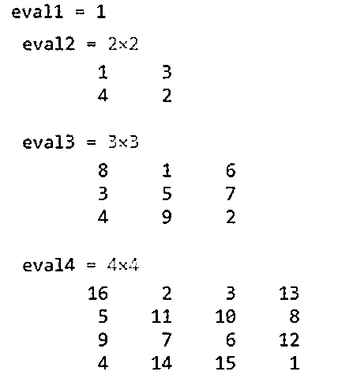
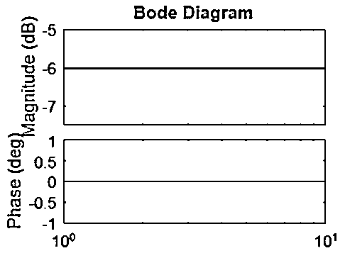

# 评估函数 MATLAB

> 原文：<https://www.educba.com/eval-function-matlab/>

## 评估函数 MATLAB 简介

以下文章提供了评估函数 MATLAB 的概述。MATLAB 是一个用于科学计算的交互式编程环境。它广泛应用于许多需要解决问题、数据分析、算法开发和实验的技术领域。特定学科的软件大量使用 MATLAB 编写。

### 什么是 Eval 命令？

MATLAB 提供的 Eval 命令是 MATLAB 中最灵活、最强大的命令之一。eval(evaluate 的缩写)用于计算 MATLAB 表达式。对于我们可以使用 MATLAB prompt 执行的所有命令，我们可以利用“eval command”来使用 M-file 执行这些命令。请记住，MATLAB 建议使用 MATLAB 语言结构和函数，而不是使用 eval 命令，因为如果我们使用 eval 命令，代码会变得难以理解和调试。

<small>Hadoop、数据科学、统计学&其他</small>

**语法:**

`[out1, out2, ..., out N] = eval (exp)`

**描述:**

*   “eval command”将计算参数中传递的表达式的输出。
*   我们可以使用括号连接子字符串和变量来构造表达式。
*   如果我们想在出错时使用 catch 表达式，我们可以使用以下语法:

`eval (exp, catch_expr)`

### MATLAB 评估函数示例

下面是提到的例子:

#### 示例#1

在本例中，我们将把数据保存到新文件中，这些文件将被递增编号。

*   声明要创建的文件的名称和扩展名。
*   使用“for 循环”创建新文件，并使用 eval 命令计算表达式。

**代码:**

newFile = ' learnEval

[Declaring the name of our files]

fileExtension = '。dat '；

[Declaring the extension of our files]

对于文件= 1 : 5

[‘for loop’ to create 5 new files]

filename = [newFile，int2str (files)，file extension]；

eval (['保存'，文件名，'文件'])

结束

[In the above code, ‘eval command’ is used to ‘save’ the newly created files with the names as defined by input variable ‘filename’]

**输入:**

`newFile = 'learnEval';
fileExtension = '.dat';
for files = 1 : 5
filename = [newFile, int2str(files), fileExtension];
eval (['save ', filename , ' files'])
end`

**输出:**

正如我们在输出中看到的，我们使用“eval command”获得了 5 个新文件，其名称和扩展名由我们传递。

#### 实施例 2

在本例中，我们将使用“for loop”和“eval command”生成 4 个矩阵的序列“eval1”、“eval2”、“eval3”和“eval4”。

*   使用“for 循环”来声明矩阵的名称，并使用“magic”命令来创建矩阵。
*   使用 eval 命令计算上面的表达式。

**代码:**

对于 n = 1:4

[‘for loop’ to create 4 matrices]

learnEval = ['eval '，int2str (n)，' = magic(n)']；

评估(学习评估)

结束

[In the above code, ‘eval command’ is used to evaluate the ‘learnEval’ expression and create 4 matrices of dimensions 1×1, 2×2, 3×3 and 4×4]

**输入:**

`for n = 1:4
learnEval = ['eval', int2str(n),' = magic (n)'];
eval (learnEval)
end`

**输出:**

正如我们在输出中看到的，我们已经使用“eval command”获得了 4 个矩阵，它们的名称和维数符合我们的预期。

#### 实施例 3

在这个例子中，我们将使用传递的分子和分母创建一个波特图。

*   求分子。
*   求分母。
*   传递上述 2 个输入和在“eval command”中创建波特图的命令。

**代码:**

numInput = input('请输入分子:')；

[Asking for the numerator]

denInput = input('请输入分母:')；

[Asking for the denominator]

eval (['bode('，mat2str (numInput)，'，'，mat2str (denInput)，')'])

[In the above code, ‘eval command’ is used to create a bode diagram using 2 inputs entered by us]

**输入:**

`numInput = input ('Please enter numerator: ');
denInput = input ('Please enter denominator: ');
eval (['bode(' , mat2str(numInput), ',' , mat2str(denInput) , ') '])`

**输出:**

**

** 

正如我们在输出中看到的，我们使用“eval command”获得了一个波特图。

#### 实施例 4

在这个例子中，我们将使用“eval 命令”来执行 3 D 数组的大小函数

**代码:**

A =个(3)；

[Initializing the input array]

A(:，:，2)= A '；

[Array1, Array2, Array3] = eval (‘size (A)’) [Defining the output variables] [In the above code, ‘eval command’ is used to execute the size function for the input array]

**输入:**

`A = ones (3);
A (:, :, 2) = A';
[Array1, Array2, Array3] = eval ('size (A)')`

**输出:**

正如我们在输出中看到的，我们使用“size function”作为“eval”中的一个命令，获得了数组的每个维度的大小。

### 结论

“Eval Command”可以在 MATLAB 中用于计算作为圆括号内的参数传递的表达式。除了表达式，输入变量也被传递以获得期望的输出。请记住，在其最新版本中，MATLAB 推荐语言结构和函数是比使用 Eval 命令更好的选择。

### 推荐文章

这是一个评估 MATLAB 函数的指南。这里我们讨论什么是 eval 命令？并分别给出了编程实例。您也可以看看以下文章，了解更多信息–

1.  [Matlab mesh()](https://www.educba.com/matlab-mesh/)
2.  [绘图矢量 Matlab](https://www.educba.com/plot-vector-matlab/)
3.  [MATLAB 缸()](https://www.educba.com/matlab-cylinder/)
4.  [Matlab stem()](https://www.educba.com/matlab-stem/)

