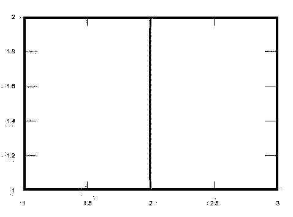
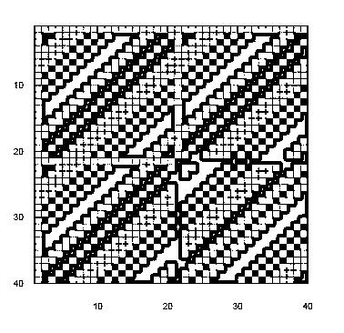
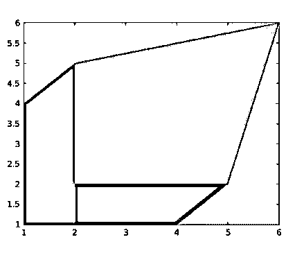
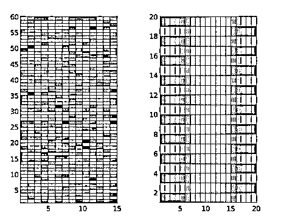
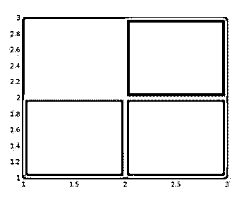
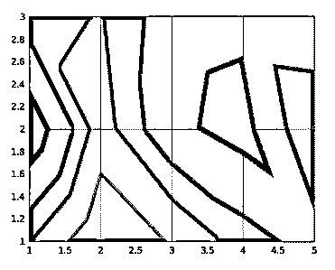
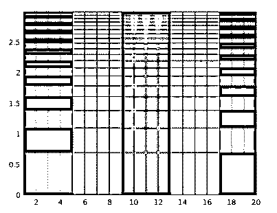
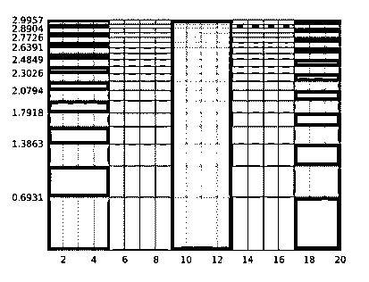

# Matlab pcolor()

> 原文：<https://www.educba.com/matlab-pcolor/>

## Matlab pcolor()简介

在 MATLAB 中，pcolor()是绘图函数，用于以彩色单元格数组的形式表示输入矩阵数据，从而创建伪彩色图。彩色细胞被称为面。该图创建为 x-y 平面平面，x 和 y 坐标作为面的顶点(角)。x 和 y 坐标的限制由输入矩阵的大小决定。

### 句法

根据提供给 pcolor()方法的输入参数，可以使用不同的语法来实现该方法。比如:

<small>Hadoop、数据科学、统计学&其他</small>

其中 C 是输入矩阵数据

`pcolor(C)`

其中 C 是输入矩阵数据

`pcolor(X,Y,C)`

*X*–顶点的 X 坐标

顶点的 Y- y 坐标

ax 定义绘图的目标轴

`pcolor(ax,___)`

将伪彩色图存储为表面对象

`s=pcolor(___)`

### Matlab pcolor()的属性

下面是属性表:

| **属性** | **描述** |
| 英语字母表中第三个字母 | 输入矩阵数据 |
| x，Y | 顶点的坐标 |
| 削减 | 绘图的目标轴 |

### 实现 Matlab pcolor()的示例

下面是提到的例子:

#### 示例#1

为输入矩阵 Cmat 创建伪彩色图。

**代码:**

`Cmat=z=[567;111213];
pcolor(Cmat);`

**输出** **:**

**解释:**输入矩阵的大小为 2×3，绘图的顶点被确定为默认数据的 2×3。也可以使用轴功能在相反方向创建伪彩色图。

#### 实施例 2

生成 Hadamard 正方形正交矩阵，并为其创建伪彩色图，原点设置在左上角。

**代码:**

`CMat = hadamard(40);
pcolor(CMat)
axis ij
axis square`

**输出:**

**说明:**生成的图形是 40X40 的双色图，反方向表示。

#### 实施例 3

在矩阵输入 X 和 y 给出的定义的 X 和 y 坐标内，为输入矩阵数据 Cmat 创建伪彩色图。

**代码:**

`Xcod=[1 2 4; 1 2 5; 1 2 6];
Ycod = Xcod';
Cmat = [2 4 3; 2 3 5; 6 5 6];
pcolor(Xcod,Ycod,Cmat)`

**输出:**

**解释:**合成图的顶点与 X 和 Y 矩阵给出的值一致，来自 Cmat 的数据在限值范围内绘制。来自输入矩阵的数据在图中用不同的颜色代码表示。

#### 实施例 4

MATLAB 支持使用 nexttile()和 tiledlayout()等函数进行绘图。以下代码用于创建 1X2 图表布局，并在布局的每个单元格中为两组不同的输入和函数创建两个不同的伪彩色图。

**代码:**

`tiledlayout(1,2)
Lx = nexttile;
LCmat = rand(60,15);
pcolor(Lx,LCmat)
Rx = nexttile;
colorscale = [1:20; 20:-1:1];
RCmat = repmat(colorscale,10,1);
pcolor(Rx,RCmat)`

**输出:**

**解释:**结果图被排列在由两个图块组成的单一布局中，这两个图块是使用函数 nexttile()生成的。

### 具有表面对象的 Pcolor()

当 pcolor()方法被赋给一个变量时，它返回一个 surface 对象。该返回值可用于在创建后自定义绘图的属性。

#### 示例#1

开发以下代码为输入矩阵创建一个伪彩色图，并在图生成后修改边缘颜色和线宽。

**代码:**

`Cmat = [1 2 3; 4 5 6; 7 8 9];
s = pcolor(Cmat);
s.EdgeColor = [0.9 0.3 0.7];
s.LineWidth = 5;`

**输出:**

**解释:**将合成的伪彩色图分配给变量‘s’。使用“s”值修改图的边缘颜色和线宽，如输出图所示。

#### 实施例 2

以下代码片段旨在创建伪彩色图，并使用表面对象属性使用插值着色修改单元的表面颜色。

**代码:**

`Cmat = [15 3 9 17 22; 31 12 24 28 14; 16 14 23 24 25];
s = pcolor(Cmat);
s.FaceColor = 'interp';`

**输出:**

**解释:**将合成的伪彩色图分配给表面对象。由于对曲面对象“s”的曲面对象特性“facecolor”进行了修改，因此面的颜色表示被修改。

### 使用 pcolor()绘制半对数图

MATLAB 绘图函数 pcolor()也可用于创建半对数伪彩色图。

#### 示例#1

下面的 MATLAB 代码设计用于创建半对数伪彩色图，并使用表面对象属性从其返回值改变外观。

**代码:**

`[X,Y] = meshgrid(1:20);
YL = log(Y);
colorscale = [1:20; 20: -1:1];
Cmat = repmat(colorscale,10,1);
s = pcolor(X,YL,Cmat);`

**输出:**

**解释:**结果输出是表面图，其中 y 坐标输入是 x 坐标输入的对数函数。从 pcolor()方法生成的伪彩色半对数图可存储为表面对象，其属性可如以下示例所示进行更改:

#### 实施例 2

**代码:**

`[X,Y] = meshgrid(1:20);
YL = log(Y);
colorscale = [1:20; 20:-1:1];
Cmat = repmat(colorscale,10,1);
s = pcolor(X,YL,Cmat);
logvals = YL(2:2:20,1)';
set(gca,'YTick',logvals);`

**输出:**

**解释:**上述代码中的绘图是通过改变表面对象的属性，使用修改后的 y 刻度值生成的。

### 使用 pcolor()进行参数绘图

pcolor()方法也支持参数函数。

#### 示例#1

下面的 MATLAB 代码用于从参数方程生成的 x-y 坐标生成伪彩色图。

**代码:**

`[Xcd,Ycd] = meshgrid(-3:6/17:3);
fX = 2*Xcd.*Ycd;
fY = Xcd.^2 + Ycd.^2;
colorscale = [1:18; 18:-1:1];
Cmat = repmat(colorscale,9,1);
pcolor(fX,fY,Cmat);`

**输出:** T3】

**解释:**结果图表示输入矩阵数据，由两个参数方程定义的 x-y 坐标值内的 repmat()函数生成。

**Note:** The size of the x-y coordinate grid must match the size of the input matrix data C. Based on the value in input matrix, the color map array gets colored from its vertices up to face surroundings.The first row gets mapped by the smallest value in C whereas the last row by the largest one, in the color map array. In case of long input array/matrix, the performance of pcolor() method seems to be slower.

### 推荐文章

这是一个 Matlab pcolor()的指南。这里我们讨论 Matlab pcolor()的介绍，带有适当的语法和相应的例子，以便更好地理解。您也可以浏览我们的其他相关文章，了解更多信息——

1.  [Matlab stem()](https://www.educba.com/matlab-stem/)
2.  [Fzero Matlab](https://www.educba.com/fzero-matlab/)
3.  [函数的 MATLAB 导数](https://www.educba.com/matlab-derivative-of-function/)
4.  [Matlab 线条样式](https://www.educba.com/matlab-line-style/)
5.  [Matlab 优化设置指南](https://www.educba.com/optimset-matlab/)

