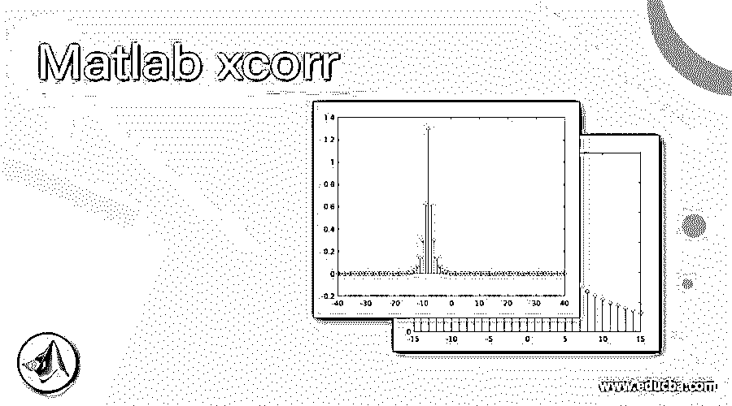
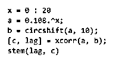
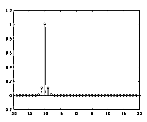
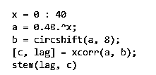
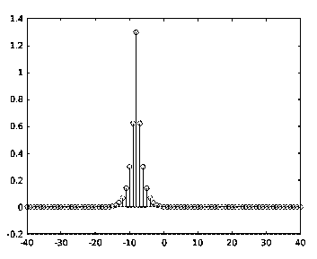
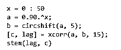
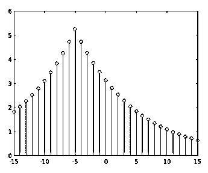
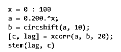
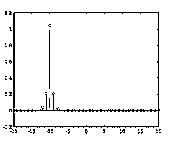

# Matlab xcorr

> 原文：<https://www.educba.com/matlab-xcorr/>

## Matlab xcorr 简介

MATLAB 的 xcorr 方法可用于计算两个本质上离散的时间序列的互相关。计算互相关的主要目的是能够使用任何入射信号或光束的一部分来检查由第二部分产生的瞬态演变。它还可以用来获得入射信号或光束本身的附加信息，否则很难测量。

**语法:**

<small>Hadoop、数据科学、统计学&其他</small>

1.  C = xcorr (a，b)用于返回两个时间序列(本质上是离散的)之间的互相关。
2.  方法“xcorr”将计算向量“a”和向量“b”的滞后副本之间的相似性
3.  C = xcorr (___，maximumlag)用于根据要求限制最大滞后

现在让我们了解如何使用“xcorr”方法在 MATLAB 中计算互相关:

### Matlab xcorr 示例

让我们讨论 Matlab xcorr 的例子。

#### 示例#1

在本例中，我们将使用 xcorr 方法来计算两个向量之间的互相关。本例中要遵循的步骤是:

1.  创建一个矢量“a”
2.  创建另一个向量“b”，从“a”移动所需的单位
3.  将上述两个向量作为参数传递给 xcorr 方法
4.  使用 stem 方法绘制输出

**代码:**

`x = 0 : 20`

**【初始化向量的大小】**

`a = 0.108.^x;`

**【初始化向量‘a’】**

`b = circshift(a, 10);`

**【初始化向量‘b’。这里我们使用了“circshift”方法来获得一个从“a”]**移动了 10 个元素的向量

`[c, lag] = xcorr(a, b);`

**【使用 xcorr 方法获得互相关】**

`stem(lag, c)`

**【使用 stem 方法绘制输出】**

**这是我们的输入和输出在 Matlab 命令窗口中的样子:**

**输入:**

**输出:**

正如我们在输出中看到的，最大的峰值出现在-10；即当 a & b 的元素完全匹配时，这与我们预期的一样。

#### 实施例 2

让我们举另一个例子，其中我们将使用 xcorr 方法来计算 2 个向量之间的互相关。本例中要遵循的步骤是:

1.  创建一个矢量“a”
2.  创建另一个向量“b”，从“a”移动所需的单位
3.  将上述两个向量作为参数传递给 xcorr 方法
4.  使用 stem 方法绘制输出

**代码:**

`x = 0 : 40`

**【初始化向量的大小】**

`a = 0.48.^x;`

**【初始化向量‘a’】**

`b = circshift(a, 8);`

**【初始化向量‘b’。这里我们使用了“circshift”方法来获得一个从“a”]**移动了 8 个元素的向量

`[c, lag] = xcorr(a, b);`

**【使用 xcorr 方法获得互相关】**

`stem(lag, c)`

**【使用 stem 方法绘制输出】**

**这是我们的输入和输出在 Matlab 命令窗口中的样子:**

**输入:**

**输出:**

正如我们在输出中看到的，最大的峰值出现在-8；即当 a & b 的元素完全匹配时，这与我们预期的一样。

在上面的两个例子中，延迟没有限制。接下来，我们将学习如何在 xcorr 方法中定义滞后

#### 实施例 3

在本例中，我们将使用 xcorr 方法来计算 2 个向量之间的互相关，并将限制最大滞后。本例中要遵循的步骤是:

1.  创建一个矢量“a”
2.  创建另一个向量“b”，从“a”移动所需的单位
3.  将上述两个向量作为参数传递给 xcorr 方法
4.  除了上面的 2 个参数，传递第 3 个和第 1 个参数来指定最大延迟
5.  使用 stem 方法绘制输出

**代码:**

`x = 0 : 50`

**【初始化向量的大小】**

`a = 0.90.^x;`

**【初始化向量‘a’】**

`b = circshift(a, 5);`

**【初始化向量‘b’。这里我们使用了“circshift”方法来获得一个从“a”]**移动了 5 个元素的向量

`[c, lag] = xcorr(a, b, 15);`

**【使用 xcorr 方法得到互相关。请注意，我们已经通过了第 3 个第 3 个参数‘15’，这代表了我们需要的最大滞后]**

`stem(lag, c)`

**【使用 stem 方法绘制输出】**

**这是我们的输入和输出在 Matlab 命令窗口中的样子:**

**输入:**

**输出:**

**正如我们在输出中看到的，信号被限制在我们预期的最大 15°延迟。**

#### 实施例 4

让我们举另一个例子，其中我们将使用 xcorr 方法来计算 2 个向量之间的互相关，并将限制最大滞后。本例中要遵循的步骤是:

1.  创建一个矢量“a”
2.  创建另一个向量“b”，从“a”移动所需的单位
3.  将上述两个向量作为参数传递给 xcorr 方法
4.  传递一个 3 rd 参数，该参数将指定最大延迟
5.  使用 stem 方法绘制输出

**代码:**

`x = 0 : 100`

**【初始化向量的大小】**

`a = 0.200.^x;`

**【初始化向量‘a’】**

`b = circshift(a, 10);`

**【初始化向量‘b’。这里我们使用了“circshift”方法来获得一个从“a”]**移动了 10 个元素的向量

`[c, lag] = xcorr(a, b, 20);`

**【使用 xcorr 方法得到互相关。请注意，我们已经通过了第 3 个第 3 个参数‘20’，这代表了我们需要的最大滞后]**

`stem(lag, c)`

**【使用 stem 方法绘制输出】**

**这是我们的输入和输出在 Matlab 命令窗口中的样子:**

**输入:**

**输出:**

**正如我们在输出中看到的，信号受到限制，最大延迟为 20，正如我们预期的那样**

### 结论

xcorr 方法可以在 MATLAB 中用于计算两个本质上离散的时间序列的互相关。如果需要，我们可以根据我们的要求限制最大滞后。

### 推荐文章

这是一个 Matlab xcorr 的指南。这里我们讨论介绍，如何在 Matlab 中计算互相关以及更好地理解的例子。您也可以看看以下文章，了解更多信息–

1.  [Matlab 表单](https://www.educba.com/matlab-forms/)
2.  [Matlab 绘图标题](https://www.educba.com/matlab-plot-title/)
3.  [Matlab fplot()](https://www.educba.com/matlab-fplot/)
4.  [Matlab 符号](https://www.educba.com/matlab-syms/)

