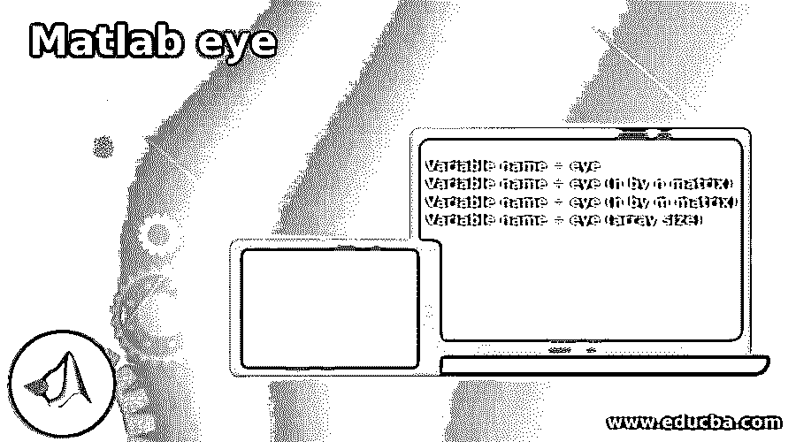
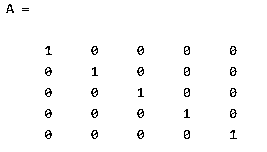
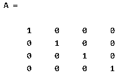
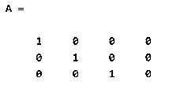
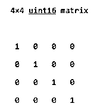

# Matlab eye

> 原文：<https://www.educba.com/matlab-eye/>

## Matlab eye 简介

Matlab 为用户提供了不同类型的函数，眼睛是 Matlab 提供的函数之一。基本上，Matlab eye()用于识别主对角线为 1 和 0 的 n 乘 n 矩阵，否则，Matlab eye()函数返回主对角线为 1 和 0 的 n 乘 m 矩阵。如果我们用 Matlab eye()函数指定大小，那么我将返回带有 1 和 0 的数组对角线。通常情况下，Matlab eye()函数用于根据不同用途的用户需求识别矩阵。

**语法**

<small>Hadoop、数据科学、统计学&其他</small>

Matlab eye()有多种语法可供使用，如下所示。

`Variable name = eye
Variable name = eye (n by n matrix)
Variable name = eye (n by m matrix)
Variable name = eye (array size)`

**解释**

在第一种语法中，我们使用不同的参数，比如变量名表示一个取决于用户的实际变量名，之后，我们使用 eye()函数。在此语法中，eye()用于返回标量 1。

在第二个例子中，我们用 eye()函数传递矩阵的大小，如上面的语法所示。这意味着它用于识别主对角线为 1 和 0 的 n 乘 n 矩阵。

在第三种语法中，我们定义 n 乘 m 大小的矩阵，它也用于返回其主对角线在其他地方是 1 和 0 的矩阵。

在第四种语法中，我们按照上面的语法定义数组大小，这意味着它在主对角线上返回 1，在其他地方返回 0。

### 眼睛在 Matlab 中是如何工作的？

现在让我们看看 eye()函数在 Matlab 中是如何工作的，如下所示。现在让我们看看 eye()函数所需的不同输入参数，如下所示。

**第一个变量(n)的尺寸大小:**

通常情况下，第一个变量的维度大小总是一个整数，它具有如下属性。

这里我们考虑 n 和 I 变量来解释。

1.  如果 n 的值只是一个整数输入参数，那么矩阵(I)是一个正方形，我们可以把它看作 n 乘 n 矩阵。
2.  如果 n 的值为零，那么我们可以认为矩阵是空的。
3.  如果 n 的值是负的，那么我们可以认为它是 0，或者我们可以把它视为 0。

它使用不同的数据类型，如 double、single、int8、int 16…直到 int64。

**第二个变量(m)的尺寸大小:**

通常情况下，第二个变量的维度大小总是一个整数，它具有如下属性。

1.  如果 m 的值是 0，那么矩阵是 0。
2.  如果 m 的值是负的，那么我们认为它是 0，或者我们可以把它视为 0。

它还使用相同的数据类型，即 double、single、int8、int 16…直到 int64。

**数组的大小(sa):**

它用于指定不超过两个整数值的行向量，并且还具有如下属性。

1.  如果大小为 0，那么我们可以认为矩阵是空的。
2.  如果大小是负的，那么我们可以认为它是 0。

它还使用相同的数据类型，如 double、single、int8、int 16…直到 int64。

### 例子

现在让我们看看 Matlab eye()函数的不同例子，以便更好地理解如下。

现在让我们看一个非常简单的 eye()函数的例子

`A = eye(5)`

**解释**

在上面的例子中，我们尝试使用 Matlab eye()函数创建一个 n 乘 n 的矩阵；这里 n 的值是 5，所以我们创建了一个 5x 5 的矩阵，A 是我们为矩阵指定的变量名。注意这里所有的对角线都是 1，其他元素都是 0。我们使用下面的屏幕截图展示了上述语句的最终输出。

类似地，我们可以使用 eye()函数创建一个正方形矩阵，如下所示。

`A = eye(4)`

**解释**

通过使用上述语句，我们尝试创建一个 4 乘 4 的正方形单位矩阵。其中所有对角线都是 1，其他元素都是 0。我们使用下面的屏幕截图展示了上述语句的最终输出。

现在我们来看另一个 eye()函数的例子如下。

`A = eye(3,4)`

**解释**

通过使用上述语句，我们尝试实现矩形矩阵。这里矩阵的大小是 3 乘 4，如上所述。我们使用下面的屏幕截图展示了上述语句的最终输出。

现在让我们看看如何创建标识向量，如下所示。

`A = [5,1] B = eye(A)`

**解释**

通过使用上述语句，我们尝试创建 5 乘 1 的身份向量。这里，我们首先指定向量的大小，然后使用 eye()函数调用向量，如下所示。我们使用下面的屏幕截图展示了上述语句的最终输出。

现在让我们看看非默认数据类型的例子，如下所示。

`A = eye (4, "uint16")`

**解释**

在上面的例子中，我们使用如图所示的 uint16 数据类型，这里我们创建了一个 4x 4 的矩阵。我们使用下面的屏幕截图展示了上述语句的最终输出。

现在我们来看一些复杂的例子如下。

`A = [2+3i, 4i] B =eye(3,'like',A)`

**解释**

通过使用上面的例子，我们尝试实现复杂的例子。在这个例子中，我们使用了一个像数组一样的复数值，或者我们可以说它不是一个实数值。我们使用下面的屏幕截图展示了上述语句的最终输出。

因此，在这里，我们可以按照我们的要求实现 Matlab eye()函数。

### 结论

我们希望你从这篇文章中学习 Matlab eye。从上面的文章中，我们学习了眼睛的基本语法，我们也看到了眼睛的不同例子。从这篇文章中，我们了解了如何以及何时使用 Matlab eye。

### 推荐文章

这是一个 Matlab 眼的指南。这里我们讨论眼睛的基本语法，我们也看到眼睛的不同例子。您也可以看看以下文章，了解更多信息–

1.  [Matlab 布尔型](https://www.educba.com/matlab-boolean/)
2.  [Matlab 单元格](https://www.educba.com/matlab-cell/)
3.  [Matlab 中的多个图](https://www.educba.com/multiple-plots-in-matlab/)
4.  [Matlab polyfit()](https://www.educba.com/matlab-polyfit/)

