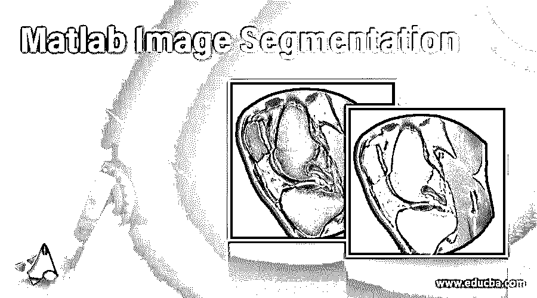
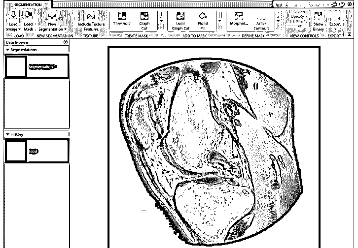
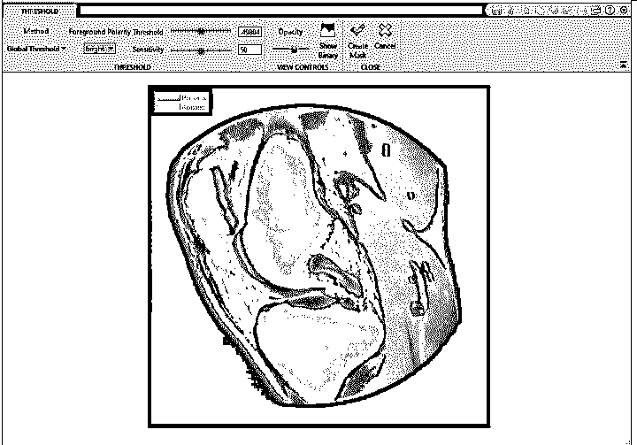

# Matlab 图像分割

> 原文：<https://www.educba.com/matlab-image-segmentation/>

## Matlab 图像分割简介

图像分割指的是一种图像处理技术，其中图像或图像中的对象被分离，这意味着其部分被分成小块。对像素进行区分，以便可以针对不同的区域和通用背景图像数据对它们进行分析。通常，它在两个测试中分析像素，测试它们如何相似地或间歇地连接到相邻的对象；此外，Matlab 根据像素的属性对其进行区分，因此它们可以被划分为一个假设场景的区域，以及放入其中的图像的输出将会如何。

作为一种现实的实现，MRI 使用这种技术来检测身体图像上可能是潜在肿瘤的不相关像素。

<small>Hadoop、数据科学、统计学&其他</small>

### 图像分割在 Matlab 中是如何工作的？

图像分割是将像素区分成特定的区域。图像分割过程允许用户划分和分开图像的不同部分，并给出使用所需部分的自由。这种技术有助于在图像生成时指出异常或检测特定问题。

有两种处理分段的方法

*   注意到不属于该模式的像素群
*   寻找相似之处。

#### 1.MATLAB 中的图像分割

Matlab 为用户提供了不止一个而是多个技术通道来分离图像。随着深入研究的发展，Matlab 已经集成了用于分割和图像分析的算法。

#### 2.用于图像分割的 Matlab 应用

Matlab 的第一个伟大特性是一个充满活力的高效的图像分割应用程序。这个应用程序预先集成了各种图像处理技术，可以通过不同的方法和系统分割您的图像。最后，您可以比较结果并选择所需的效果。

#### 3.用于颜色阈值的 Matlab 应用程序

应用不同分割技术的第二个应用是阈值处理。阈值处理意味着检测图像中的颜色组或颜色代码，并将其分离以创建特定颜色的区域。例如，您可以使用它来过滤图像和阈值化颜色，以创建遮罩或其他云图像。

##### 示例:

下面的例子演示了在图像分割应用程序中用阈值分割图像。

**步骤 1:** 将图像加载到图像片段或 App:

转到 MATLAB toolstrip >图像分割器应用程序>图像处理和计算机视觉>应用程序>单击图像分割器>加载>从工作区加载图像

**第二步:**使用阈值进行图像分割

图像分割器应用程序工具条>创建蒙版部分>点击阈值。

### Matlab 图像分割的其他方法

以下是 Matlab 图像分割的其他方法:

#### 1.绘图和制图

映射和基于图形的图像分割技术类似于图形。图表将图表或结构分成轴或方向；这里用同样的方法，把图像分为前景物质和背景静止。同样，您可以使用惰性捕捉来实现这一点，也可以使用 Matlab 中的一个简单的应用程序选项。

#### 2.群聚；聚集

聚类可见于损伤或撞击分析的图像分割中。您可以将图像分成特定标记的集群。因此，集群可以让您将标记区域与其余区域分开。

#### 3.在区域上生长线段

众所周知，图像分割包括图像中大多数基于区域的像素划分。它将一个对象作为一个图像，并在那里增加像素，以分割对象的图像。Matlab 应用程序也可以帮助你。

以上是一些流行的图像分离方法，以及 MATLAB 如何成为一个高效的平台。

#### 4.深度学习技术

顾名思义，深度学习使用语义类型的分割技术，甚至可以对单个像素进行排序并标记。这是在 CNN 的帮助下完成的。这种图像处理用于深度传感应用，例如地图、位置生成或卫星图像传输。

### 右拉自举示例

下面举几个例子

#### 示例# 1–医学图像分割

这种使用是特别必要的，并且使用图像分割的聚类技术。例如，病理学家通过分离身体组织(H&E)来寻找组织损伤或内伤。其中相同组织的簇具有相同的颜色和不一致性，出现在不同的组中。

#### 示例 2–自动驾驶汽车

当数据科学家和分析师将无人驾驶汽车或自动驾驶概念化时，他们会使用语义图像分割技术。它使用区分车辆和道路上其他干扰或物体的方法。一个特定的部分帮助车辆识别现实生活中的特定事物。

#### 示例 3–杂项

图像中的 OCR 文本检测、研究人员的微生物、检测材料中的杂质和缺陷、安全监视中的人脸检测和缺陷检测等。

### Matlab 中图像分离的优势:

*   大型数据库- Matlab 有各种各样的预装方法和图像处理技术，用于不同的计算方式。
*   Matlab 允许用户检查方法和算法，而不需要反复编译它们。
*   Matlab 通过任务的记忆和多样化的用户界面降低了图像分割的复杂性。该界面使用户能够轻松操作任何图像分割任务。
*   Matlab 为性能增强和功能改进提供定期更新。
*   Matlab 是一个伟大的平台，拥有大量的用户和一个客户端友好的社区。
*   Matlab 为新用户提供了大量免费的例子和指导。
*   Matlab 允许你阅读和分析几种图像格式和不同的图像分割输出。
*   经验丰富和训练有素的技术人员和用户响应团队总是渴望帮助用户和改进 Matlab。
*   嵌入式功能包括一个独特的编码器，一个不断增加和详细的图像分割，以及数学算法功能，结合了不同编程环境的许多元素。
*   所有功能的另一个魅力是可以自由调用第三方库，并在其图像分割应用程序中集成多种技术。
*   定制是 Matlab 的一大特色。

### 结论

Matlab 是一个高级的编程基础和平台。我们知道，图像分割在今天的时代是广泛存在的，并被用来保护和改善人类生活。当这种重要性与图像分割联系在一起时，您希望得到最好的结果。这个最好的结果可以用 Matlab 中的图像分割来实现。

### 推荐文章

这是一个 Matlab 图像分割指南。在这里，我们讨论图像分割如何在 Matlab 中工作，以及方法，例子和优势。您也可以看看以下文章，了解更多信息–

1.  [Matlab 标志](https://www.educba.com/matlab-flag/)
2.  [Matlab 图片](https://www.educba.com/matlab-images/)
3.  [简化 Matlab](https://www.educba.com/simplify-matlab/)
4.  [MATLAB 指数](https://www.educba.com/matlab-exponential/)

