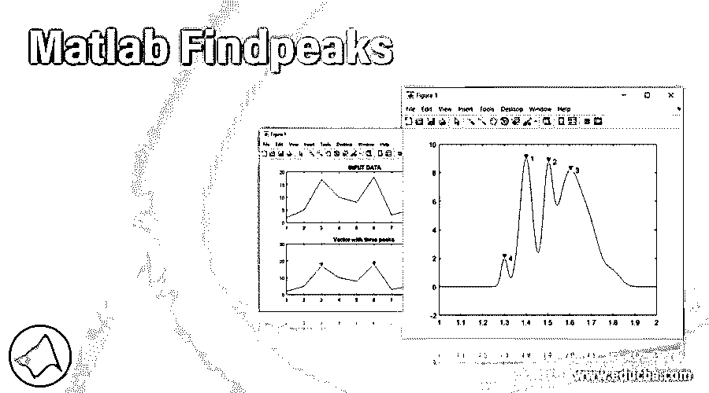
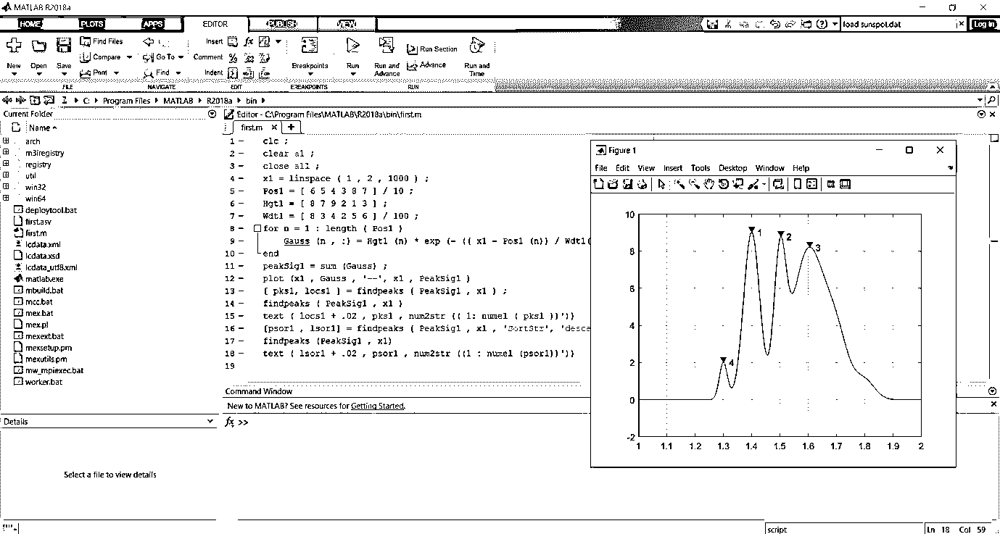

# Matlab 查找峰值

> 原文：<https://www.educba.com/matlab-findpeaks/>

## Matlab Findpeaks 简介

用于查找输入数据或信号峰值的函数称为 Matlab findpeaks。在 Matlab 中，findpeaks 语句提供了查找峰值及其不同参数(如位置、宽度等)的方法。Findpeaks 语句还可以用来显示没有输出参数或数据的峰值。findpeaks 函数查找正峰和负峰。如果峰值是平的，则该函数返回最低的索引点。findpeaks 函数使用“pks = findpeaks (data)”语法来查找输入信号向量或数据的局部峰值。

### 句法

*   pks = findpeaks(数据)
*   [pks，locs] = findpeaks(数据)
*   [___] = findpeaks(data，x)
*   [___] = findpeaks(数据，Fs)
*   查找峰值(数据)

### Matlab Findpeaks 怎么做？

为了使用 Matlab findpeaks 获得峰值，我们遵循以下步骤:-

<small>Hadoop、数据科学、统计学&其他</small>

**步骤 1:** 取一个输入信号或数据

**步骤 2:** 然后，我们使用绘图功能绘制信号或数据

步骤 3: 然后我们使用带有适当语法的 findpeaks 语句

**步骤 4:** 然后我们绘制包含输入信号局部最大值的图形

### Matlab Findpeaks 示例

下面举几个例子

#### 示例#1

让我们看看 MATLAB findpeaks 的例子。在第一个例子中，我们可以找到输入参数或数据的最大峰值。在本例中，我们将一组输入数据放入数组。array = [2 5 17 10 8 18 3 5 20 18]这是一组数据。首先，我们使用 subplot 和 plot 函数绘制输入数据。然后通过使用 findpeaks 语句，我们可以找到输入数据的最大峰值。找到最大峰值后，绘制峰值图。

**代码:**

`clc;
clear all;
close all;
array = [2 5 17 10 8 18 3 5 20 18];
subplot(2,1,1)
plot(array)
title( 'INPUT DATA')
pks = findpeaks(array)
subplot(2,1,2)
findpeaks(array)
title( 'Vector with three peaks')`

**输出:**

#### 实施例 2

让我们看一个使用 find peaks 函数查找峰值及其位置的示例，首先，我们使用“linspace”函数创建一个线性间隔的向量，我们创建一个从区间 0 到 1 的向量，并将该向量放入 x1 变量中。我们指定每条曲线的位置、宽度和高度，并将其放入 Pos1、Hgt1 和 Wdt1 中。然后我们画出单独的曲线和它们的总和。现在我们应用 findpeaks 和 revert 设置来发现信号的峰值及其位置。然后绘制信号并标记其峰值。然后我们从最高到最低对这些峰进行排序，并标记它们的峰。

**代码:**

`clc;
clear al;
close all;
x1 = linspace(1,2,1000);
Pos1 = [6 5 4 3 8 7]/10;
Hgt1 = [8 7 9 2 1 3];
Wdt1 = [8 3 4 2 5 6]/100;
for n = 1:length(Pos1)
Gauss(n,:) = Hgt1(n)*exp(-((x1 - Pos1(n))/Wdt1(n)).^2);
end
peakSig1 = sum(Gauss);
plot(x1,Gauss,'--',x1,PeakSig1)
[pks1,locs1] = findpeaks(PeakSig1,x1);
findpeaks(PeakSig1,x1)
text(locs1+.02,pks1,num2str((1:numel(pks1))'))
[psor1,lsor1] = findpeaks(PeakSig1,x1,'SortStr','descend');
findpeaks(PeakSig1,x1)
text(lsor1+.02,psor1,num2str((1:numel(psor1))'))`

**输出:**

#### 实施例 3

让我们来看一个 findpeaks 的例子，首先加载文件黑子. dat。基本上，黑子. dat 包含了从 1700 年到 1987 年每年观测到的平均黑子数。然后我们发现最大值并画出来。现在，我们通过忽略彼此相邻的峰值来更新周期持续时间的近似值。我们再次找到了峰值，并再次绘制了它。现在，超过六年的峰值受到限制，所有可接受的峰值都被分割成数值。峰值位置用于查找峰值语句，以计算峰值之间的中点。日期时间数组是使用年份数据创建的。让我们假设每年 5 月 15 日日所有的太阳光线都指向这个点。使用 Matlab findpeaks 语句寻找太阳黑子年的最大值。

使用 year 函数确定太阳黑子的最小峰值间隔。

**代码:**

`clc;
clear al;
close all;
load sunspot.dat
year1 = sunspot(:,1);
avSpots1 = sunspot(:,2);
findpeaks(avSpots1,year1)
findpeaks(avSpots1,year1,'MinPeakDistance',6)
[pks1,locs1] = findpeaks(avSpots1,year1,'MinPeakDistance',6);
meanCycle = mean(diff(locs1))
ty1 = datetime(year1,3,20);
[pk1,lk1] = findpeaks(avSpots1,ty1,'MinPeakDistance',years(6));
plot(ty1,avSpots1,lk1,pk1,'o')`

**输出:**

### 结论

在本文中，我们看到了 Matlab Findpeaks 的概念。基本上，Matlab Findpeaksis 用于查找输入信号或数据的局部峰值。然后看到了与 Matlab Findpeaks 相关的语法以及如何在 Matlab 代码中使用它。另外，我们看到了一些与 Matlab Findpeaks 语句相关的例子。

### 推荐文章

这是一个 Matlab Findpeaks 的指南。在这里，我们讨论如何做 Matlab Findpeaks 和例子以及代码和输出。您也可以看看以下文章，了解更多信息–

1.  [简化 Matlab](https://www.educba.com/simplify-matlab/)
2.  [MATLAB 指数](https://www.educba.com/matlab-exponential/)
3.  [Matlab 绘图图例](https://www.educba.com/matlab-plot-legend/)
4.  [Ceil Matlab](https://www.educba.com/ceil-matlab/)

