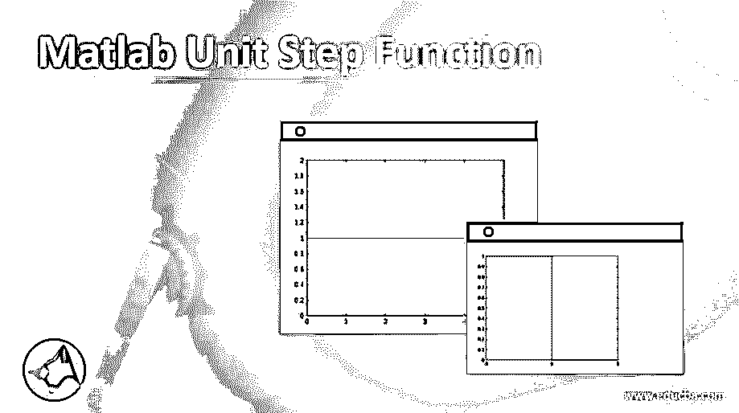
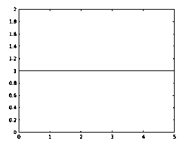
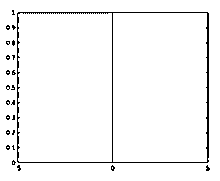

# Matlab 单位阶跃函数

> 原文：<https://www.educba.com/matlab-unit-step-function/>

## Matlab 单位阶跃函数介绍

MATLAB 单位阶跃函数用于表示信号或脉冲，而无需为各种时间范围指定单独的函数形式。单位阶跃功能用于一次性测试任何系统的低频和高频响应。单位阶跃函数从 0 到 1 的变化理论上不需要时间。单位阶跃函数通常称为亥维赛函数。

**语法:**

<small>Hadoop、数据科学、统计学&其他</small>

`H = Heaviside (t)`

**单元步骤或 Heaviside 函数的详细信息:**

1.  H = heaviside (t)用于评估“t”处的单位阶跃函数值
2.  它本质上是不连续的，并返回以下值:
    1.  如果 t < 0 则为 0
    2.  如果 t = 0，1/2
    3.  1 如果 t > 0

现在让我们了解如何在 MATLAB 中使用 Heaviside 函数或单位阶跃函数。我们将讨论做以下事情的代码:

1.  亥维赛函数的使用
2.  绘制亥维赛函数

请注意，在下面的例子中，我们将使用一个符号对象作为输入。然而，如果我们使用浮点输入，我们将得到浮点输出。因为 t < 0 and t > 0 的输出将是一个整数，所以不会有什么不同。我们可以看到输入为 t = 0 时的区别(参考例 3)。

### Matlab 单位阶跃函数示例

让我们讨论一些 Matlab 单位阶跃函数的例子:

#### 示例#1

在本例中，我们将对小于 1 的输入使用单位阶跃函数，并将看到输出。

**代码:**

`H = heaviside (sym (-10))`

**【初始化符号对象并将负数作为参数传递】**

这是我们的输入和输出在 MATLAB 中的样子:

**输入:**

**输出:**

**

** 

如我们所见，对于一个为负数的自变量，即当“t”小于 0 时，我们得到的输出为 0。

#### 实施例 2

在本例中，我们将对大于零的输入使用单位阶跃函数。

**代码:**

`H = heaviside (sym (20))`

**【初始化符号对象并传递一个正数作为参数】**

这是我们的输入和输出在 MATLAB 中的样子:

**输入:**

**输出:**

**

** 

**正如我们所看到的，我们已经获得了 1 作为正数自变量的输出，即当‘t’大于 0 时。**

#### 实施例 3

本例将对大于等于零的输入使用单位阶跃函数。这里，我们将讨论两种情况:

1.  使用符号对象
2.  不使用符号对象(使用浮点输入)

**使用符号对象时的代码:**

A =亥维赛(sym (0))

**【初始化符号对象并将零作为参数传递】**

这是我们的输入和输出在 MATLAB 中的样子:

**输入:**

**输出:**

正如我们所看到的，对于一个等于零的自变量，我们得到了 1/2 的输出。

**不使用符号对象的代码(使用浮点输入):**

H = heaviside (0)

**【将零作为参数传递给‘heav iside’函数】**

这是我们的输入和输出在 MATLAB 中的样子:

**输入:**

**输出:**

正如我们所看到的，当我们在输入中没有使用符号对象时，我们已经获得了一个浮点。

**接下来，我们将学习在 MATLAB 中绘制单位阶跃函数。**

#### 实施例 4

在本例中，我们将为 0 到 5 之间的值绘制单位阶跃函数。众所周知，单位阶跃函数在 t = 0 时给出 0.5 作为输出，在 t > 0 时给出 1，因此对于 0 到 5 之间的值，输出将从 0.5 开始(对于 t = 0)，然后对于所有大于 0 的值都是 1。

**代码；**

`syms t`

**【初始化符号对象】**

`fplot (heaviside (t), [0, 5])`

**【使用‘FP lot’函数绘制值在 0 和 5 之间的‘heav iside’函数】**

这是我们的输入和输出在 MATLAB 中的样子:

**输入:**

**输出:**

**在输出中我们可以看到，对于 0 到 5 之间的值，输出是从 0.5 开始的(对于 t = 0)，然后对于所有大于 0 的值都是 1。**

#### 实施例 5

在本例中，我们将为-5 和 5 之间的值绘制单位阶跃函数。正如我们所知，单位阶跃函数在 t < 0, 1 for t > 0 时输出为 0，在 t = 0 时输出为 0.5，因此对于-5 和 5 之间的值，输出将从 0 开始(对于 t < 0)，然后在 t = 0 时输出为 0.5，最后对于所有大于 0 的值输出为 1。

**代码:**

`syms t`

**【初始化符号对象】**

`fplot (heaviside (t), [-5, 5])`

**【使用‘FP lot’函数绘制值在-5 和 5 之间的‘heav iside’函数】**

这是我们的输入和输出在 MATLAB 中的样子:

**输入:**

**输出:**

**在输出中我们可以看到，对于-5 到 0 之间的值，输出为 0，然后当输入值在 0 到 5 的范围内时有一个从 0 到 1 的单位步长**

### 结论

单位阶跃函数几乎立即从 0 变为 1。它可以接受三个值:0、1 和。它通常用于一次性测试任何系统的低频和高频响应。

### 推荐文章

这是一个 Matlab 单位阶跃函数的指南。这里我们讨论介绍、语法和例子。您也可以看看以下文章，了解更多信息–

1.  [奈奎斯特 Matlab](https://www.educba.com/nyquist-matlab/)
2.  [Matlab 极限](https://www.educba.com/matlab-limit/)
3.  [Matlab Saveas](https://www.educba.com/matlab-saveas/)
4.  [Matlab 单元格](https://www.educba.com/matlab-cell/)

