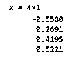
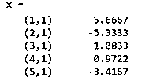

# Matlab 反斜杠

> 原文：<https://www.educba.com/matlab-backslash/>

## Matlab 反斜杠运算符

MATLAB 反斜杠运算符用于求解形式为 a*x = b 的线性方程，其中“a”和“b”是矩阵,“x”是向量。这个方程的解由 x = a \ b 给出，但只有在‘a’和‘b’的行数相等时才成立。如果行数不相等，并且' a '不是标量，我们将从 MATLAB 得到一个警告。

**反斜杠运算符的语法:**

<small>Hadoop、数据科学、统计学&其他</small>

`x = a \ b`

反斜杠运算符的详细信息:

1.x = a \ b 将对矩阵执行左除法，也称为反斜杠
2。如果' a '是一个标量，那么反斜杠运算符将执行一个元素式除法

### MATLAB 中如何使用反斜杠运算符？

现在让我们了解如何在 MATLAB 中使用反斜杠运算符。

#### 示例#1

在这个例子中，我们将在一个 3 x 3 的矩阵上使用反斜杠运算符。我们将初始化两个矩阵，一个是 3×3 矩阵，另一个是 3×1 矩阵，以创建和求解线性方程 a*x = b

**代码:**

`a = [4 6 12; 1 10 6; 14 4 3] [Initializing a 3 x 3 matrix as the first input] b = [2; 4; 7] [Initializing a 3 x 1 matrix as the second input] x = a \ b
[Using the back slash operator to solve the linear equation formed by ‘a’ and ‘b’]`

这是我们的输入和输出在 MATLAB 中的样子:

**输入:**

**输出:**

正如我们所看到的，我们已经通过使用反斜杠运算符获得了等式 a*x = b 的解作为输出

#### 实施例 2

在这个例子中，我们将在一个 4 x 4 的矩阵上使用反斜杠运算符。这里，我们也将初始化两个矩阵，一个是 4 x 4 矩阵，另一个是 4 x 1 矩阵，以创建和求解线性方程 a*x = b

**代码:**

`a = [6 1 12 2; 1 1 4 5; 4 12 3 11; 2 4 6 1] [Initializing a 4 x 4 matrix as the first input] b = [3; 4; 8; 3] [Initializing a 4 x 1 matrix as the second input] x = a \ b
[Using the backslash operator to solve the linear equation formed by ‘a’ and ‘b’]`

这是我们的输入和输出在 MATLAB 中的样子:

**输入:**

**输出:**

正如我们所看到的，我们已经通过使用反斜杠运算符获得了方程 a*x = b 的解作为输出。

#### 实施例 3

在这个例子中，我们将在稀疏矩阵上使用反斜杠运算符。请注意，稀疏矩阵是只有少量非零元素的矩阵。这里我们将初始化两个稀疏矩阵来创建和求解线性方程 a*x = b。

**代码:**

`a = sparse ([0 0 1 3 0; 0 1 4 0 0; 1 0 0 0 4; 2 1 0 0 0; 1 0 4 0 0])
[Initializing a 5 x 5 sparse matrix as the first input] b = sparse ([4; -1; -8; 6; 10])
[Initializing a 5 x 1 sparse matrix as the second input] x = a \ b
[Using the backslash operator to solve the linear equation formed by ‘a’ and ‘b’]`

这是我们的输入和输出在 MATLAB 中的样子:

**输入:**

**输出:**

正如我们所看到的，我们已经通过在稀疏矩阵上使用反斜杠运算符获得了方程 a*x = b 的解作为输出。

在上面的例子中，我们假设两个矩阵中的行数相等。接下来，让我们看看如果输入矩阵中的行数不相等会发生什么。

#### 实施例 4

在这个例子中，我们将在一个 3×3 矩阵和一个 2×1 矩阵上使用反斜杠运算符。请注意，我们取两个行数不同的矩阵。

**代码:**

`a = [1 6 22; 1 0 8; 4 14 3] [Initializing a 3 x 3 matrix as the first input] b = [2; 4] [Initializing a 2 x 1 matrix as the second input] x = a \ b
[Using the backslash operator to solve the linear equation formed by ‘a’ and ‘b’]`

这是我们的输入和输出在 MATLAB 中的样子:

**输入:**

**输出:**

正如我们所看到的，当输入矩阵中的行数不相等时，我们在输出中得到一条错误消息。

### 结论

*   反斜杠运算符用于求解 a*x = b 形式的线性方程，其中“a”和“b”是矩阵,“x”是向量。
*   它用于计算两个矩阵之间的左除。
*   为了使反斜杠运算符起作用，两个输入矩阵必须有相等的行数。

### 推荐文章

这是一个 Matlab 反斜杠指南。这里我们讨论一下入门，语法，如何在 MATLAB 中使用反斜杠运算符？代码实现示例。您也可以看看以下文章，了解更多信息–

1.  [奈奎斯特 Matlab](https://www.educba.com/nyquist-matlab/)
2.  [Matlab 极限](https://www.educba.com/matlab-limit/)
3.  [脉冲响应 Matlab](https://www.educba.com/impulse-response-matlab/)
4.  [Matlab Saveas](https://www.educba.com/matlab-saveas/)

