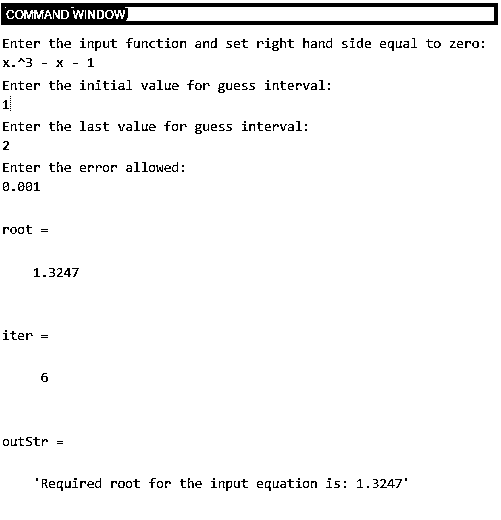
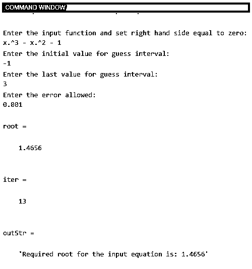
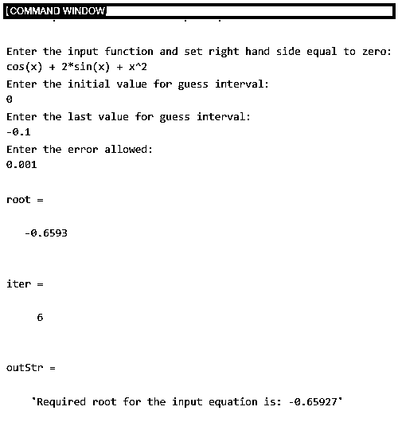

# 割线 MATLAB

> 原文：<https://www.educba.com/secant-matlab/>

## 割线 MATLAB 简介

割线法在数学中用于求方程的根。在这个主题中，我们将讨论割线 MATLAB。如果满足以下条件，此方法可用于求多项式方程(f(x) = 0)的根:

1.  根必须位于[a，b]定义的区间内
2.  函数在上述区间内必须是连续的
3.  乘积 f(a) * f(b)必须小于零。

割线法要求最初进行两次猜测。它尽可能正确地估计函数和 X 轴的交点。为此，它使用初始猜测创建一条割线，并不断重复这个过程。

<small>Hadoop、数据科学、统计学&其他</small>

### 割线 MATLAB 示例

现在让我们理解 MATLAB 中割线方法的代码:

#### 示例#1

在这个例子中，我们将采用 3 次多项式函数

**代码:**

`Z = input ('Enter the input function and set right hand side equal to zero:','s');
[Asking user to enter the function] [Enter the input function as x.^3 - x - 1] f = inline (Z);
[Calling inline command to create the function in MATLAB] A (1) = input ('Enter the initial value for guess interval:');
[Asking user to enter ‘Initial value’ which is used as the first value for 1st iteration] [Enter the first value as 1] A (2) = input ('Enter the last value for guess interval:');
[Asking user to enter ‘End value’ which is used as the last value for 1st iteration] [Enter the end value as 2] allowedError = input ('Enter the error allowed:');
[Asking user to enter tolerable error] [Pass the allowed error as 0.001] iter = 0;
[Initializing the iterations] for i = 3 : 500
A (i) = A (i-1) - (f (A ( i - 1))) * ((A (i - 1) - A (i - 2)) / (f (A (i - 1)) - f(A (i - 2))));
iter = iter+1;
if abs ((A (i)-A (i - 1)) / A (i)) * 100 <allowedError
root = A (i)
iter = iter
break
end
end
outStr = ['Required root for the input equation is: ', num2str (A (i)), '']`

**上述“if-else”循环的解释:**

1.  用最初的猜测，对通过(A(1)，f (A(1))和(A(2)，f (A(2))的函数构造一条割线。这条线的方程式是:
2.  y =[f(A(2))–f(A(1))/A(2)–A(1)]*(A–A(2))+f(A(2))
3.  “y”被替换为零以获得“A”的值
4.  “a”现在被认为是新的最终值
5.  这个迭代过程继续下去，直到我们得到根

这是我们在 MATLAB 中的输出:

**输出:**

我们已经在 6 次迭代中获得了输入函数的根 1.3247。

#### 实施例 2

在这个例子中，我们将采用另一个 3 次多项式函数。

**代码:**

`Z = input ('Enter the input function and set right hand side equal to zero:','s');
[Asking user to enter the function] [Enter the input function as x.^3 – x.^2 - 1] f = inline (Z);
[Calling inline command to create the function in MATLAB] A (1) = input ('Enter the initial value for guess interval:');
[Asking user to enter ‘Initial value’ which is used as the first value for 1st iteration] [Enter the first value as -1] A (2) = input ('Enter the last value for guess interval:');
[Asking user to enter ‘End value’ which is used as the last value for 1st iteration] [Enter the end value as 3] allowedError = input ('Enter the error allowed:');
[Asking user to enter tolerable error] [Pass the allowed error as 0.001] iter = 0;
[Initializing the iterations] for i = 3 : 500
A (i) = A (i-1) - (f (A ( i - 1))) * ((A (i - 1) - A (i - 2)) / (f (A (i - 1)) - f(A (i - 2))));
iter = iter+1;
if abs ((A (i)-A (i - 1)) / A (i)) * 100 <allowedError
root = A (i)
iter = iter
break
end
end
outStr = ['Required root for the input equation is: ', num2str (A (i)), '']`

**输出:**

我们已经在 13 次迭代中获得了输入函数的根 1.4656。

#### 实施例 3

在本例中，我们将采用余弦和正弦的多项式函数

**代码:**

`Z = input ('Enter the input function and set right hand side equal to zero:','s');
[Asking user to enter the function] [Enter the input function as cos(x) + 2*sin(x) + x^2] f = inline (Z);
[Calling inline command to create the function in MATLAB] A (1) = input ('Enter the initial value for guess interval:');
[Asking user to enter ‘Initial value’ which is used as the first value for 1st iteration] [Enter the first value as 0] A (2) = input ('Enter the last value for guess interval:');
[Asking user to enter ‘End value’ which is used as the last value for 1st iteration] [Enter the end value as -0.1] allowedError = input ('Enter the error allowed:');
[Asking user to enter tolerable error] [Pass the allowed error as 0.001] iter = 0;
[Initializing the iterations] for i = 3 : 500
A (i) = A (i-1) - (f (A ( i - 1))) * ((A (i - 1) - A (i - 2)) / (f (A (i - 1)) - f(A (i - 2))));
iter = iter+1;
if abs ((A (i)-A (i - 1)) / A (i)) * 100 <allowedError
root = A (i)
iter = iter
break
end
end
outStr = ['Required root for the input equation is: ', num2str (A (i)), '']`

**输出:**

我们已经在 6 次迭代中获得了输入函数的根-0.6593。

### 结论–割线 MATLAB

*   割线法用于求任何多项式函数的根
*   由于 MATLAB 中没有割线规则的直接函数，我们手工定义代码或逻辑。

### 推荐文章

这是割线的 MATLAB 指南。这里我们讨论割线 MATLAB 的例子以及代码和输出。您也可以看看以下文章，了解更多信息–

1.  [曲线拟合 Matlab](https://www.educba.com/curve-fitting-matlab/)
2.  [Matlab loglog()](https://www.educba.com/matlab-loglog/)
3.  [MATLAB 缸()](https://www.educba.com/matlab-cylinder/)
4.  [Matlab 正弦波](https://www.educba.com/matlab-sine-wave/)

