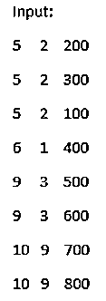
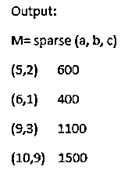
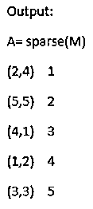

# MATLAB 中的稀疏矩阵

> 原文：<https://www.educba.com/sparse-matrix-in-matlab/>

## MATLAB 中稀疏矩阵介绍

MATLAB 中的稀疏矩阵是用来存储具有零和非零值的数据的，因此它节省了内存并有助于有效地管理数据。假设一个有 x 列 y 行的矩阵中非零值的数量比零的数量少，那么它就是稀疏矩阵。简而言之，它是包含较少非零值的矩阵。稀疏矩阵用于减少扫描时间，节省大量空间。

Matlab 中使用了两种类型的稀疏矩阵运算:

<small>Hadoop、数据科学、统计学&其他</small>

*   **计算复杂度:**等于稀疏矩阵中存在的非零元素个数。它还依赖于它的行和列的大小，但是它独立于乘积，即在包括零和非零元素的稀疏矩阵中存在的元素的数量。
*   **算法细节:**根据使用的函数和运算符，稀疏矩阵应该遵循各种规则

### 在 MATLAB 中创建和使用稀疏矩阵？

下面是稀疏矩阵的创建和使用:

*   假设我们有一个 10*10 的矩阵，其中只有 5 个非零值，其余的都是零。通常，我们需要 10*10*2=40 字节的存储器来存储这个二维矩阵，并且为了访问矩阵中存在的 5 个非零元素，我们必须扫描大约 100 次，这是不可行的并且非常耗时。
*   因此，为了克服这个问题，我们可以使用稀疏矩阵表示。通常，在稀疏矩阵中使用两种类型的表示，即三元组表示和链接表示。
*   在 Matlab 中，我们可以通过使用关键字“稀疏”来创建稀疏矩阵。

Matlab 中用于表示稀疏矩阵的语法，具有如下附加功能:

`i = Sparse(M)`

*   这是用来转换一个正常的矩阵 M 到稀疏矩阵，这将挤出零出现在矩阵中，它有助于节省内存。如果矩阵包含许多零，那么它不会自动将矩阵转换为稀疏矩阵。我们必须考虑矩阵的密度，以确定我们是否应该将矩阵转换为稀疏矩阵。
*   矩阵的密度定义为矩阵中非零元素的总数除以矩阵中值的总数。通常，具有低密度的矩阵被认为更适合将其转换成稀疏矩阵。

下面是 MATLAB 中稀疏矩阵的例子:

#### 示例#1

稀疏矩阵，如果它有重复的值。

`a = [5,5,5,6,9,9,10,10] b= [2,2,2,1,3,3,9,9] c= [200,300,100,400,500,600,700,800] [a, b, c]`

在上面的例子中，如果 ath 和 bth 值有重复的元素，那么将它们各自的值相加，并将结果值赋值。例如:在 5 对和 2 对的情况下，将值相加并分配总和。如果矩阵有这样的格式，那么它可以用和上面例子一样的方式稀疏化。

输入矩阵可以是双精度和逻辑数据类型。它还可以处理复数。稀疏矩阵意味着只存储矩阵中非零的元素，这样可以节省内存并减少计算时间。元素所需的空间与类型无关，无论它是零还是非零。它将为零和非零元素分配相同数量的内存位置。

如果矩阵很大并且有很多零，那么这就减少了存储数据所需的内存。稀疏矩阵不仅减少了存储空间，而且减少了执行时间。如果我们将法线转换成稀疏矩阵，则不执行不必要的操作，就像在稀疏矩阵中不执行低级算术计算一样，这进一步减少了计算的执行时间并提供了结果。如果它有庞大的数据，那么在执行任何表达式时，它真的很有帮助。

#### 实施例 2

要将全矩阵转换为稀疏矩阵:

`M= ([2  5  4  1  3 ] [ 4  5  1  2  3 ] [1  2   3  4  5])`

在上面的例子中，第一个元素取自两个列表，并与它们的索引相结合。我们也可以在 Matlab 中使用不同的函数从外部导入不同的稀疏矩阵。

在 Matlab 中有多种处理和访问稀疏矩阵的方法，例如:

*   **nonzeros:** 返回一个稀疏矩阵中所有非零元素，得到一个列向量。
*   **nnz:** 返回稀疏矩阵中非零值的个数。
*   **nzmax:** 返回分配给稀疏矩阵中非零元素的内存大小。

[Matlab 中的 Find 函数](https://www.educba.com/find-function-matlab/)用于查找稀疏矩阵中不为零的元素，行列索引。我们还可以在矩阵中插入或追加一行，如下例所示:

#### 实施例 3

`C = 1   2     1
3   2      2
4   5      2
5    2     1
C (3,1) = 52
[m, n, a] = find(C);
[m, n, a]`

这里，我们将一个新行插入到矩阵中，在添加额外的行之后，其他行将随之移动。我们还可以可视化稀疏矩阵的非零元素，它显示了矩阵中非零元素的分布。用于查看稀疏矩阵的非零元素的函数是“spy”函数，其中出现在图中的每个点表示稀疏矩阵中每个非零元素的位置。

### 结论

稀疏矩阵通常用于处理任何大规模的应用，主要是处理任何微分方程。我们还可以使用 Matlab 中的函数“full”将稀疏矩阵转换为全矩阵，这并不总是理想的，我们可以使用 is sparse()函数检查矩阵是稀疏矩阵还是全矩阵。

### 推荐文章

这是一个 MATLAB 中稀疏矩阵的指南。在这里，我们讨论了两种类型的稀疏矩阵，以及创建和使用各自的例子。您也可以浏览我们推荐的其他文章，了解更多信息——

1.  [MATLAB 中的 3D 矩阵](https://www.educba.com/3d-matrix-in-matlab/)
2.  [Matlab 中的颜色](https://www.educba.com/colors-in-matlab/)
3.  [MATLAB 中的复数](https://www.educba.com/complex-numbers-in-matlab/)
4.  [MATLAB 中的热图](https://www.educba.com/heatmap-in-matlab/)

