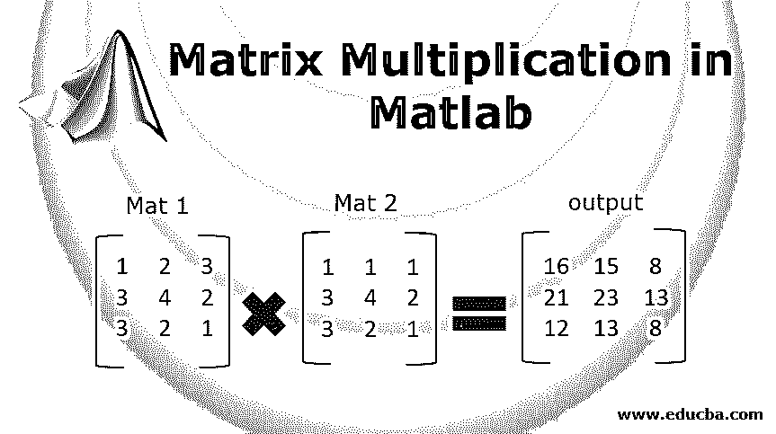
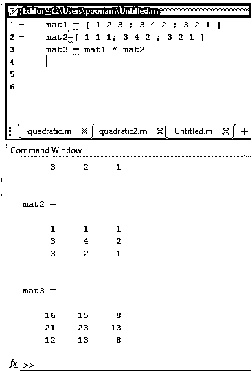
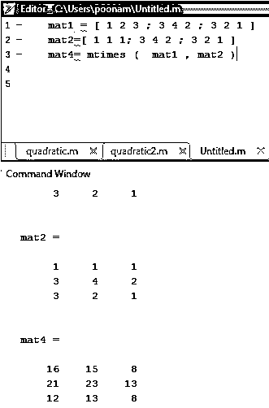
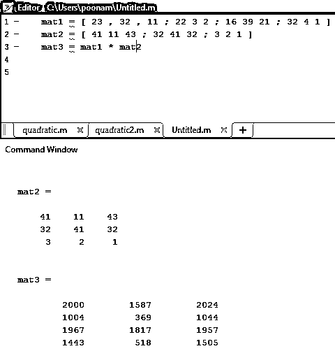
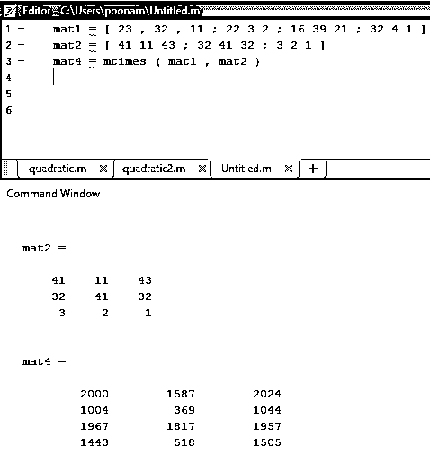
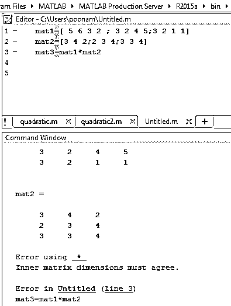

# Matlab 中的矩阵乘法

> 原文：<https://www.educba.com/matrix-multiplication-in-matlab/>

## Matlab 中矩阵乘法的介绍

Matlab 这个词代表矩阵实验室。最初，Matlab 设计用于执行矩阵运算。通过使用 Matlab，我们可以很容易地实现复杂的运算和问题。众所周知，在矩阵运算中，乘法是困难而复杂的运算之一，但是通过使用简单的命令“时间”,我们可以将两个矩阵相乘。

矩阵乘法就像数学一样有一些规律。如果有两个矩阵，那么第一个矩阵的列数应该等于第二列的行数。假设第一矩阵维数是 2 行 3 列，第二矩阵维数是 4 行 3 列，那么我们不能执行乘法，因为第一矩阵中的列数和第二矩阵中的行数不同。

<small>Hadoop、数据科学、统计学&其他</small>

### 如何在 Matlab 中进行矩阵乘法运算？

矩阵相乘有两种方法，一种是使用乘法' * '运算符。第二种方法是使用' mtimes '命令。

#### 使用' * '运算符

要将两个矩阵相乘，我们首先需要两个矩阵。我们可以直接声明矩阵，也可以接受用户的输入。以下是我们需要遵循的一些步骤:

*   **步骤 1:** 通过声明两个变量接受两个矩阵。
*   **第二步:**为输出分配 3 个 rd 变量，写一条语句为矩阵 1 *矩阵 2。
*   **第三步:**显示输出。

#### 使用“mtimes”命令

在这种方法中，不需要操作人员，我们可以直接命令输入矩阵。一条语句可以写成 mtimes(矩阵 1，矩阵 2)

*   **步骤 1:** 通过声明两个变量接受两个矩阵。
*   **第二步:**分配一个 3 rd 变量用于输出，并给出命令 mtimes。
*   **第三步:**显示输出。

### 实现矩阵乘法的示例

下面是 Matlab 中矩阵乘法的一些例子:

#### 示例#1

让我们考虑两个矩阵 mat1 和 mat2，

mat 1 =

1     2     3

3     4     2

3     2     1

mat 2 =

1     1     1

3     4     2

3     2     1

##### 使用' * '运算符

下表显示了使用“*”运算符的上述示例。

| **Matlab 编辑器** | **输出** |
| mat1 = [ 1 2 3 ; 3 4 2 ; 3 2 1 ]mat 2 =[1 1 1；3 4 2 ;3 2 1 ]mat3 = mat1 * mat2 | mat1 =1     2     33     4     23     2     1mat2 =1     1     13     4     23     2     1mat3 =16    15     821    23    1312    13     8 |

**输出:**

##### 使用“mtimes”命令

下表显示了使用“mtimes”命令的上述示例。

| **Matlab 编辑器** | **输出** |
| mat1= [ 1 2 3 ; 3 4 2 ; 3 2 1 ]mat 2 =[1 1 1；3 4 2 ;3 2 1 ]mat4= mtimes ( mat1，mat2) | mat1 =1     2     33     4     23     2     1mat2 =1     1     13     4     23     2     1mat4 =16    15     821    23    1312    13     8 |

**输出:**

#### 实施例 2

让我们考虑两个矩阵 mat 和 mat 2，

mat1 =

23    32    11

22     3     2

16    39    21

32     4     1

mat2 =

41    11    43

32    41    32

3     2     1

在上面的例子中，第一矩阵的维数是 4 行 3 列，第二矩阵的维数是 3 行 3 列，所以第一矩阵的列数等于第二矩阵的行数，所以可以执行乘法。

##### 使用' * '运算符

下表显示了使用“*”运算符的上述示例。

| **Matlab 编辑器** | **输出** |
| mat1 = [ 23 , 32 , 11 ; 22 3 2 ; 16 39 21 ; 32 4 1 ]mat 2 =[4 1 11 43；32 41 32 ;3 2 1 ]mat3 = mat1 * mat 2 | mat1 =23    32    1122     3     216    39    2132     4     1mat2 =41    11    4332    41    323     2     1mat3 =2000        1587        20241004         369        10441967        1817        19571443         518        1505 |

**输出:**

##### 使用“mtimes”命令

下表显示了使用“mtimes”命令的上述示例。

| **Matlab 编辑器** | **输出** |
| mat1 = [ 23 , 32 , 11 ; 22 3 2 ; 16 39 21 ; 32 4 1 ]mat 2 =[41 11 43；32 41 32 ;3 2 1 ]mat4 = mtimes ( mat1，mat2) | mat1 =23    32    1122     3     216    39    2132     4     1mat2 =41    11    4332    41    323     2     1mat4 =2000        1587        2024

1004         369        1044

1967        1817        1957

1443         518        1505

 |

**输出:**

#### 实施例 3

让我们假设两个矩阵是 mat1 和 mat2，

mat1 =

5     6     3     2

3     2     4     5

3     2     1     1

mat2 =

3     4     2

2     3     4

3     3     4

在上面的例子中，第一矩阵的维数是 3 行 4 列，第二矩阵的维数是 3 行 3 列，所以第一矩阵的列数不等于第二矩阵的行数，所以乘法不能执行。

| **Matlab 编辑器** | **输出** |
| mat1= [ 5 6 3 2 ; 3 2 4 5 ; 3 2 1 1 ]mat 2 =[3 4 2；2 3 4 ;3 3 4 ]mat3= mat1 * mat2 | mat1 =5     6     3     23     2     4     53     2     1     1mat2 =3     4     22     3     43     3     4使用*时出错内部矩阵尺寸必须一致。 |

**输出:**

### 结论

矩阵乘法在数学中是非常困难和复杂的运算，但我们在 Matlab 中实现了同样的运算，我们可以很容易地得到没有错误的输出。用于矩阵乘法的两种方法都易于实现。它使程序更有效率。

### 推荐文章

这是一个 Matlab 中矩阵乘法的指南。这里我们讨论如何在 Matlab 中执行矩阵乘法，并给出例子。您也可以阅读以下文章，了解更多信息——

1.  [Java 中的矩阵乘法](https://www.educba.com/matrix-multiplication-in-java/)
2.  [MATLAB 中的 3D 矩阵](https://www.educba.com/3d-matrix-in-matlab/)
3.  [Matlab 中的矩阵](https://www.educba.com/matrix-in-matlab/)
4.  [Matlab 和运算符](https://www.educba.com/matlab-and-operator/)

