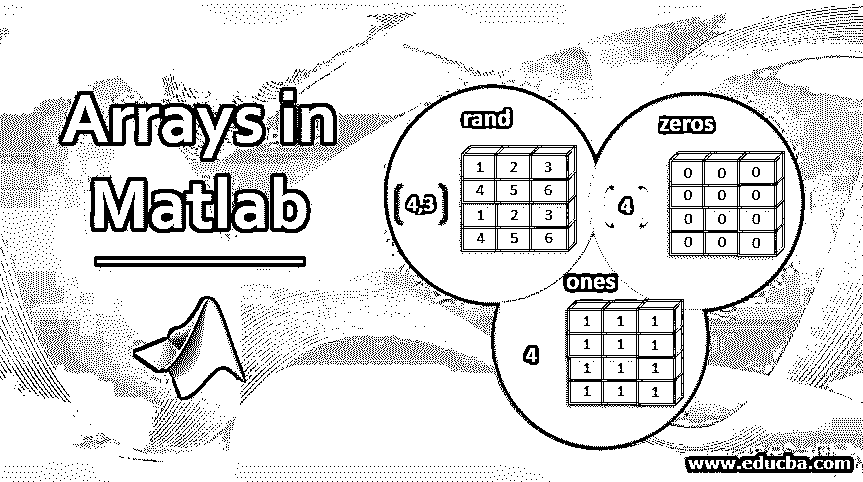
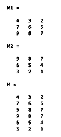
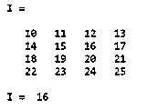
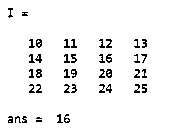
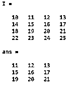
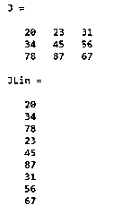
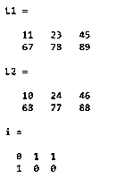

# Matlab 中的数组

> 原文：<https://www.educba.com/arrays-in-matlab/>

## Matlab 中的数组介绍

数组是存储在内存中的数字或字符串的集合。每个元素是一个具有索引号的数组，索引从第 0 个位置开始，并且可以被称为数组中的第一个元素。在 Matlab 中，我们使用一个数组，它可以收集数字，并可以通过索引来访问。Matlab 中有各种特殊的函数来执行类似数组的零()、诊断()、一()等操作。

### Matlab 中数组的各种运算

[MATLAB](https://www.educba.com/what-is-matlab/) 中的多维数组有二维或更多维。在二维中，阵列中的元素可以通过使用行和列来表示，而在三维或更多维中，使用元素的薄片或页面。在数组中可以执行许多操作。请查找以下示例供您参考:

<small>Hadoop、数据科学、统计学&其他</small>

**举例:**

M1= [4，3，2；7,6,5;9,8,7]

这是三维数组的第一页。我们还可以通过使用“猫”功能继续添加页面。

M=cat(维度，M1)

这里，

*   M =新数组。
*   Dimension =追加数组的维度。
*   M1 =要连接的数组。

`M1 = [4,3,2;7,6,5;9,8,7] M2 = [9,8,7;6,5,4;3,2,1] M = cat (1,M1,M2)`

**输出:**

我们还可以使用各种函数，如 rand()、ones()、zeroes()函数来创建多维数组。

#### 1.兰德()

这个函数用来创建一个从 0 到 1 的随机分布的数组。

rand (4，3): 这将创建一个 4 行 3 列的随机数数组。

**举例:**

`rand (4,3)`

**输出:**

#### 2.零()

该函数用于根据行数和列数创建一个零数组。

**zeros (4):** 这将创建一个由零组成的数组。

**举例:**

`zeros(4)`

**输出:**

#### 3.个()

这个函数根据指定的数字创建一个 1 的数组。

**1(4):**这将创建一个 1 的数组。

**举例:**

`ones (4)`

**输出:**

### 使用数组的示例

我们也可以在 MATLAB 中创建包含字符组合的字符数组。像数字数组一样，也有各种可以使用字符数组执行的操作。我们总是可以通过使用 char 函数将数组转换为字符数据类型。

数组是 MATLAB 的，可以通过以下不同的索引方法进行索引:

#### 1.按位置索引元素

这种方法用于通过指定行号和列号来查找单个元素，从而找到数组的元素。我们还可以通过指定行号和元素在相应行中的位置来访问多个元素。我们还可以通过指定行和列的范围来访问元素的范围。请查找以下示例，以便更好地理解:

**举例:**

`I = [10,11,12,13;14,15,16,17;18,19,20,21;22,23,24,25] I= 4*4`

**输出:**

*   要查找数组中的单个元素:

`I (2,3)`

**输出:**

这给出了第二行的第三个元素。

*   要查找数组中的多个元素:

`I (2, [1,2])`

**输出:**

这给出了第二行的第一个和第二个元素。

*   要查找数组中元素的范围:

`I (1:3,2:4)`

**输出:**

#### 2.借助于单个索引进行索引

不管在语法中提到行和列，我们可以直接提到单个索引并找到元素。这种方法也称为线性索引。在这里，元素将存储在一个单独的列中。请参考下面的例子:

**举例:**

`J= [20,23,31; 34,45,56;78,87,67] JLin=J (:)`

这里，它将上述元素存储在一列中。

**输出:**

我们可以通过使用一个索引号来访问元素，比如 JLin (5)给出 45。

#### 3.使用逻辑值进行索引

在使用条件语句时，我们使用逻辑值的索引，如 true 或 False，我们可以找到具有 True 值的元素。请找到下面的例子

**举例:**

`L1 = [11,23,45;67,78,89] L2 = [10,24,46;68,77,88] i=L1<L2`

**输出:**

这将使用条件语句(L1

`Pos= L1(i)`

**输出:**

`Pos= L2(i)`

**输出:**

### 结论

使用各种编程语言[中的数组](https://www.educba.com/what-is-a-programming-language/)使得手工任务变得容易，并被程序员所使用。使用类数组有很多优点:访问数组中的元素很容易，可以使用简单的步骤来执行，程序中没有性能问题，内存使用得当，执行速度快，有助于使用堆栈、链表、树等实现程序。

### 推荐文章

这是 Matlab 中的数组指南。在这里，我们讨论的基本概念，Matlab 中的数组操作，以及各种例子和它的实现。您也可以浏览我们推荐的文章，了解更多信息——

1.  [什么是 Repmat Matlab？](https://www.educba.com/repmat-in-matlab/)
2.  [Matlab 创建函数的优势](https://www.educba.com/matlab-create-function/)
3.  [用语法](https://www.educba.com/matlab-gradient/)在 Matlab 中处理梯度
4.  [转置矩阵 Matlab 示例](https://www.educba.com/transpose-matrix-matlab/)
5.  [Matlab Comet() |步骤和方法](https://www.educba.com/matlab-comet/)

