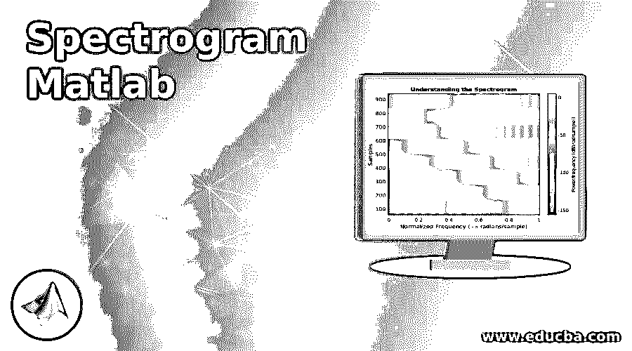
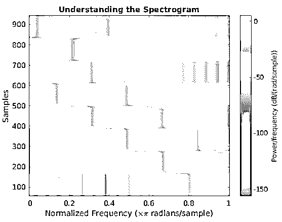
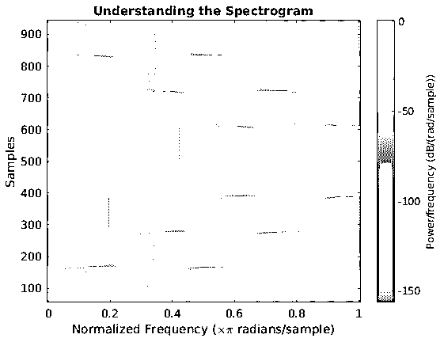
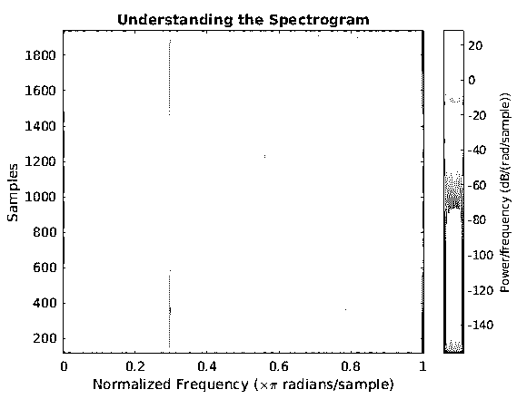
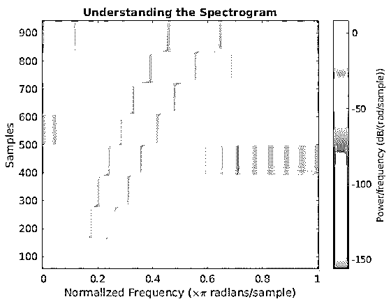

# 频谱图 Matlab

> 原文：<https://www.educba.com/spectrogram-matlab/>

## Matlab 中的声谱图介绍

MATLAB 是一个交互式的编程环境，用于科学计算。它广泛应用于许多需要解决问题、数据分析、算法开发和实验的技术领域。具体学科的软件广泛使用 MATLAB 编写。在本文中，我们将研究 MATLAB 中的声谱图函数。在我们看到频谱图函数在 MATLAB 中是如何使用的之前，让我们快速刷新一下对频谱图的理解。

频谱图提供了信号强度的详尽图片。这是频率、时间和振幅的单一图形视图。频谱图用于直观地显示信号中的电噪声、宽带噪声或间歇噪声。这进一步帮助我们隔离信号中的噪声或其他问题。声谱图在后期制作中非常有用，因为它提供了细节层次。频谱图也用于显示机器、动物、飞机等产生的声波的频率。现在让我们学习如何频谱图函数在 Matlab 中工作。

<small>Hadoop、数据科学、统计学&其他</small>

**语法:**

下面是频谱图 Matlab 的语法:

`s = spectrogram (z)`

**解释:** s = spectrogram (z)将返回作为自变量传递的信号‘z’的短时 Ft(傅里叶变换)。在输出中，每一列将包含输入信号“z”的时间局部化和短期频率内容的估计。此外，默认情况下，“z”将被分为 8 段。如果做不到，则“z”将被截断。

### 频谱图 Matlab 实现实例

现在让我们借助几个例子来理解谱图函数。

#### 示例#1

在第一个例子中，我们将创建二次啁啾的频谱图:

**代码:**

`time = 0: 0.002: 2;
z = chirp (time, 200,1, 400);
spectrogram (z);
title ('Understanding the Spectrogram')`

**输出:**

**说明:**首先，使用 chirp 函数创建输入二次啁啾。该输入啁啾将以 200 Hz 的频率开始，并在时间= 1 秒时超过 400 Hz。调用声谱图函数。给输出加上标题。

#### 实施例 2

现在让我们用线性啁啾代替二次啁啾，看看代码是什么样子的:

**代码:**

`time = 0: 0.002: 2;
z = chirp (time, 0, 1, 250);
spectrogram (z);
title ('Understanding the Spectrogram');`

**输出:**

**说明:**首先，使用 chirp 函数创建输入线性啁啾。该输入啁啾将以 0 Hz 的频率开始，并在时间= 1 秒时超过 250 Hz。调用声谱图函数。给输出加上标题。

#### 实施例 3

在下一个示例中，我们将创建 2056 个余弦波信号样本，并查看频谱图的代码:

**代码:**

`samples = 2056;
n = 0: samples-1;
NF = 4 * pi/7;
z = cos (NF * n) + 5 * cos (3 * NF * n);
spectrogram (z);
title ('Understanding the Spectrogram');`

**输出:**

**解释:**首先明确所需样本数。定义归一化频率。产生包含两个余弦波之和的输入信号。调用声谱图函数。给输出加上标题。

#### 实施例 4

在本例中，我们将看到使用频谱图创建对数啁啾的代码在 MATLAB 中的样子:

**代码:**

`time = 0: 0.002: 2;
z = chirp (time, 40, 1, 80, 'logarithmic');
spectrogram (z)
title ('Understanding the Spectrogram')`

**输出:**

**说明:**首先，使用啁啾函数创建输入对数啁啾。该输入啁啾将以 40 Hz 的频率开始，并在时间= 1 秒时超过 80 Hz。调用声谱图函数。给输出加上标题。

### 结论

正如我们在上面的例子中看到的，光谱图是二维图形，第 3 个维度用颜色表示。在本文中，我们学习了如何在 MATLAB 中使用 spectrogram 函数创建光谱图。频谱图在地震研究中非常常用，用于查看由多个或单个地震仪记录的与连续信号相关的频率内容。这有助于区分和描述各种类型的地球振动或地震。

### 推荐文章

这是一个声谱图 Matlab 指南。在这里，我们讨论了频谱图 Matlab 的介绍，语法，代码和输出的例子。您也可以浏览我们的其他相关文章，了解更多信息——

1.  [Matlab 绘图颜色](https://www.educba.com/matlab-plot-colors/)
2.  [MATLAB 导数](https://www.educba.com/matlab-derivative/)
3.  [条形图 Matlab](https://www.educba.com/bar-plot-matlab/)
4.  [傅立叶级数 Matlab](https://www.educba.com/fourier-series-matlab/)

