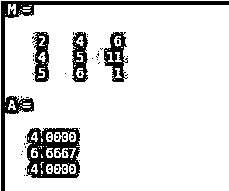

# Matlab 平均值

> 原文：<https://www.educba.com/matlab-average/>

## Matlab 平均值介绍

在统计学和数学中，平均值的计算方法是将任何一组对象或值相加，然后将该和除以几个对象或值。平均值也称为“平均值”。任何数据的平均值为我们提供了集中趋势的概念，也就是说，它帮助我们对数据集中的典型值有一个直觉。在 MATLAB 中，我们使用“mean”函数来求平均值。

例如，如果一组 5 个人的年龄分别是 22、26、34、27 和 45 岁，则平均年龄为(22 + 26 +34 + 27 + 45) / 5 = 30.8

<small>Hadoop、数据科学、统计学&其他</small>

**语法:**

下面是 Matlab 平均的语法:

`A = mean (M)`

**解释:** A = mean(M)将返回数组 M 中所有元素的平均值。对于矩阵 M，A = mean(M)将以行向量的形式返回 M 中每一列的平均值

### 实现 Matlab 平均值的示例

现在让我们用不同的例子来理解 MATLAB 中均值函数的代码:

#### 示例#1

在本例中，我们将采用一个 2 x 2 矩阵，并使用 mean 函数求出其平均值。

对于我们的第一个示例，我们将遵循以下步骤:

1.创建 2 x 2 矩阵

2.将输入矩阵作为参数传递给均值函数

**代码**

`M = [0   5; 3   6;] A = mean (M)`

**输出:**

**解释:**首先，创建 2 x 2 矩阵。将矩阵“M”作为输入传递给均值函数。mean 函数将查找每列中元素的平均值，并将返回一个 1 x 2 行的向量。数学上，第 1 列和第 2 列元素的平均值分别为 1.5 和 5.5。正如我们在输出中看到的，我们获得了第 1 列的平均值为 1.5，第 2 列的平均值为 5.5，这与我们的预期相同。

#### 实施例 2

在本例中，我们将采用一个 3 x 3 的矩阵，并使用 mean 函数求出其平均值。

对于此示例，我们将遵循以下步骤:

1.创建 3 x 3 矩阵

2.将输入矩阵作为参数传递给均值函数

**代码:**

`M = [3  5  9; 3   2  1; -4  5  8] A = mean (M)`

**输出:**

**解释:**首先，创建 3×3 矩阵。将矩阵“M”作为输入传递给均值函数。mean 函数将查找每一列中元素的平均值，并将返回一个 1 x 3 行的向量。数学上，第 1、2 和 3 列元素的平均值分别为 0.6667、4 和 6。正如我们在输出中看到的，我们已经获得了第 1 列的平均值为 0.6667，第 2 列为 4，第 3 列为 6，这与我们预期的相同。

在上面的两个例子中，平均值是沿着每一列计算的，因为默认情况下，这就是 mean 函数的工作方式。接下来，我们将学习如何使用 mean 函数求出矩阵各行的平均值。

#### 实施例 3

在本例中，我们将采用一个 2 x 2 矩阵，并使用 mean 函数沿行计算其平均值。

对于此示例，我们将遵循以下步骤:

1.创建 2 x 2 矩阵。

2.将输入矩阵作为第一个参数传递给均值函数。

3.将第二个参数作为“2”传递。

**代码:**

`M = [5   2; 4   11;] A = mean (M, 2)`

**输出:**

**解释:**首先，创建 2 x 2 矩阵，将矩阵‘M’作为第一个参数传递给均值函数。传递第二个参数“2”是为了确保沿着矩阵的行计算平均值。mean 函数将查找每行中元素的平均值，并将返回一个 2 x 1 行的向量。数学上，第 1 行和第 2 行元素的平均值分别是 3.5 & 7.5。正如我们在输出中看到的，我们获得了第 1 行的平均值为 3.5，第 2 行的平均值为 7.5，这与我们的预期相同。

#### 实施例 4

在本例中，我们将采用一个 3 x 3 的矩阵，并使用 mean 函数求出其行平均值。

对于此示例，我们将遵循以下步骤:

1.创建 3 x 3 矩阵

2.将输入矩阵作为第一个参数传递给均值函数

3.将第二个参数作为“2”传递

**代码:**

`M = [2   4   6; 4    5   11; 5   6   1] A = mean (M, 2)`

**输出:**

**解释:**首先，创建 3×3 矩阵。将矩阵“M”作为第一个参数传递给均值函数。传递第二个参数“2”是为了确保沿着矩阵的行计算平均值。mean 函数将查找每行中元素的平均值，并将返回一个 3 x 1 行的向量。数学上，第 1、2、3 行元素的平均值分别是 4、6.6667 & 4。正如我们在输出中看到的，我们已经获得了第 1 行的平均值为 4，第 2 行的平均值为 6.6667，第 3 行的平均值为 4，这与我们预期的相同。

### 结论

在 MATLAB 中，mean 函数用于计算一个矩阵或数组的平均值。默认情况下，mean 函数会计算输入矩阵中各列的平均值。如果我们需要矩阵各行的平均值，我们可以传递第二个参数“2”

### 推荐文章

这是一个 Matlab 平均指南。在这里，我们讨论了 Matlab 的平均介绍，语法，代码，输出和解释的例子。您也可以浏览我们的其他相关文章，了解更多信息——

1.  [MATLAB 指数](https://www.educba.com/matlab-exponential/)
2.  [Ceil Matlab](https://www.educba.com/ceil-matlab/)
3.  [Matlab 绘图颜色](https://www.educba.com/matlab-plot-colors/)
4.  [MATLAB 导数](https://www.educba.com/matlab-derivative/)

