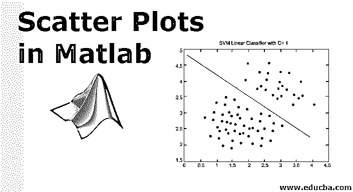
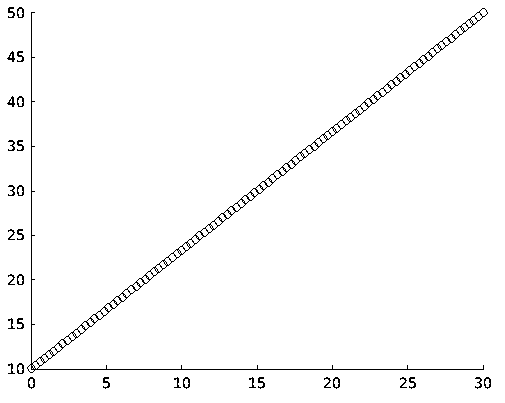
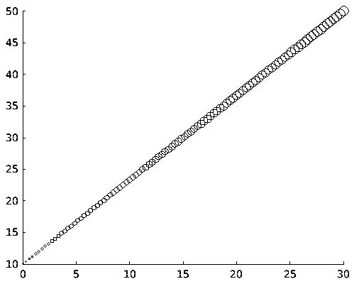
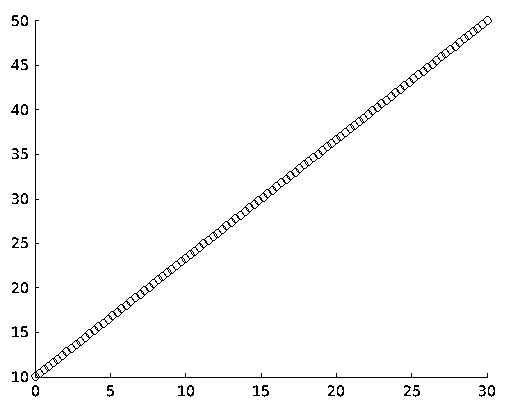
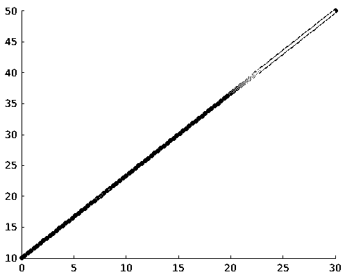
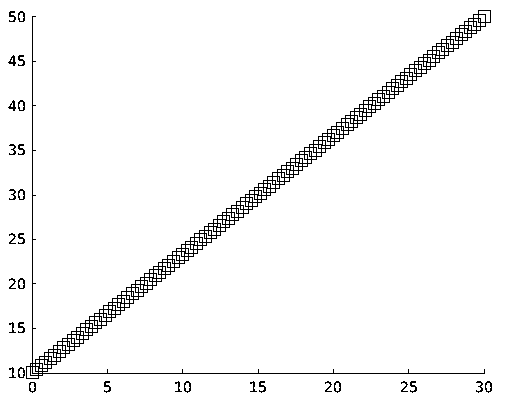
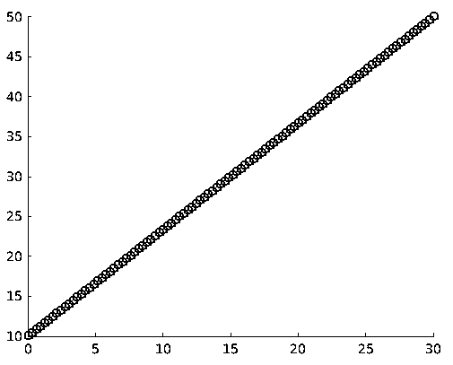

# Matlab 中的散点图

> 原文：<https://www.educba.com/scatter-plots-in-matlab/>

## Matlab 中散点图的定义

MATLAB 是一种用于技术计算的语言。我们大多数人都会同意，一个易于使用的环境是集成计算、可视化和最终编程任务所必需的。MATLAB 通过提供一个不仅易于使用，而且我们得到的解以我们大多数人都熟悉的数学符号的形式显示出来的环境来做同样的事情。在本主题中，我们将学习 Matlab 中的散点图。

**MATLAB 的用途包括(但不限于):**

<small>Hadoop、数据科学、统计学&其他</small>

*   计算
*   算法的发展
*   系统模型化
*   模拟
*   样机研究
*   数据分析(数据的分析和可视化)
*   工程和科学制图
*   应用开发

MATLAB 为它的用户提供了一篮子函数，在本文中我们将了解一个强大的函数，叫做“散点图函数”

**散点图函数语法:**

`scatter(a, b)
scatter(a, b, z)
scatter(a, b, z, c)
scatter(___, 'filled')
scatter(___, mkr)
scatter(___, Name, Value)`

现在让我们逐一了解这一切:

### MATLAB 中散点图的描述

下面是 MATLAB 中散点图的描述

#### 1.散布(a，b)

*   这个函数将帮助我们在函数中提到的“a”和“b”向量的指定位置绘制一个带有圆圈的散点图
*   这种类型的图表也被称为“气泡图”

例:让我们定义两个变量 a & b

`a = linspace(0, 30, 100);        [This will create 100 values between 0 and 30, all equally spaced] b = linspace(10, 50, 100);      [This will create 100 values between 10 and 50, all equally spaced] scatter(a, b)`

**解:**在 MATLAB 中我们会得到如下的图形

#### 2.散点图(a，b，z)

该功能将设定圆的尺寸。

在图表中，使用此功能可以创建以下圆形尺寸:

*   相等大小的圆:要创建具有相等大小的圆的图，请将函数中的“z”参数定义为标量
*   不同大小的圆:要创建具有不同大小的圆的图，请将函数中的“z”参数定义为向量，向量的长度等于“a”和“b”的长度

**例子**

为了更好地理解，让我们举一个和前面的解释一样的例子

`a = linspace(0, 30, 100);
b = linspace(10, 50, 100);
z = linspace(1, 100, 100); [Here we are passing the z parameter as a vector, so our graph will have circles of different sizes] scatter(a, b, z)`

**解**:我们会在 MATLAB 中得到如下图形

我们可以清楚地看到图中的圆圈大小不同。这样做的意义在于，我们会立即将注意力转移到更高的价值上。

#### 3.散点图(a，b，z，c)

该函数将定义图表中要绘制的圆圈的颜色。

这将有助于指定颜色，如下所示:

*   对于具有相同颜色的圆，将“c”定义为 RGB 三色组的颜色名称
*   对于不同颜色的圆，将“c”定义为 RGB 三元组或向量上的三色矩阵

**举例:**

`a = linspace(0, 30, 100);
b = linspace(10, 50, 100);
c = linspace(1, 10, length(x));
scatter(a, b, [ ], c)`

**解**:我们会在 MATLAB 中得到如下图形

这里，a、b 和 c 中的元素将决定圆圈的位置和颜色。然后散布函数将帮助将 c 中存在的元素映射到颜色图中存在的颜色。

我们可以清楚地想象出颜色变化的圆圈。这有助于我们根据需要区分更高和更低的值

#### 4.散点图(___，'已填充')

现在，如果我们需要所有这些圆都是实心的，或者换句话说，用颜色填充。该功能将有助于填充圆。我们只需要在函数中传递参数“filled ”,就可以填充散点图中的圆。

**举例:**

`a= linspace(0, 30, 100);
b = linspace(10, 50, 100);
z = 25;
c = linspace(1,10, length(a));
scatter(a, b, z, c, 'filled')</code?`

**解:**在 MATLAB 中我们会得到如下的图形

#### 5.散点(___，mkr)

散点图的默认形状是圆形。如果我们需要一些其他形状，如正方形，这个功能可以使用。我们只需要指定标记，例如，我们可以在函数中使用参数“s”得到正方形。

**举例:**

`a = linspace(0, 30, 100);
b = linspace(10, 50, 100);
z = 140;
scatter(a, b, z, ‘s’)`

**解:**在 MATLAB 中我们会得到如下的图形

#### 6.散点图(___，名称，值)

此函数将修改参数中提到的“名称”和“值”对的散点图。例如线宽，1 将在图中以 1 毫米为单位设置圆的轮廓。同样，“标记颜色”将用于改变圆圈的轮廓颜色。

**举例:**

`a= linspace(0, 30, 100);
b = linspace(10, 50, 100);
sz = 40;
scatter(a, b, sz, 'MarkerEdgeColor', [0 .5 .5],...
'LineWidth', 1.5)`

**解:**在 MATLAB 中我们会得到如下的图形

在这里，我们可以清楚地看到，轮廓的颜色发生了变化，宽度现在也是 1.5

*   散点图是非常方便的图表，可以通过可视化来获得数据的外观和感觉
*   散点图可用于显示数据值之间是否存在任何关系
*   例如，值集中在特定区域的散点图表示数据集中的大量值属于该区域
*   它还有助于可视化数据中的异常值
*   类似地，在我们使用的例子中，我们能够可视化变量之间的线性关系。
*   是的，如果所有的值都是分散的，不遵循任何模式，我们可以肯定，我们使用的变量之间几乎没有任何关系。

### 推荐文章

这是一个 Matlab 散点图指南。这里我们讨论 MATLAB 在散点图描述中的应用。你也可以看看下面这篇文章。

1.  [Matlab 的优势](https://www.educba.com/advantages-of-matlab/)
2.  [Matlab 中的均值函数](https://www.educba.com/mean-function-in-matlab/)
3.  [Matlab 中的滤波函数](https://www.educba.com/filter-function-in-matlab/)
4.  [Matlab 中的矩阵](https://www.educba.com/matrix-in-matlab/)
5.  [R | Types | Examples 中的绘图函数](https://www.educba.com/plot-function-in-r/)
6.  [学习 MATLAB 绘图功能](https://www.educba.com/matlab-plot-function/)
7.  [Linspace MATLAB 完全指南](https://www.educba.com/linspace-matlab/)
8.  [学习算法实现 Matlab 线宽](https://www.educba.com/matlab-linewidth/)

