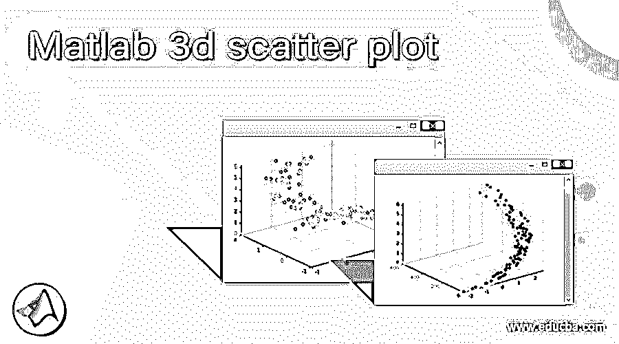
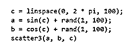
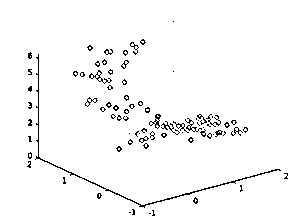
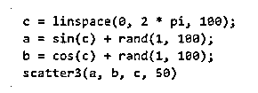
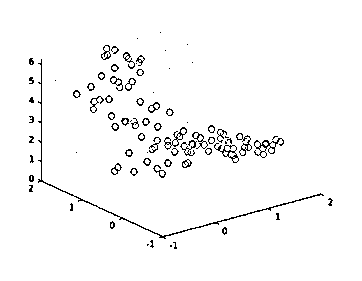
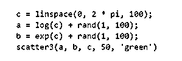
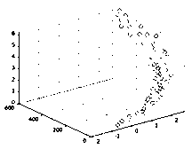
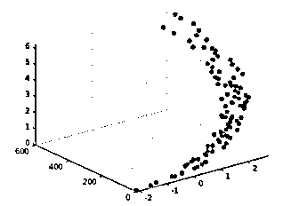

# Matlab 3d 散点图

> 原文：<https://www.educba.com/matlab-3d-scatter-plot/>

## Matlab 三维散点图简介

三维散点图用于显示笛卡尔坐标中 3 个变量之间的关系。3 D 散点图用于解释数据的分布并识别任何异常值。散点图在数据科学中非常有用，其中测试数据中的关系用于创建预测输出的算法。在 MATLAB 中，我们使用带有 3 个参数的 scatter3()函数来创建 3D 绘图。在本主题中，我们将学习 Matlab 3d 散点图。

**散射 3 函数的语法:**

<small>Hadoop、数据科学、统计学&其他</small>

1.  分散 3 (a，b，c)
2.  分散 3 (a，b，c，Z)
3.  分散 3 (a，b，c，Z，Y)

**散射 3 功能描述:**

1.  散点图 3 (a，b，c)用于为输入向量 a，b，c 创建散点图。默认情况下，MATLAB 散点图将数据点绘制为圆形
2.  scatter3 (a，b，c，Z)用于创建输入向量 a，b，c 的散点图，圆圈的大小由参数“Z”定义
3.  scatter3 (a，b，c，Z，Y)用于创建输入向量 a，b，c 的散点图，圆圈的大小由参数“Z”定义，颜色由参数“Y”指定

### Matlab 三维散点图示例。

现在让我们来理解 MATLAB 中使用 scatter3 函数的代码。

#### 示例#1

在本例中，我们将使用最基本形式的散射 3 函数，并绘制一个正弦波和一个带有随机噪声的共波。以下是需要遵循的步骤:

1.  定义随机噪声
2.  初始化正弦波
3.  初始化 cos 波

**代码:**

`c = linspace(0, 2 * pi, 100);
[Initializing the random noise] a = sin(c) + rand(1, 100);
[Initializing the sine wave] b = cos(c) + rand(1, 100);
[Initializing the cos wave] scatter3(a, b, c)
[Using the scatter3 function to plot the input waves]`

这是我们的输入和输出在 MATLAB 中的样子:

**输入:**

**输出:**

正如我们在输出中看到的，我们已经使用 scatter3 函数获得了输入波的 3D 散点图。

#### 实施例 2

接下来，我们将学习如何控制使用 scatter3 函数生成的散点图中圆圈的大小。为此，我们将把所需大小作为第 4 个参数传递给 scatter3 函数。

**代码:**

`c = linspace(0, 2 * pi, 100);
[Initializing the random noise] a = sin(c) + rand(1, 100);
[Initializing the sine wave] b = cos(c) + rand(1, 100);
[Initializing the cos wave] scatter3(a, b, c, 50)
[Using the scatter3 function to plot the input waves. Please note that we have passed ‘50’ as the 4th argument which defines the size of the circles in the plot]`

这是我们的输入和输出在 MATLAB 中的样子:

**输入:**

**输出:**

正如我们在输出中看到的，我们已经使用 scatter3 函数获得了输入波的 3D 散点图。此外，与示例 1 中的图相比，图中圆圈的尺寸现在更大。

#### 实施例 3

在上面的两个例子中，获得的圆的颜色是蓝色。让我们看看如何根据我们的要求改变这种颜色。在本例中，我们将绘制带有随机噪声的对数函数和指数函数。以下是需要遵循的步骤:

1.  定义随机噪声
2.  初始化对数函数
3.  初始化指数函数

**代码:**

`c = linspace(0, 2 * pi, 100);
[Initializing the random noise] a = log(c) + rand(1, 100);
[Initializing the log function] b = exp(c) + rand(1, 100);
[Initializing the exponential function] scatter3(a, b, c, 50, 'green')
[Using the scatter3 function to plot the input waves. Please note that the argument ‘green’ is used to get the circles of the scatter plot in green color]`

这是我们的输入和输出在 MATLAB 中的样子:

**输入:**

**输出:**

正如我们在输出中看到的，我们已经使用 scatter3 函数获得了输入波的 3D 散点图。此外，圆圈的颜色是“绿色”，正如我们所料。

我们也可以得到固体性质的圆圈而不是透明的。为此，我们将通过另一个论证‘填充’。

**代码:**

`c = linspace(0, 2 * pi, 100);
[Initializing the random noise] a = log(c) + rand(1, 100);
[Initializing the log function] b = exp(c) + rand(1, 100);
[Initializing the exponential function] scatter3(a, b, c, 50, 'green', 'filled')
[Using the scatter3 function to plot the input waves. Please note that the argument ‘filled’ is used to get the circles of the solid nature]`

这是我们的输入和输出在 MATLAB 中的样子:

**输入:**

**输出:**

正如我们在输出中看到的，我们已经使用 scatter3 函数获得了输入波的 3D 散点图。还有，剧情中的圆圈都是实打实的性质，如我们所料。

如果我们想得到除了圆形以外的其他形状，我们再次将所需的形状作为参数传递。例如，我们可以将“star”作为一个参数来使用“star”形状创建绘图。

### 结论

1.  MATLAB 中的 scatter3 函数用于绘制 3D 散点图
2.  这些图用于在一个图中绘制 3 个变量
3.  我们可以使用 scatter3 函数的参数来控制绘制点的大小、形状和其他属性

### 推荐文章

这是一个 Matlab 三维散点图指南。这里我们讨论 Matlab 3d 散点图的例子以及在 Matlab 中使用 scatter3 函数的代码。您也可以看看以下文章，了解更多信息–

1.  [什么是 Matlab？](https://www.educba.com/what-is-matlab-2/)
2.  [奈奎斯特 Matlab](https://www.educba.com/nyquist-matlab/)
3.  [Matlab 绘图图](https://www.educba.com/plot-graph-matlab/)
4.  [Arctan Matlab](https://www.educba.com/arctan-matlab/)

