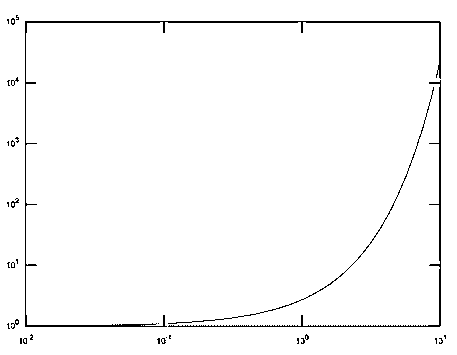
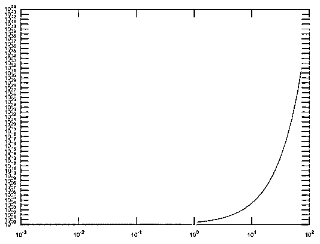
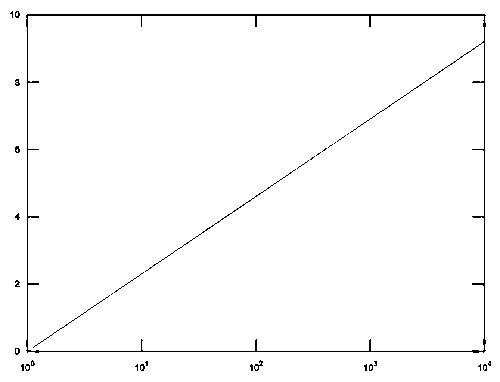

# Matlab 对数图

> 原文：<https://www.educba.com/log-plot-matlab/>

## 对数绘图 Matlab 简介

对数图是在水平轴和垂直轴上都有对数刻度的二维图形。对数可以写成指数方程的逆。任何对数方程最常见的基数，如果没有特别说明，总是被认为是 10。对数图用于估计各种数值参数，也用于经济学领域。对数图主要用于绘制正实数，绘制负数不会产生任何解。在本主题中，我们将学习 Matlab 中的对数图。

### 使用对数图 Matlab

在 Matlab 中，我们使用对数图来绘制水平轴和垂直轴上的对数刻度图。有各种不同的语法用于根据数字的性质来绘制数字，不管它是实数还是复数。

<small>Hadoop、数据科学、统计学&其他</small>

请查找以下语法及其用法:

*   **Loglog(X):** 它绘制了 X 中出现的列及其索引的对数刻度，前提是它是一个实数。如果该值是一个复数，那么它会忽略它的虚部，并根据该数字的实部绘制图形。
*   **LogLog (a1，b1…):** 根据 a1 和 b1 中出现的不同对绘制对数值。如果它们中的任何一个 an 或 bn 是矩阵，那么它意味着画出它的向量自变量和矩阵中的值以及它们的维数。
*   **Loglog (a1，b1，linespeci…):** 根据我们给定的线规格绘制对数值。这里，linespeci 表示线条的属性，包括颜色、线条类型等。
*   日志日志(…。属性的名称'，'属性的值'):这意味着改变行属性。有各种各样的公式和语法可以用来改变线条的类型和颜色。
*   **Loglog (axes，...):**用语法中“axes”标签提到的轴值绘制图形。

根据我们在语法中提供的值，可以更改线条的各种属性，如颜色、颜色模式、线条宽度、线条样式、线条连接和对齐不同的顶点中心。

*   线条颜色可以是红色、蓝绿色、青色、品红色、黄色、黑色、白色和无色。每种颜色都有其独特的十六进制颜色代码和 RGB 三元组，由值 0 和 1 给出。在 Matlab 中，它们有自己独特的 RGB 三元组和十六进制颜色，用于绘制图形。
*   有两种颜色模式可以根据需要分配。如果设置为“自动”, Matlab 会自动改变线条的颜色。如果设置为“手动”,那么我们可以通过指定“线规格”参数中的值来手动更改线的颜色。如果我们在“line spec”参数中设置了任何值，那么颜色模式将更改为手动。
*   有多种线条样式可以根据业务需求进行更改。如果线条样式是'-'那么它就是实线，如果样式是'--'那么它就是虚线，如果样式是'..'那么它就是虚线，如果样式是'-. '那么它被称为点划线。
*   有两种类型的线条样式模式，其工作机制与颜色样式模式相同。如果线条样式模式设置为自动，那么 Matlab 决定线条的模式，而如果设置为手动，那么我们必须在其线条样式属性中指定线条的样式模式。如果我们在绘制测井图时已经在其规范中指定了线型模式，则默认情况下会将其指定为“手动”。
*   线条宽度也可以根据线条的适当边缘进行调整。
*   我们也可以调整线角样式，可以是圆形，倒角和斜接。
*   我们也可以将顶点对齐参数设置为关闭或打开。如果关闭，则垂直和水平线条将不会足够清晰，从而显示线条的不均匀外观。如果启用，则垂直和水平线条会锐化，显示线条的均匀外观。

### Matlab 对数图示例

以下是 Matlab 中提到的对数图示例:

#### 示例#1

要在两个轴上绘制对数刻度:

`a = logspace (-2,1)
b= exp(a)
loglog(a,b)`

**输出:**

这在 x 轴和 y 轴上绘制了对数刻度。在 x 轴上，它的范围是从 10^-2 到 10^1，并且该图是根据上面的图绘制的。

#### 实施例 2

`a = logspace ( -3,2)
b= exp(a)
loglog(a,b)`

**输出:**

这在 x 轴和 y 轴上绘制了对数刻度。在 x 轴上，它的范围是从 10^-3 到 10^2，并且该图是根据上面的图绘制的。

Semilogx 用于仅在 y 具有线性值的情况下绘制 x 轴的对数值。

它由以下语法给出:

*   **semilogx(a):** 这将绘制 x 轴的对数值和 Y 轴的线性值。
*   **semilogx (a1，b1…):** 根据 a1 和 b1 中出现的不同对，绘制 x 中的对数值。如果 an 或 bn 中的任何一个是矩阵，那么它意味着画出它的向量自变量和矩阵中的值的维数。
*   **semilogx (a1，b1，linespeci…):** 根据我们给定的线的规格，绘制 x 轴上的对数值。这里，linespeci 表示线条的属性，包括颜色、线条类型等。

#### 实施例 3

`a= 0: 10000
b = log(a)
semilogx(a,b)`

**输出:**

它将绘制 x 轴上从 10^0 到 10^4.的对数值

### 结论

对数图用于经济学领域，以估计数字参数，以及用于机器学习领域，以转换非正态分布的列。因此，根据需要，我们可以在 Matlab 中使用 loglog 和 semilogx。

### 推荐文章

这是一个 Matlab 日志绘图指南。在这里，我们讨论了 Matlab 的介绍和使用，以及例子和输出。您也可以看看以下文章，了解更多信息–

1.  [Matlab 中的循环介绍](https://www.educba.com/loops-in-matlab/)
2.  [使用基本的 MATLAB 绘图功能](https://www.educba.com/matlab-plot-function/)
3.  [Matlab 的最新特性](https://www.educba.com/matlab-features/)
4.  [Matlab 反函数](https://www.educba.com/matlab-inverse-function/)

