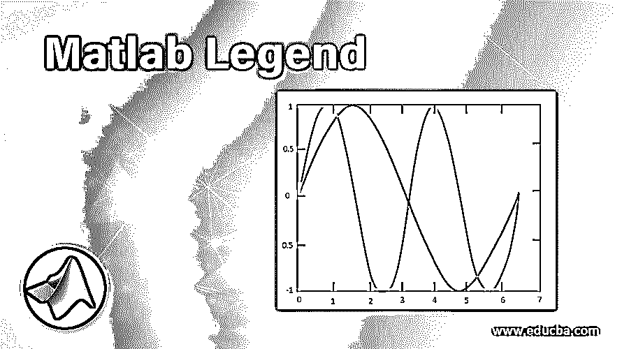
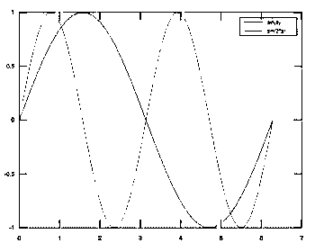
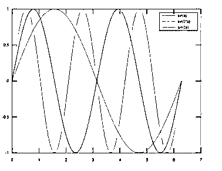
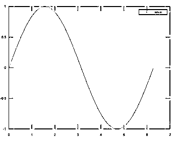
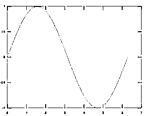

# Matlab 图例

> 原文：<https://www.educba.com/matlab-legend/>

## Matlab 图例介绍

图表是数据集中被解释数据的图形形式。图例是将它们添加到图表中以解释具有不同属性和形式的显示数据的方法。它们主要用于图形、图表或电子表格。对于每个图例，都有一个图例键链接到图表中显示的每个数据。图例可用于各种图形或图表，如条形图、折线图、饼图等。应始终注意，我们在图例命令中定义的参数应等于 plot 命令中的属性数。

### Matlab 图例的使用

在 Matlab 中，图例用于标注所提到的每个参数的绘制数据。对于标签，它使用数据系列的一个属性，即 DisplayName。每当我们在当前坐标轴中添加新的或删除数据系列时，图例都会自动更新。如果没有当前轴，则没有图例，图例为空。

<small>Hadoop、数据科学、统计学&其他</small>

**Matlab 中使用的语法:**

*   **L=legend** :用于在绘制的数据系列中包含图例。
*   **L=legend(图例 1 的标签…图例 N 的标签)**:这包括 labels 参数中指定的图形中的图例标签。我们可以用字符串或字符的形式提到标签。例如，legend('周一'，'周二'，'周三')
*   **L=legend(图例的标签)**:用来提及图例中的标签。标签可以是字符串数组、字符向量或字符矩阵。
*   **L =图例(包括子集)**:仅包括子集中存在的值。我们可以将子集指定为输入中的值或无参数。
*   **L=legend(目标轴，_ _ _ _ _ _)**:用于指定目标轴参数中需要的轴或图表。
*   **L=legend (__，‘图例的位置’)**:用于指定图例应该放在图中的位置。图例的这个属性应该总是在所有输入参数之后给出。
*   **L=legend (__，‘图例的方向’)**:用于指定图例在图中应该放置的方向。方向的默认值是垂直。
*   **L=legend (___，'属性的名称'，'属性的值')**:当我们想要自定义图中图例的外观时使用。我们可以在“属性名称”参数中给出属性名称，然后给出所需的值。下面讨论图例的各种属性。
*   **L=legend(bkgd)** :用于设置背景外观及其轮廓。它的默认值是“boxon”。
*   **L =图例(可见性)**:用于设置图例的可见性，图例有不同的值，如显示、隐藏和切换。
*   **L=legend(off)** :用于从图中删除图例及其自定义。

### Matlab 图例示例

请查找以下解释 Matlab 中图例用法的示例:

#### 示例#1

绘制两条线并在当前图表中显示图例。

**代码:**

`a = linspace(0,2*pi);
y = sin(a);
plot(a,y)
hold on
y1 = sin(2*a);
plot(a,y1)
legend('sin(a)','sin(2*a)')`

**输出:**

在上面的示例中，两条线的图例显示在绘图的右上角，一条线描述函数 sin(a)的值，另一条线描述函数 sin(2a)的值。

#### 实施例 2

打印另一条线，并使用 plot 命令中图例的 DisplayName 特性指定图例的标签。在本例中，我们在现有的行中添加了另一行，如上例所述。

**代码:**

`a = linspace(0,2*pi);
y = sin(a);
plot(a,y)
hold on
y1 = sin(2*a);
plot(a,y1)
legend('sin(a)','sin(2*a)')
y2 = sin(3*a);
plot(a,y2,'DisplayName','sin(3a)')
hold off`

**输出:**

在上述示例中，使用 plot 命令中的图例标签将另一条线添加到现有地块，如高亮显示的部分所示。这可以通过使用图例属性“DisplayName”和图例标签作为其值来实现。这里 sin(3a)是值，它作为图例标签添加到图中。

Matlab 中图例的各种属性将在下面讨论。位置是图例的主要属性之一，它决定了图例的位置。

有多种值可以分配给属性，例如:

*   **北:**用于绘制轴或图表顶部的图例，并放置在图表内部。
*   **东北:**用于绘制坐标轴或图表右上角的图例。
*   **西北:**用于绘制坐标轴或图表左上角的图例。
*   **northoutside:** 用于绘制轴顶部的图例，位于外部。
*   **south:** 用于绘制轴或图表底部的图例，位于图表内部。
*   **东南:**用于绘制坐标轴或图表右下角的图例。
*   **西南:**用于绘制坐标轴或图表左下方的图例。
*   **southoutside:** 用于绘制轴底部的图例，位于外部。
*   **东:**用于绘制轴或图表右侧的图例，位于图表内部。
*   **eastoutside:** 用于绘制轴右侧的图例，位于外部。
*   **west:** 用于绘制轴或图表左侧的图例，放置在图表内部。
*   **westoutside:** 用于绘制轴左侧的图例，位于外部。
*   除此之外，还有许多其他位置也在 Matlab 中使用。
*   我们还可以决定图例的可见性和方向，根据需要可以是水平的和垂直的。

#### 实施例 3

从图中删除图例。

**代码:**

`a = linspace(0,2*pi);
y = sin(a);
plot(a,y)
legend('sin(a)')`

**输出:**

**代码:**

`a = linspace(0,2*pi);
y = sin(a);
plot(a,y)
legend(‘off’)`

**输出:**

### 结论

大多数图形中使用图例来标记图中不同线条的行为。还有许多其他属性与 Matlab 中图例的自定义相关联。

### 推荐文章

这是一个 Matlab 传奇指南。这里我们结合实例讨论 Matlab Legend 的介绍和使用。您也可以看看以下文章，了解更多信息–

1.  [Matlab 中的曲面图](https://www.educba.com/surface-plot-in-matlab/)
2.  [Matlab 中的滤波函数](https://www.educba.com/filter-function-in-matlab/)
3.  [数据可视化工具](https://www.educba.com/data-visualization-tools/)
4.  [Tableau 中的仪表板](https://www.educba.com/dashboard-in-tableau/)
5.  [如何用实例进行 Matlab 计数？](https://www.educba.com/matlab-count/)
6.  [线性拟合 Matlab |示例](https://www.educba.com/linear-fit-matlab/)

