# Matlab fplot()

> 原文：<https://www.educba.com/matlab-fplot/>

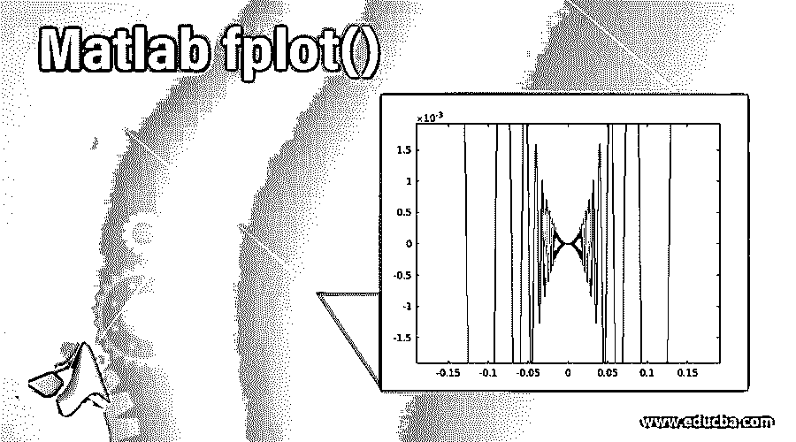

## Matlab fplot()简介

MATLAB 函数 fplot()用于生成关于表达式或函数的符号图。从 fplot()函数生成的图形的默认区间范围是[-5，5]。

**例子**

<small>Hadoop、数据科学、统计学&其他</small>

以下代码旨在使用 fplot()方法为函数 tan(2x)生成一个图。

`symsvar
fplot(tan(2*var))`

**输出**:针对函数 tan(2*var)相对于-5 到 5 范围内的 var 值生成的图。

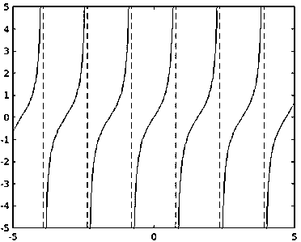

### 句法

根据函数调用中给出的输入参数，有各种语法可用于实现 fplot()方法，如下所述:

| **语法** | **属性描述** |
| fplot | f 是要为其生成图的函数或表达式 |
| fplot(f，xinterval)/fplot(f，[xminxmax]) | Xmin- initial limit of the interval from which the plotting f(x) should be initiatedXmax-应完成绘制 f(x)的时间间隔的最终限制 |
| fplot(pt，qt) | pt 和 qt 是公共变量 t 的两个不同函数，即 pt=p(t)和 qt=q(t) |
| fplot(pt，qt，tinterval)/fplot(pt，qt，[tmintmax]) | tmin- initial limit of the interval from which the plotting p(t) and q(t) should be initiated

tmax-应完成绘制 p(t)和 q(t)的时间间隔的最终限制。

 |
| fplot(___，LineSpec) | Linespec 用于通过自定义设置线条颜色、标记符号和线条样式等来自定义绘图显示。 |
| fplot(___，名称，值) | 用于为绘图设置值为“值”的属性“名称” |
| fplot(ax，_ _ _ _ _ _) | 用于使用新定义的轴 ax 而非默认轴创建绘图 |
| p = fplot(___) | fplot()函数调用的输出存储在参数化的 line 对象中 |

### Matlab fplot()的方法

让我们通过例子来理解实现 fplot()方法的各种语法的应用。

#### 方法 1–使用语法 fplot(x)

在下面的例子中，只有一个输入参数，即由因变量 x 定义的表达式函数。这里，变量 x 的取值范围设置为默认值，即[-5，5]。

`syms func(x)
func(x) = sin(x);
fplot(func)`

**输出:**

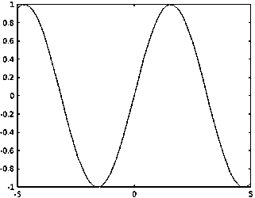

#### 方法 2–使用语法 fplot(f，finterval)

编写以下代码，在指定的时间间隔(即 finterval)内为给定的表达式 func(x)生成 pot。

**代码:**

`syms func(x)
func(x) = sin(x);
fplot(func,[-2,2])`

**输出:**为 sin(x)的表达式生成结果图，用于定义范围的值-2 到 2。

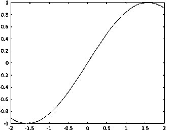

#### 方法 3–使用语法 fplot(pt，qt)

下面的 MATLAB 代码旨在通过调用 fplot()方法，使用公共因变量 t 为两个函数 pt、qt 生成图形。

**代码:**因变量 t 的取值范围为默认值集，即[-5，5]。

`pt = @(t) tan(2*t);
qt = @(t) cot(3*t);
fplot(pt,qt)`

**输出**:

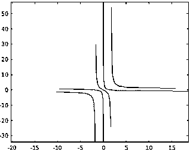

#### 方法 4–使用语法 fplot(pt，qt，tinterval)

**代码:**

`pt = @(t) tan(2*t);
qt = @(t) cot(3*t);
fplot(pt,qt,[-1,1])`

**Output** :从上述代码生成的结果图，包含在[-1，1]的指定时间范围内因变量 t 的表达式 tan(2t)和 cot(3t)的图。

5 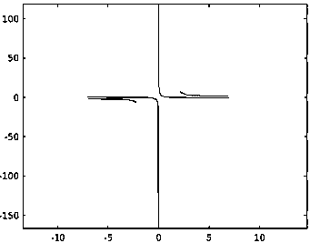

#### 方法 4-**使用语法 p=fplot(——)**

下面的代码是用来演示函数 fplot()对一个参数对象的行为。

##### 第一阶段

**代码:**使用函数调用 fplot()生成图形，并将其分配给参数变量‘p’。

`syms var
p = fplot(cos(var))`

**输出:**

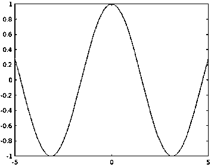

##### 次相

**代码:**通过编辑通过参数化对象‘p’访问的属性值来定制图形的显示。

`p.LineStyle = '--';
p.Color = 'r';
p.Marker = 'x';
p.MarkerEdgeColor = 'b';`

**输出:**

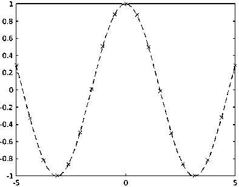

##### 例子

编写以下代码，通过包括标题、x、y 标签和刻度值，为给定的函数表达式生成绘图，并编辑图形的表示。

**代码:**

`syms var
fplot(cos(var),[-2*pi 2*pi])
grid on
title('sin(var) from -2\pi to 2\pi')
xlabel('var')
ylabel('f')
nx = gca;
S = sym(nx.XLim(1):pi/2:nx.XLim(2));
nx.XTick = double(S);
nx.XTickLabel = arrayfun(@texlabel,S,'UniformOutput',false);`

**输出:**

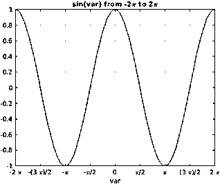

该图是为表达式 sin(var)生成的，其值范围为 var，-2\pi 至 2\pi。设置图的标题为‘sin(var)from-2 \ pi to 2 \ pi’，xlabel 为‘var’，ylable 为‘f’。

### fplot()支持不同的属性

fplot()支持各种属性来编辑绘图的显示。下表描述了主要属性:

| **属性** | **描述** |
| LineSpec | 用于自定义地块线、标记等的显示。 |
| 颜色 | 用于决定线条的颜色 |
| LineStyle | 用于决定线条的样式 |
| 标记 | 决定将符号用作标记 |
| MarkerEdgeColor | 用于决定标记的轮廓颜色 |
| MarkerFaceColor | 用于设置标记中要填充的颜色 |
| 市场规模 | 决定标记的大小 |
| 网格密度 | 设置评估点的数量 |

### 实现 Matlab fplot()的示例

下面是提到的例子:

#### 示例#1

以下代码片段旨在绘制函数“pt”和“qt”并调节属性线宽。

**代码:**

`pt = @(t) tan(2*t);
qt = @(t) cot(3*t);
fplot(pt,qt,'-.*c','Linewidth',2)`

**输出**:

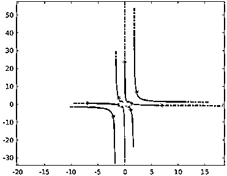

从函数 pt 和 qt 的方法 fplot()生成的结果图以修改的线宽值 2 呈现。

#### 实施例 2

绘图的平滑度、精确度和速度由选项 MeshDensity 控制，mesh density 是评估点的计数。

**代码:**

`syms x
Funcstep = rectangularPulse(2.1, 2.15, x);
subplot(2,1,1)
fplot(Funcstep);
title(' MeshDensity (Default value) = 23')
subplot(2,1,2)
fplot(Funcstep,'MeshDensity',50);
title(' MeshDensity (Increased value)= 50')`

**输出:**

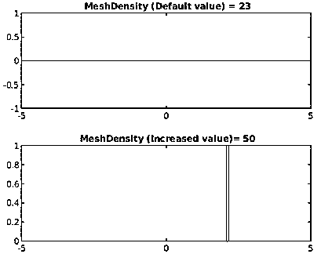

fplot()方法还支持通过将布局分割成相同数量的单元格，在一个单独的框架中绘制多个功能。

#### **例 3**

**代码:**

`syms var
subplot(2,1,1)
fplot([sin(var) cos(var)])
title('Multiple plots on single layout')
subplot(2,1,2)
fplot(sin(var))
hold on
fplot(cos(var))
title('Multiple plots with  Command hold on')
hold off`

**输出:**

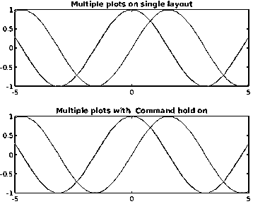

### 附加说明

以下是 Matlab fplot()的附加说明:

**1。**缩放的重新评估:通过使用缩放功能，可以重新评估从 fplot 生成的图。它帮助用户揭示情节中隐藏的细节。

**代码:**

`syms var
fplot(var^2*cos(1/var));
axis([-2 2 -0.02 0.02]);
for i=1:5
zoom(1.6)
pause(0.6)
end`

**输出:**

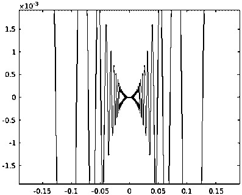

**2** 。在使用 fplot(f)语法或其任何变体的情况下，返回的对象是 FunctionLine 对象类型，而在 fplot(funx，funy)语法的情况下，对象返回类型是 ParameterizedFunctionLine。

因此，MATLAB 中的函数 fplot()支持任何类型的函数或表达式的高级绘图功能，并提供了广泛的定制灵活性。

### 推荐文章

这是一个 Matlab fplot()的指南。在这里，我们讨论了需要了解的方法，并详细介绍了要实现的示例和附加说明。您也可以浏览我们的其他相关文章，了解更多信息——

1.  [Matlab 彩条标签](https://www.educba.com/matlab-colorbar-label/)
2.  [Matlab 中的箱线图](https://www.educba.com/boxplot-in-matlab/)
3.  [绘图矢量 Matlab](https://www.educba.com/plot-vector-matlab/)
4.  [颤 Matlab](https://www.educba.com/quiver-matlab/)

