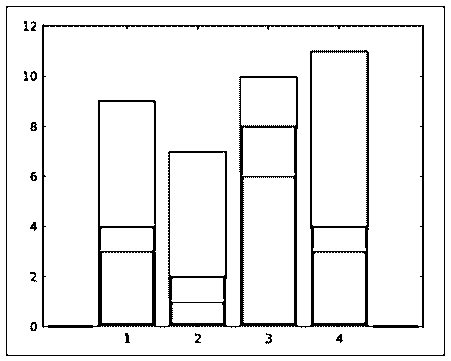
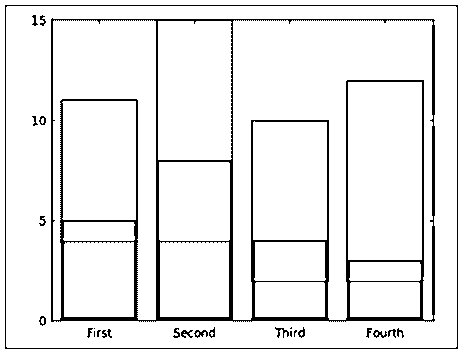

# Matlab 堆积条形图

> 原文：<https://www.educba.com/matlab-stacked-bar/>

## Matlab 堆积条形图简介

堆积条形图用于通过将较大的类别划分为较小的类别来表示该类别。堆积条形图表示较小部分与总量之间的关系。堆积条形图一个接一个地显示分段值。堆积条形图中较小的部分加起来就是该类别的总值。这些类型的图表非常适合于比较每个分段或分组条形图的总值。然而，堆叠条形的问题是，随着段数的增加，读取这些条形变得更加困难。

**在 Matlab 中创建堆叠条形图的语法:**

<small>Hadoop、数据科学、统计学&其他</small>

`∙         bar(- - , 'stacked')`

**描述:**

条形图(-–，“堆叠”)用于将每个组显示为一个多色条形图

### Matlab 堆积条形图示例

现在让我们理解在 MATLAB 中创建堆叠条形图的代码。

#### 示例#1

在第一个示例中，我们将创建一个基本的堆积条形图，而不定义任何类别。

下面是我们在这个例子中要遵循的步骤:

*   定义矩阵，其行将被用作条形，即矩阵的每一行将被表示为堆积图中的条形
*   将此矩阵作为输入传递给“Bar”函数
*   将“stacked”作为第二个参数传递。如果我们需要一个堆叠条形图作为输出，就使用这个参数

**代码:**

`A = [3 2 5; 2 1 6; 5 8 2];`

[Creating matrix with number of rows equal to the number of bars and number of columns equal to the number of segments in each bar]

`bar(A, 'stacked')`

[Passing the input matrix to the function ‘bar’. The 2nd argument ‘stacked’ is used to  give a stacked bar graph as the output] [Please note that, since we have used a 3 x 3 matrix as the input, our output stacked bar graph will have 3 bars, each with 3 segments]

这是我们的输入和输出在 MATLAB 命令窗口中的样子:

**输入:**

`A = [3 2 5; 2 1 6; 5 8 2];
bar(A, 'stacked')`

**输出:**

**T2】**

 **正如我们在输出中看到的，函数“bar”和第 2 个和第 1 个参数“stacked”在输出中为我们提供了一个堆叠条形图。

#### 实施例 2

在本例中，我们将创建一个包含 4 个条形和 3 个分段的堆叠条形。

下面是我们在这个例子中要遵循的步骤:

*   定义一个大小为 4 X 3 的矩阵，其行将被用作条形，即矩阵的每一行将被表示为堆积图中的一个条形
*   将此矩阵作为输入传递给“Bar”函数
*   将“stacked”作为第二个参数传递。该参数表示我们需要一个堆叠条形图作为输出

**代码:**

`A = [3 1 5; 1 1 5; 6 2 2; 3 1 7];`

[Creating a 4 X 3 matrix; with rows to be used as bars in the stacked graph]

`bar(A, 'stacked')`

[Passing the input matrix to the function ‘bar’. The 2nd argument ‘stacked’ will give a stacked bar graph as the output] [Please note that, since we have used a 4 x 3 matrix as the input, our output stacked bar graph will have 4 bars, each with 3 segments]

这是我们的输入和输出在 MATLAB 命令窗口中的样子:

**输入:**

`A = [3 1 5; 1 1 5; 6 2 2; 3 1 7];
bar(A, 'stacked')`

**输出:**

正如我们在输出中看到的，函数“bar”和第 2 个和第 1 个参数“stacked”在输出中给出了一个堆叠条形图。

#### 实施例 3

在本例中，我们将创建一个沿 x 轴具有不同类别的堆积条形图。为此，我们将定义一个表示 x 轴的分类数组。

下面是我们在这个例子中要遵循的步骤:

*   定义具有所需类别的分类数组。数组中元素的数量应该等于堆积图中条形的数量(即输入矩阵中的行数)
*   定义一个大小为 4 X 3 的矩阵，其行将被用作条形，即矩阵的每一行将被表示为堆积图中的一个条形
*   将该数组和矩阵作为输入传递给“Bar”函数
*   将“stacked”作为第三个参数传递。该参数表示我们需要一个堆叠条形图作为输出

**代码:**

`X = categorical({'First', 'Second', 'Third', 'Fourth'});`

[Defining the categories for stacked bar graph]

`X = reordercats(X, {'First', 'Second', 'Third', 'Fourth'});`

[Using the function ‘reordercats’ to fix the order of categories in stacked bar graph]

`A = [4 1 6; 4 4 7; 2 2 6; 2 1 9];`

[Creating a 4 X 3 matrix; with rows to be used as bars in the stacked graph]

`bar(X, A, 'stacked')`

[Passing the categorical array and input matrix to the function ‘bar’. The argument ‘stacked’ will give a stacked bar graph as the output] [Please note that, since we have used a 4 x 3 matrix as the input, our output stacked bar graph will have 4 bars, each with 3 segments]

这是我们的输入和输出在 MATLAB 命令窗口中的样子:

**输入:**

`X = categorical({'First', 'Second', 'Third', 'Fourth'});
X = reordercats(X, {'First', 'Second', 'Third', 'Fourth'});
A = [4 1 6; 4 4 7; 2 2 6; 2 1 9];
bar(X, A, 'stacked')`

**输出:**

正如我们在输出中看到的，函数“bar”和第 2 个和第 1 个参数“stacked”在输出中给出了一个堆叠条形图。

### 结论

*   我们使用堆积条形图来表示一个更大的类别，方法是将它分成更小的类别。
*   “Bar”函数与参数“stacked”一起使用来创建堆积条形图。
*   Bar 函数的输入是一个矩阵，它的行代表条的数量，列代表每个条中的段的数量。

### 推荐文章

这是一个 Matlab 堆积条形图的指南。在这里，我们还讨论了 Matlab 堆栈栏的介绍和语法，以及不同的例子和代码实现。您也可以看看以下文章，了解更多信息–

1.  [Matlab 自相关](https://www.educba.com/matlab-autocorrelation/)
2.  [Matlab 编写](https://www.educba.com/matlab-fwrite/)
3.  [Matlab 格式](https://www.educba.com/matlab-format/)
4.  [移动平均线 Matlab](https://www.educba.com/moving-average-matlab/)

**