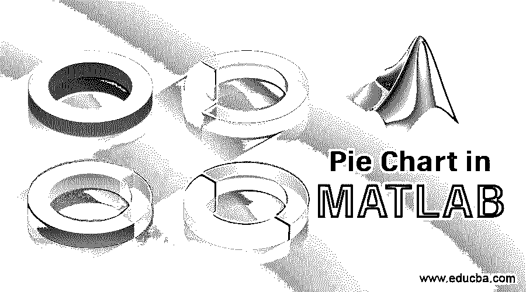

# MATLAB 中的饼图

> 原文：<https://www.educba.com/pie-chart-in-matlab/>

## MATLAB 饼图简介

饼图是一种圆形图表，它被分成圆形切片，以显示每个类别中作为整体或总值一部分的比例和百分比。它们广泛用于商业演示和教育中，以比较不同类别中的比例，例如一个地区的人口划分等。但是，如果有更多类别或大量数据，饼图是不可取的，因为切片的大小变得越来越小，很难解读结果和分析。在本文中，我们将详细讨论 MATLAB 中的饼状图。

### MATLAB 中饼图的类型

下面是 MATLAB 中饼图的类型。

<small>Hadoop、数据科学、统计学&其他</small>

#### 1.饼图(X)

在 MATLAB 中，我们可以使用 pie(X)函数绘制饼图，用 X 中的值表示，图表中的每个切片或比例代表 X 的一部分。如果 X 的数据类型是分类的，则图表中的切片按各自的类别显示，图表中每个类别或切片的面积由类别中的值的数量除以 X 中的值的数量确定。如果 X 是数字，则 X 中的值必须是有限的。如果输入数组是数字，那么默认情况下输出是百分比和各自的颜色。

使用 pie(X)可以执行许多操作，例如:

*   **pie(X，labels):** 用于标记图表中的切片，标签的数量应该等于 X 中出现的值的数量，应该是有限的数字。
*   **pie(X，explode):** explode 是一个由零和非零组成的矩阵，表示 X 的值。该函数用于从图表中展开或分离切片。如果 explode 是分类的，那么它可以是类别名称数组、任何字符串数组、表示 X 和饼图中每个类别的数字或逻辑向量，根据 explode 中的类别分隔切片。如果分解是数值型的，那么它应该是一个由零和非零组成的矩阵，或者是一个代表 x 值的数值向量。分解的大小应该与 x 的大小相同。
*   **pie(X，explode，labels):** 此函数用于探索和标记 X 中每个切片的类别。如果 X 是数字，则标签的数量应等于 X 中元素的数量，如果 X 是分类的，则标签的数量应等于 X 中存在的类别的数量。
*   馅饼(斧头，..)和馅饼(..)是一些函数，其中 ax value 绘制给定指定值的输出。

#### 2.Pie3(X)

MATLAB 中的这个函数用于创建一个三维饼图，表示 X 中的数据。X 中的值可以表示为一个切片或总值的一部分。

使用此函数可以执行许多操作，这与 pie(X)函数中使用的操作几乎相同，例如:

*   **pie3(X，labels):** 该函数用于根据 X 中存在的类别来标记切片，每个切片的标签数量应该与 X 中的类别数量相同。
*   **pie3(X，explode):** 该函数用于从图表中心展开或分离切片。
*   **pie3(axes_handle，..):**该函数在“axes_handle”关键字指定的轴上而不是在当前轴上绘制输出。
*   pie3(…):此函数返回文本图形对象或要修补的句柄向量。

### 饼图的优点和缺点

以下是优点和缺点:

#### 饼图的优势

*   饼图便于不知情的观众阅读图表，它将数据表示为整体的一小部分，使读者或观众能够一目了然地比较各种类别并得出有效的结论。
*   它们出现在许多统计软件中，如 R、SPSS、Excel 等。这易于解释并且在可视化数据时不需要任何额外的解释。
*   它使数据具有可读性，因为我们可以操纵或更改饼图中的切片，以强调我们希望作为业务目标的一部分向读者展示的要点。饼图在视觉上比条形图、直方图等任何其他图表都简单。

#### 饼图的缺点

*   饼图不适合大型数据集。如果数据集中的类别数多于图表中的切片数，那么读取比例和进行分析的复杂性就会增加。
*   饼状图不能揭示数据的实际值，例如小数量或小数可能不容易表示。图表的数据操作可能导致读者基于视觉影响而不是数据分析得出错误的结论。它们不会帮助我们理解原因或任何关键假设。
*   在处理具有相似值的数据时，饼图不是首选，因为当我们将数据划分为切片时，数据中的相似性使读者难以比较类别，并且它们之间的差异没有得到正确传达。与数据可视化中的其他替代方案相比，它们占用更多的空间。

可以克服上述缺点的饼图的一些替代图是条形图、直方图和圆环图。圆环图与饼图具有相同的圆形形状和功能，但增加了显示多个数据集的数据的优势，这在简单的饼图中是不可能的。

### 结论

尽管有缺点，饼图还是有许多应用。它们通常用于比较市场中的类别(理想情况下少于 6 个)，例如查看每个行业的销售百分比。简而言之，它们是很好的视觉辅助工具，人眼很容易理解。在许多需要显示数据的商业应用中，它们也增加了一些专业性。

### 推荐文章

这是一个 MATLAB 中的饼状图指南。这里我们讨论 MATLAB 中饼状图的类型、优点和缺点。您还可以浏览我们推荐的其他文章——

1.  [MATLAB 中的贝塞尔函数](https://www.educba.com/bessel-functions-in-matlab/)
2.  [什么是 Matlab？](https://www.educba.com/what-is-matlab/)
3.  [Matlab 备选方案](https://www.educba.com/matlab-alternatives/)
4.  [Matlab 简介](https://www.educba.com/introduction-to-matlab/)
5.  [Matlab 梯度完全指南](https://www.educba.com/matlab-gradient/)
6.  [JavaFX 饼图|如何创建？](https://www.educba.com/javafx-pie-chart/)

