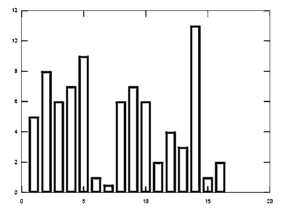
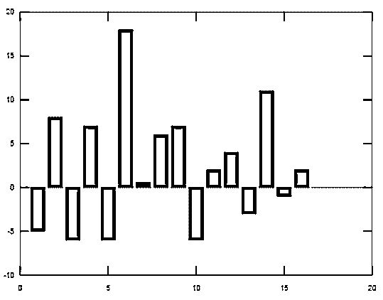

# Matlab Saveas

> 原文：<https://www.educba.com/matlab-saveas/>

## Matlab Saveas 简介

在某些应用中，需要保存输出图形文件以进行进一步的操作，如从输出文件中读取数据、分析数据，以及引用输出图形文件。为了将图形保存到特定文件，我们使用 saveas 语句。SAVEAS 是 matlab 的一个内置函数，用于将图形保存为特定的文件格式。我们可以保存不同格式的数字，如 png，jpg，epsc 等。

**语法:**

<small>Hadoop、数据科学、统计学&其他</small>

Matlab 另存为函数的语法如下所示:-

`saveas(fig,filename)`

`saveas(fig,filename,formattype)`

### Matlab Saveas 怎么做？

另存为功能用于保存特定文件格式的图像，格式如。png，。jpg，还有很多。对于这个函数，我们有上面看到的语法。为了使用 saveas 函数，我们首先要创建一个图像。为了创建一个图像，我们使用 bar 函数，bar 是 matlab 中的一个内置函数，使用 bar(x1)函数创建条形图，x1 中的每个元素都有一个 bar。如果 x1 是一个 y 乘 z 矩阵，那么 bar 创建 y 组 z 条。或者，我们可以使用 plot 函数创建一个图像，plot 也是 matlab 中的内置函数。plot 用于绘制连续的线和图形，就像模拟信号一样。然后使用 saveas 函数保存该数字。为了保存这个创建的图像，我们在括号 gcf 中取 saveas，然后我们取一个带有数字扩展名的文件名。让我们假设我们取‘bar chart 11’作为带有扩展名的文件名。我们还在“format type”参数中指定了格式类型。

### Matlab 另存为示例

下面是一些例子:

#### 示例#1

让我们看一个 saveas 语句的例子；基本上，saveas 函数是 matlab 的一个内置函数，用于将图形保存为特定的格式。在这个例子中，我们创建一个条形图，为了创建一个条形图，我们在变量 x1 中取数据。我们把一个条形图的数据放在一个方括号中，每个数据号用一个空格隔开，这些数据被赋值给一个变量 x1。然后我们使用 matlab 中的一个 bar 函数，它是 matlab 的一个内置函数。条形图使用 bar(x1)函数创建，x1 中的每个元素有一个条形。如果 x1 是一个 y 乘 z 矩阵，那么 bar 创建 y 组 z 条。然后这个生成的条形图被保存在。使用另存为功能的 png 格式。我们在括号中使用 saveas 函数，我们使用 gcf，然后我们使用一个带有图形扩展名的文件名。本例中，我们使用“Barchart11”作为扩展名为. png 的文件名。png 格式。

**代码:**

`clc ;
clear all;
close all;
x1 = [5 8 6 7 9 1 0.5 6 7 6 2 4 3 11 1 2];
bar(x1);
saveas (gcf,'Barchart11.png')`

**输出:**

#### 实施例 2

让我们考虑一个 saveas 函数的例子，在这个例子中，我们创建了一个图形。为了创建一个图形，我们使用了一个 plot，plot 是 matlab 上的一个内置函数，用于创建所提供数据的连续信号。我们用两个变量 x 和 y 来绘制数据。在 x 变量中，我们指定 1 到 20 的范围，差值为 1。在 y 变量中，我们将数据绘制在 x 轴上。然后我们使用 plot(x，y ),它将生成一个图形，这个图形我们希望使用 saveas 函数保存。我们将该图保存为 EPS 文件，并指定 epsc 以彩色格式保存该图像。我们在括号中使用 saveas 函数。我们使用 gcf，要保存当前图形，我们必须将 fig 指定为 gcf，然后我们使用一个文件名。本例中，我们使用“条形图 1”作为名称，并将格式类型“格式类型”指定为 epsc。我们在 EPS 文件中保存一个数字。

**代码:**

`clc;
clear all;
close all;
x = 1:1:20;y = [5 3 8 7 5 15 2 6 7 9 20 1 8 9 6 12.5 4 2 3 9];plot (x,y);
saveas (gcf, 'Barchart1', 'epsc')`

**输出:**

#### 实施例 3

让我们看看 saveas 语句的另一个例子，在这个例子中，我们创建了一个条形图，对于一个条形图，我们在变量 y1 中获取数据。现在，我们可以获取数据的正负整数值，并绘制条形图。为了绘制条形图，我们使用 Matlab 中的 bar 函数。然后使用 saveas 语句将生成的 bar 保存为 jpg 格式。我们将图形保存在 jpg 文件中。

**代码:**

`clc;
clear all;
close all;
y1 = [-5 8 -6 7 -6 18 0.59 6.0 7 -6 2 4 -3 11 -1 2];
bar (y1);
saveas (gcf, 'Bargraph.jpg')`

**输出:**

### 结论

在本文中我们看到了 matlab 函数 saveas 的概念；基本上另存为是用来保存图形到特定的文件格式。然后看到了与 saveas 语句相关的语法以及如何在 matlab 代码中使用它。我们还在 matlab 上看到了一些与 saveas 语句及其输出相关的例子。

### 推荐文章

这是一个 Matlab 另存为指南。这里我们也讨论一下 matlab saveas 的定义和如何做？以及不同的示例及其代码实现。您也可以看看以下文章，了解更多信息–

1.  [Matlab 绘图标题](https://www.educba.com/matlab-plot-title/)
2.  [Matlab fplot()](https://www.educba.com/matlab-fplot/)
3.  [Matlab 符号](https://www.educba.com/matlab-syms/)
4.  [Matlab 排序](https://www.educba.com/matlab-sort/)

