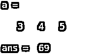
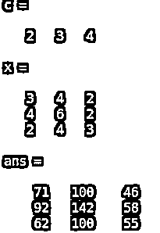
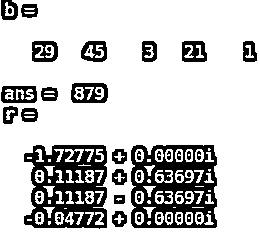
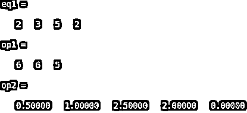
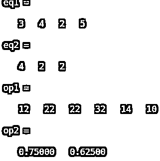

# Matlab 中的多项式

> 原文：<https://www.educba.com/polynomial-in-matlab/>

## Matlab 中什么是多项式？

多项式是数学中具有系数和指数值的一般方程。在多项式中，指数值决不是负整数，它只有一个未知变量。Matlab 多项式表示为向量和矩阵。多项式有多种函数用于运算，如 poly、poly、polyfit、residue、roots、polyval、polyvalm、conv、deconv、polyint 和 polyder。所有这些函数都用来对方程进行各种运算。

### 多项式语法

下面是 Matlab 中多项式的语法:

<small>Hadoop、数据科学、统计学&其他</small>

**1。Polyval ( a，4 )**

`polyval (function name , variable value)`

**2 .多项式(a，x )**

`polyvalm ( function name , variable matrix)`

**3。R =根(a)**

`variable name = roots(function name)`

**4。上=多段线(a)**

`output variable = polyder(input variable name)`

**5。Op = polyint ( a )**

`output variable = polyint(input variable name)`

**6。Op = conv ( a，b)**

`output variable = conv(polynomial1,polynomial2)`

**7。Op = dconv ( a，b)**

`output variable = conv(polynomial1,polynomial2)`

### Matlab 中多项式是如何工作的？

多项式在 Matlab 中有多种求值形式。在这里，用“poly”来表示一般的多项式方程。“polyeig”用于表示特征值多项式。“polyfit”用于表示曲线拟合。“剩余”用于表示部分分数展开的根。“根”用来寻找多项式的根。“polyval”用于计算多项式。“polyvalm”用于评估矩阵变量问题。“conv”用于求多项式的卷积和乘法。“解卷积”用于执行多项式的除法和解卷积。“polyint”用于积分,“polyder”用于多项式的微分。

**Matlab 中求解多项式的步骤**

**Step1:** 接受多项式向量。

**第二步:**使用带变量值的函数:Polyval(函数名，变量值):Polyvalm(函数名，变量矩阵)

**第三步:**显示结果。

### Matlab 中实现多项式的实例

以下是在 Matlab 中用多项式实现的示例:

#### 示例#1

考虑一个多项式 a ( x ) = 3 x^2 + 4x + 5

**代码:**

`clear all ;
a = [ 3 4 5 ] polyval ( a , 4)`

**输出:**

#### 实施例 2

考虑多项式方程 b ( x ) = 2 9 x^4 + 45 x^3 + 3 x^2 + 21 x + 1

**代码:**

`clear all ;
b = [ 29 45 3 21 1 ] polyval (b , 2)`

**输出:**

#### 实施例 3

考虑多项式方程 c ( x ) = 2x^2 + 3x + 4

矩阵 s0 形式的 x 值，

X = 3 4 2

4     6     2

2     4     3

**代码:**

`clear all ;
c = [ 2 3 4 ] x = [ 3 4 2 ; 4 6 2 ; 2 4 3 ] polyvalm (c ,x)`

**输出:**

#### 实施例 4

考虑一个例子 b(x)= 2 ^ 9 x^4+45 x^3+3 x^2+21 x+1

除了多项式的求值，我们还可以找到多项式的根:

**代码:**

`clear all ;
b = [29 45 3 21 1] polyval (b,2)
r = roots(b)`

**输出:**

#### 实施例 5

将多项式视为 2x^3 +3x^2+5x+2

在这个例子中，我们将看到如何找到多项式的导数和积分。

**代码:**

`clear all;
eq1 = [2 3 5 2] op1 = polyder(eq1)
op2 = polyint(eq1)`

**输出:**

#### 实施例 6

考虑两个多项式，方程 1= 3x^3 + 4x^2 + 2x + 5，方程 2 = 4 x^2 + 2x + 2

这个例子说明了两个多项式的卷积和解卷积:

**代码:**

`clear all ;
eq1 = [3 4 2 5] eq2 = [ 4 2 2] op1 = conv(eq1,eq2)
op2 = deconv(eq1,eq2)`

**输出:**

### 结论

在上面几节中，我们已经看到了如何对多项式求值，以及如何求多项式的根。从数学上讲，求解长多项式非常困难，但在 Matlab 中，我们可以轻松地计算方程并执行乘法、除法、卷积、反卷积、积分和求导等操作。

### 推荐文章

这是一个 Matlab 中的多项式指南。在这里，我们讨论一个介绍，多项式如何工作，以及分别用适当的代码和输出实现的例子。您也可以浏览我们的其他相关文章，了解更多信息——

1.  [Matlab 中的自然日志](https://www.educba.com/natural-log-in-matlab/)
2.  [Matlab 创建函数](https://www.educba.com/matlab-create-function/)
3.  [Matlab 梯度](https://www.educba.com/matlab-gradient/)
4.  [MATLAB 绘图函数](https://www.educba.com/matlab-plot-function/)
5.  [Matlab 中的 fmin search |如何工作？](https://www.educba.com/fminsearch-in-matlab/)

