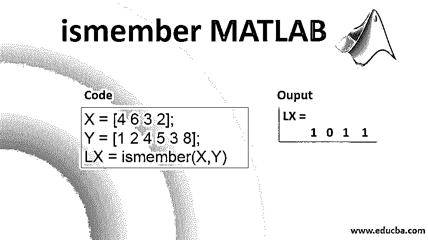
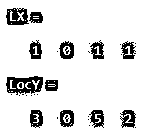

# 熟悉 MATLAB

> 原文：<https://www.educba.com/ismember-matlab/>

## ismember MATLAB 简介

在本文中，我们将看到一个关于 ismember MATLAB 的概述。数组用于存储属于特定数据类型的元素。在 Matlab 中，数组中的元素以行和列的形式存储。例如:如果阵列有 3 行 2 列，则称为 3 乘 2 阵列。这些元素存储在它们各自的存储位置。Matlab 中有各种类型的数组，也可以存储不同类型和维数的元素，这就是所谓的单元数组。Matlab 中有各种与数组相关的函数。

### Matlab 中的 ismember 函数

在 Matlab 中，我们可以使用 ismember()函数来检查一个特定的元素是否属于一个数组。结果以逻辑 1(真)或逻辑 0(假)的形式出现。考虑到 ismember 函数，请查找 Matlab 中使用的以下语法:

<small>Hadoop、数据科学、统计学&其他</small>

*   **Lx=ismember (X，Y):** 检查 X 中的元素是否存在于 Y 中，如果存在，则返回 1(True)，否则返回 0(False)。如果 X 和 Y 是表格或时间表的形式，那么它返回每一行的逻辑值，如果 X 和 Y 是时间表的形式，那么考虑行时间。结果值 Lx 是一个列向量。
*   **Lx=ismember (X，Y，rows):** 该语法将 X 和 Y 的行视为单个实体，并确定 1 和 0 形式的逻辑值。如果这些值存在，那么它返回逻辑 1(真),否则返回逻辑 0(假)。如果使用单元数组，并且输入数组是分类数组或日期时间数组，则 rows 选项无效。
*   **[Lx，LocationY]= is member(_ _ _ _ _ _ _):**此处 LocationY 用于查找出现在 Y 中的最低索引值，如果出现在 X 中的值是 Y 的成员，如果值为 0，则表示出现在 X 中的元素不是 Y 的一部分，如果语法中指定了 rows 选项，则 location Y 包含 Y 的最低索引， 假设 X 中的行应该是 Y 中的行的一部分。如果值为 0，则 X 不在 Y 的行中。如果 X 和 Y 是表或时间表的形式，则 LocationY 包含 Y 的最低索引，假设 X 中的行应该是 Y 中的行的一部分。如果值为 0，则 X 不在 Y 的行中。
*   **[Lx，location y]= ismember(_ _ _ _ _ _ _，" legacy option"):** 如果语法中提到了 legacy 选项，那么 is member 函数的属性和行为是从 R2012b 版本和以前的版本中考虑的。如果数组的类型是分类、日期时间、持续时间、时间表或表格，则不支持传统选项。

### MATLAB 中 ismember 函数实例

下面的例子解释了 Matlab 中 ismember 函数的概念:

#### 示例#1

检查 X 的元素是否存在于 y 中。

**代码:**

`X = [4 6 3 2];
Y = [1 2 4 5 3 8];
LX = ismember(X,Y)`

**输出:**

在上面的示例中，ismember 函数检查出现在 X 中的元素是否也出现在 Y 中，并以 1 和 0 的形式返回逻辑值。X 的第一个值(即 4)出现在 Y 中，因此结果 LX 的第一个值是 1。类似地，第 3 个第和第 4 个第位置的值也存在于 Y 轴中，因此结果值为 1。由于第 2 和第位置的值，即 6 在 Y 中不存在，所以结果值为 0。

#### 实施例 2

以确定 Y 数组中出现的值的对应位置。

**代码:**

`X = [4 6 3 2];
Y = [1 2 4 5 3 8];
[LX,LocY] = ismember(X,Y)`

**输出:**

在上面的例子中，ismember 函数首先检查 X 中的值是否也是 Y 的一部分。检查之后，它以 1 和 0 的形式返回结果值，这在 LX 中可以看到。之后，我们在语法中给出了另一个变量，以确定 Y 中存在的 X 值的最低索引。因此，X 的第一个元素(即 4)只存在于 Y 中的位置 3，因此它将返回 3。出现在 Y 中的第二个元素是 3，相应的位置是 5，2 出现在 Y 中的第 2 个和第 1 个位置。如果这些值不出现在 Y 中，那么位置值将是 0。

输入数组可以是逻辑、数字、字符、字符串、日期时间、分类、表格、时间表、持续时间等。如果在语法中指定了 rows 选项，那么输入数组应该具有相同的列数。除了一些例外，输入数组的类应该是相同的:

*   如果其中一个数组是 double 类型的，那么它们可以与 char、logical 和 numeric 类结合使用。
*   如果是字符向量，字符或字符串数组可以与单元格数组组合。
*   如果数组属于分类类型，那么它们可以包含在字符串、字符或单元格数组中。
*   如果数组的类型是分类的，那么分类的类型和它们的值的顺序应该是相同的。
*   如果 Y 的类型是 table 或 timetable，那么变量名应该与 x 的相同。如果输入数组的类型是 datetime，那么它们应该是一致的。

在 Matlab 中处理 ismember 函数之前，还应该考虑到其他一些例外情况。

#### 实施例 3

使用 ismember 函数检查行。

**代码:**

`X = [1 2 4 7; 3 4 5 9];
Y = [13 4 5 9; 0 3 8 7; 3 4 5 9];
[LX, LocY] = ismember(X,Y, 'rows')`

**输出:**

### 结论

Ismember 函数是 Matlab 中数组主题的重要组成部分。在使用上述函数之前，最好了解所有的异常和规则，因为有许多数据类型异常和与之相关的函数。

### 推荐文章

这是一个关于 ismember MATLAB 的指南。这里我们分别讨论 MATLAB 中的 Introduction 和 ismember 函数及其例子。您也可以浏览我们推荐的文章，了解更多信息——

1.  [MATLAB 函数介绍](https://www.educba.com/matlab-functions/)
2.  [Matlab 的十大优势](https://www.educba.com/advantages-of-matlab/)
3.  [Matlab 中均值函数概述](https://www.educba.com/mean-function-in-matlab/)
4.  [如何使用 Matlab？|使用的运算符](https://www.educba.com/how-to-use-matlab/)

