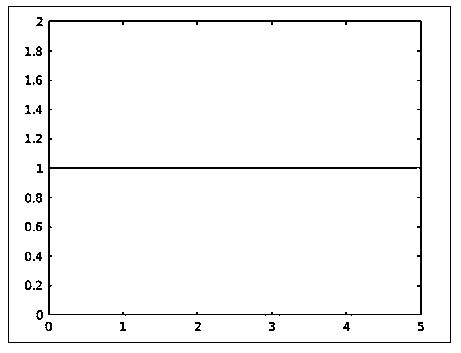
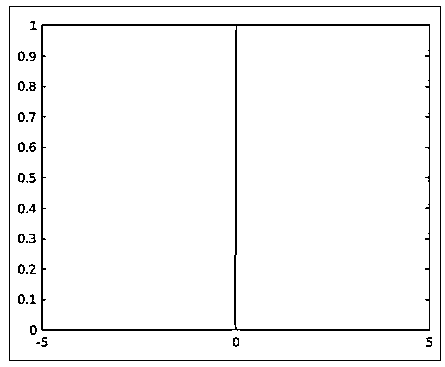

# 亥维赛 MATLAB

> 原文：<https://www.educba.com/heaviside-matlab/>

## 亥维赛 MATLAB 简介

以下文章提供了 Heaviside MATLAB 的概要。亥维赛函数在数学中用于涉及信号处理和控制理论的问题，以投射在特定时间打开并无限期保持打开的信号。表示为 H (x)的 Heaviside 函数是不连续函数，如果自变量为负，则其值为零，如果自变量为正，则其值为 1。该功能也称为单位阶跃功能。

**MATLAB 中 Heaviside 函数的语法:**

<small>Hadoop、数据科学、统计学&其他</small>

`Heaviside (x)`

Heaviside (x)将在参数值“x”处计算 Heaviside 步长。

### 亥维赛 MATLAB 示例

下面是提到的例子:

#### 示例#1

这里我们将使用 Heaviside (x)计算符号值的 Heaviside 函数。

让我们为第一个例子取一个负值；即-4。根据 Heaviside 函数的定义，对于负值，我们应该得到“0”作为输出。

**语法:**

`Hs = heaviside (sym (-4)) [passing the negative argument to the Heaviside function]`

**代码:**

`Hs = heaviside (sym (-4))`

**输出:**

正如我们所看到的，对于负输入，Heaviside 函数的输出为“0 ”,正如我们所预期的那样。

#### 实施例 2

这里有一个例子，我们用 Heaviside (x)计算一个正自变量的 Heaviside 函数。

让我们把“5”作为我们的输入参数。根据 Heaviside 函数的定义，我们应该得到 1 作为正参数的输出。

**语法:**

`Hs = heaviside (sym (5)) [passing the positive argument to the Heaviside function]`

**代码:**

`Hs = heaviside (sym (5))`

**输出:**

正如我们所看到的，对于正输入，Heaviside 函数的输出为“1 ”,正如我们所预期的那样。

#### 实施例 3

在这里，我们将使用 heaviside (x)计算一系列值的 Heaviside 函数，并将绘制它们以查看输出。

让我们取一个从 0 到 5 的数字范围作为我们的输入参数。根据 Heaviside 函数的定义，对于所有这些值，我们应该得到“1”作为输出。因此，从数学上讲，我们的输出将是一条平行于 x 轴的直线，y = 1。

**语法:**

`syms x [Initializing the variable] fplot (heaviside (x), [0, 5]) [passing the input range as argument and plotting the output]`

**代码:**

`syms x
fplot (heaviside (x), [0, 5])`

**输出:**

正如我们所看到的，对于正值范围，Heaviside 函数的输出为“1 ”,正如我们所预期的那样。

#### 实施例 4

在这里，我们将使用 heaviside (x)计算包含正值和负值的 Heaviside 函数，并将绘制它们以查看输出。

让我们取一个从-5 到 5 的数字范围作为我们的输入参数。根据 Heaviside 函数的定义，我们应该得到所有正值的输出为“1 ”,所有负值的输出为“0”。所以，数学上，我们的输出将是 2 条直线，一条在 y = 1 处平行于 x 轴，另一条沿着 x 轴；即在 y = 0 时。

**语法:**

`syms x [Initializing the variables] fplot (heaviside (x), [-5, 5]) [passing the input range as argument and plotting the output]`

**代码:**

`syms x
fplot (heaviside (x), [-5, 5])`

**输出:**

正如我们所看到的，Heaviside 函数的输出对于正范围的值是‘1 ’,对于负范围的值是‘0 ’,正如我们所预期的那样。

### 推荐文章

这是一个天堂 MATLAB 的指南。在这里，我们讨论了对 Heaviside MATLAB 的介绍，以及计算单位步长的例子。我们可以计算正负两个值的亥维赛函数。您也可以看看以下文章，了解更多信息–

1.  [MATLAB 中的 Break](https://www.educba.com/break-in-matlab/)
2.  [MATLAB 中的尺寸函数](https://www.educba.com/size-function-in-matlab/)
3.  [Matlab 中的 fmin search](https://www.educba.com/fminsearch-in-matlab/)
4.  [Matlab Errorbar](https://www.educba.com/matlab-errorbar/)

