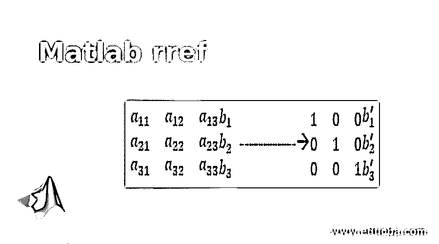
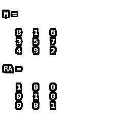
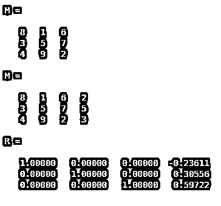
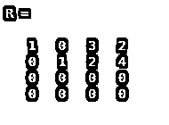
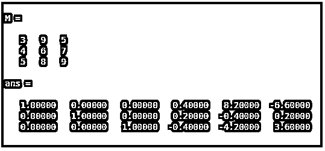
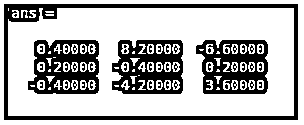

# Matlab rref

> 原文：<https://www.educba.com/matlab-rref/>

## Matlab rref 简介

MATLAB 内置方法 rref 设计为应用“高斯-乔丹消去法”和部分旋转形成减少的行梯队形式。这用于移除矩阵中连续行之间的相关性，对这些行执行一组操作。该功能有助于轻松求解系统线性方程。rref()函数的结果矩阵由非对角线位置的 0 组成，而对角线位置被 1 占据，如下所示:

<small>Hadoop、数据科学、统计学&其他</small>

**语法**:

MATLAB 中的 rref 函数可以通过处理不同的旋转参数来展示不同的行为，并且每个函数都遵循不同的语法，如下所述:

| **语法** | **描述** |
| `Rm = rref(M)` | 该语法可用于通过采用经由部分旋转的高斯-乔丹消去法来创建输入矩阵‘M’的缩减的行梯队形式。 |
| `Rm= rref(M,tol)` | 此语法可用于为输入矩阵“M”创建简化的行梯队形式，并指定透视容差，算法使用透视容差来确定可忽略的列。 |
| `[Rm,p] = rref(M)` | 该语法可用于为输入矩阵“M”创建简化的行梯队形式，并产生非零枢轴 p 作为返回值。 |

### Matlab rref 示例

以下是一些例子:

#### 示例#1

下面的例子是为一个 nXn 矩阵创建一个简化的行梯队形式。

`M = magic(3)
RA = rref(M)`

**输出**:

由于输入矩阵是满秩矩阵，rref 产生单位矩阵。

#### 实施例 2

开发下面的代码片段是为了找出 nXn 矩阵的减少的行梯队形式和非零透视列。

`M = magic(4)[RB,p] = rref(M)`

**输出**:

**T2】**

 **##### 属性

| **属性** | **描述** |
| 输入矩阵(M) | 

*   M represents the input matrix, and the desired row echelon form in the result is reduced.
*   Rrefin MATLAB supports two data types: single and double for inputting matrix values.
*   The rref () method supports complex numbers.

 |
| 枢轴公差(tol) | 

*   Pivot tolerance (tol) is a scalar input parameter of rref () method.
*   Perspective tolerance is used as a threshold. If the element with the largest absolute value in the perspective column is less than the tolerance value, the value of the corresponding column is empty.
*   This helps to prevent arithmetic operations, such as division and multiplication with non-zero pivot column elements that are less than the tolerance. The Rref in MATLAB supports two data types: single precision and double precision.
*   The default pivot tolerance value is determined by programming as follows:
*   max(size(A))* EPS * norm(A，inf)
*   The value of this parameter is scalar in nature.

 |
| M (R)的约化行梯队形式 | 

*   This parameter represents the result value of the rref () method, and is the reduced row echelon form of the input matrix M.
*   Generated in the form of an output matrix.

 |
| 非零透视列(p) | 

*   Non-zero perspective column m generated by column index of input matrix.
*   The value of this parameter produces a result in the form of a vector.
*   The main meta-column P can be used to find out several types of data, such as:
    *   Length(p) can be used to find the estimated value of the rank of the input matrix M.
    *   X(p) can be formed from the principal variables contained in the linear system, which can be expressed as: ax = b.
    *   The basis of the range of the input matrix m can be formed by m (:,p). You can use the symbol R(1:r, p) to create a identity matrix of size r times r, where r is just the length (p).

 |

#### 实施例 3

增广矩阵可以定义为线性方程组的等价表示。在导出的方程组中，当一个方程乘以一个常数并加到另一个方程上时，那么由一个新方程组组成的解与前一个相同。

**举例**:

下面的代码使用 rref()方法为增广矩阵 M(:，4)生成简化的行梯队形式。

`M = magic(3)M(:,4) = [2; 5; 3]R = rref(M)`

**输出**:

#### 实施例 4

**1。解系统方程:** Rref()对于解线性方程组很有用。

**举例:**

系统的输入矩阵 M 由变量的系数导出，如下所示:

`M = [2  2  10;
6  3  24;
2  4  14;
-3  3 -3];
b = [12 24 20 6]';
M = [M b];
R = rref(M)`

**输出**:

由此得出的等式是:

由于第三列没有枢纽元素，这表明该系统有多个解决方案。

**2。通过缩减一个增广矩阵求矩阵逆**

Rref()用于通过以下算法求矩阵的逆矩阵:

扩充矩阵 I: [A I]可以简化为

[I X];

那么 X =。

**举例**:

`M=[3 9 5;4 6 7;5 8 9]rref([M eye(size(M))])`

**输出:**

因此答案是:

可以通过比较 inv()方法的结果来验证输出:

**inv(M)**

### 限制

1.  在矩阵的秩和基向量的计算中，使用 orth、rank 和 null 比通过 rref 非零主元列进行计算相对更快和更准确。
2.  如果输入矩阵缩放不当或秩不足或接近奇异，建议使用 mldivide 函数。

**补充点:**

*   在 rref 方法的操作中执行的计算中，高斯消除中的部分旋转的应用减少了舍入误差，但是它没有完全消除。
*   当满足以下条件时，可以说矩阵 M 是行梯队形式:

当它满足每个前导系数为 1 的附加条件，并且在相应的列中必须只有非零值时，它就有资格成为简化的行梯队形式。

### 推荐文章

这是一个 Matlab rref 的指南。在这里，我们还讨论了 Matlab rref 的介绍和语法，以及不同的例子和它的代码实现。您也可以看看以下文章，了解更多信息–

1.  [颤 Matlab](https://www.educba.com/quiver-matlab/)
2.  [Matlab 绘图圆](https://www.educba.com/matlab-plot-circle/)
3.  [Matlab stem()](https://www.educba.com/matlab-stem/)
4.  [Matlab 线条样式](https://www.educba.com/matlab-line-style/)

**