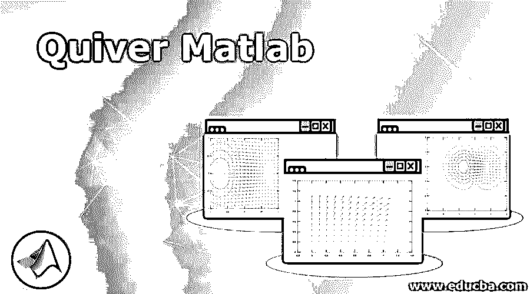
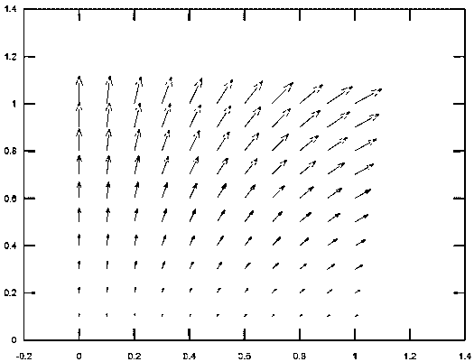
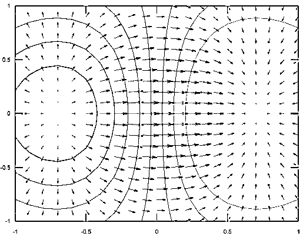
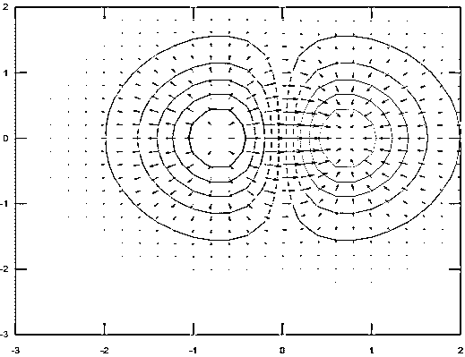

# 颤动 Matlab

> 原文：<https://www.educba.com/quiver-matlab/>

## 颤动 Matlab 简介

情节是向不知情的观众解释任何特定主题的见解的手段。Matlab 中有各种类型的图用于各种业务需求。箭图是以各种箭头的形式显示向量线的二维图。它们在电学和力学领域有助于显示电势和各种应力梯度。它们可以在一个箭头、两个箭头的帮助下，使用网格和渐变来绘制。

### Matlab 中箭图的功能

在 Matlab 中，我们可以借助函数箭图()绘制箭图或速度图。请查找 Matlab 中用于显示颤动或速度图的以下语法:

<small>Hadoop、数据科学、统计学&其他</small>

*   **Q =颤(x，y，a，b):** 该语法用于在表格 if 中提到的不同坐标中以箭头的形式绘制不同的向量。x，y，a 和 b 矩阵中的 pair 必须具有相同的大小，并且它们应该包含速度和位置分量。在结果图中，箭头总是指向顶部，但是它们可以根据需要缩放得更长或更短。
*   **Q =颤(a，b):** 这个语法将画出 a 和 b 中给定的向量，其中点在 x-y 平面上等距分布。
*   **Q =颤(……，scale):** 该语法用于缩放输出或结果图，这意味着它将缩放图中的箭头以适合各自的网格，如果需要，我们还可以通过一个称为“缩放”的因子来调整箭头。如果比例给定为 2，则箭头将是其原始长度的两倍，如果比例给定为 0.5，则箭头将是其原始长度的一半。如果我们不想缩放箭头，那么我们可以将 scale 设为 0。我们也可以借助长度滑块来调整箭头的长度。
*   Q =颤(…。行规范):该语法用于根据行规范改变行的属性，如线型、标记符号等。如果我们想改变标记的符号，那么就从向量的原点开始。
*   **Q =颤(……，属性的名称，属性的值……):** 如果我们想修改绘图的属性，我们可以使用这个语法。属性名可以用所需的值来表示。
*   **Q =箭筒(提到的斧头，。):**如果我们想在提到的坐标轴而不是当前坐标轴上显示图形，使用该语法。

### 箭图 Matlab 的特性

Matlab 中的箭图有各种属性，讨论如下:

*   箭头颜色可以通过“颜色”属性用相应的值来修改。这些值可以是十六进制颜色代码、RGB 三元组值或颜色名称的形式。RGB 三元组值是由三个元素组成的元素向量，它决定红色、绿色和蓝色的强度级别。可以有不同的颜色，如红色、绿色、蓝色、黄色、青色、品红色、黄色、白色和无。还有另一个与颜色相关的属性，即 ColorMode。它有自动和手动两个值。如果该值设置为自动，那么 Matlab 将控制颜色的属性，如果该值设置为手动，那么我们可以手动选择颜色。Auto 是 Colormode 属性的默认值。
*   LineStyle 是另一个属性，用于修改附在它上面的箭头的柄。可以有各种线条样式，如实线(默认)、虚线、虚线、点划线。LineStyleMode 是用于控制如何设置 LineStyle 的另一个属性。它有两个值，即自动和手动。如果值是 auto，那么 Matlab 将设置线条样式，如果是 manual，那么我们可以改变线条的样式。线宽是箭图的另一个属性，用来改变箭体的宽度。线宽值应为正值，0.5 是默认宽度。
*   箭头是箭图的属性之一，它给我们选择是否显示或隐藏箭头的优先权。它有两个值，开和关。如果该值设置为开(默认)，那么它将显示带箭头的矢量，如果设置为关，那么它将显示不带任何箭头的矢量。MaxHeadSize 决定附加到向量的箭头的最大尺寸。它被指定为标量值，默认值为 0.2。接受的数据类型有 single、double、uint8、int8、uint16、int16、uint32、int32、uint64、int64。

### 箭图 Matlab 示例

请查看以下示例，这些示例展示了如何在 Matlab 中使用箭图:

#### 示例#1

显示每个数据点的箭头。

**代码:**

`[x,y] = meshgrid(0:0.1:1,0:0.1:1);
a = sin(x).*y;
b = cos(x).*y;
figure
quiver(x,y,a,b)`

**输出:**

#### 实施例 2

用颤动图显示渐变。

**代码:**

`[A,B] = meshgrid(-1:.1:1);
Z = A.*exp(-A.^2 - B.^2);
[GA,GB] = gradient(Z,.1,.1);
figure
contour(A,B,Z)
hold on
quiver(A,B,GA,GB)
hold off`

**输出:**

#### 实施例 3

用颤动图显示渐变。

**代码:**

`[A,B] = meshgrid(-3:.2:2);
Z = A.*exp(-A.^2 - B.^2);
[GA,GB] = gradient(Z,.3,.3);
figure
contour(A,B,Z)
hold on
quiver(A,B,GA,GB)
hold off`

**输出:**

自动缩放是箭图的另一个属性，它可以自动缩放箭头的长度。它有两个值，开和关。如果该值为开，则它将自动缩放长度，使其保持在网格内，如果该值为关，则它不会缩放箭头的长度。

### 结论

Matlab 中还有各种与颤动或速度图相关的属性。应该理解所有的属性来定制颤动图的外观。它们大多用于物理和力学领域。

### 推荐文章

这是一个颤 Matlab 的指南。在这里，我们讨论的介绍，以颤 Matlab 和各种性质，随着工作和它的例子。您也可以浏览我们推荐的文章，了解更多信息——

1.  [Matlab 循环完整指南](https://www.educba.com/loops-in-matlab/)
2.  [Matlab pcolor() |示例|属性](https://www.educba.com/matlab-pcolor/)
3.  [Matlab 优化设置指南](https://www.educba.com/optimset-matlab/)
4.  [绘制矢量 Matlab 指南](https://www.educba.com/plot-vector-matlab/)

