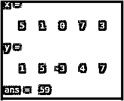
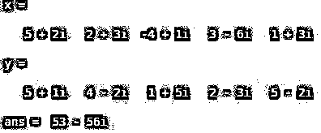
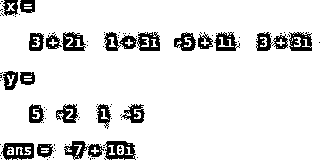

# 点积 MATLAB

> 原文：<https://www.educba.com/dot-product-matlab/>

## MATLAB 中点积介绍

两个向量的点积定义为一个向量在另一个向量方向上的投影。更简单地说，设 a 是矢量，x 是单位矢量，an⋅x 给出的点积由 a 在矢量 x 方向的投影定义。请记住，在矩阵的情况下，仅当第一个矩阵中的列数与第二个矩阵中的行数相等时，才定义点积。在 MATLAB 中，我们使用点函数来获得标量或向量的点积。

**语法**

<small>Hadoop、数据科学、统计学&其他</small>

`A = dot (x, y)`

运筹学

`A = dot (x, y, dim)`

**说明:**

A = dot (x，y)用于获得标量的点积，也称为标量点积

为了得到矢量“x”和“y”的点积，这两个矢量的长度必须相同

A = dot (x，y，dim)将沿着作为参数传递的维度计算点积

### MATLAB 中实现点积的实例

现在让我们用不同的例子来理解 MATLAB 中点函数的代码:

#### 示例#1

在本例中，我们将采用 2 个向量，并使用点函数计算它们的点积。对于我们的第一个示例，我们将输入以下值:

1.将第一个输入向量作为[5 1 0 7 3]传递

2.将第二个输入向量作为[1 5 -3 4 7]传递

**代码:**

`x = [5 1 0 7 3] y = [1 5 -3 4 7] dot(x, y)`

**输出:**

**说明:**首先声明第一个输入向量。声明第二个输入向量。将输入向量传递给点函数。*数学上，vector [5 1 0 7 3]和[1 5 -3 4 7]的点积是 59。正如我们在输出中看到的，我们已经获得了输入向量的点积 59，这与我们预期的一样。

#### 实施例 2

在本例中，我们将采用 2 个复数向量，并使用点函数计算它们的点积。对于本例，我们将输入以下值:

1.将第一个复数向量作为[5+2i 2+3i -4+i 3-6i 1+3i]传递

2.将第二个复数向量作为[5+i 4-2i 1+5i 2-3i 5-2i]传递

**代码:**

`x = [5+2i  2+3i  -4+i  3-6i  1+3i] y = [5+i  4-2i  1+5i  2-3i  5-2i] dot(x, y)`

**输出:**

**说明:**首先声明第一个复数向量。声明第二个复数向量。将输入向量传递给点函数。*数学上，复数向量[5+2i 2+3i -4+i 3-6i 1+3i]和[5+i 4-2i 1+5i 2-3i 5-2i]的点积为(53.0000 -56.0000i)。正如我们在输出中看到的，我们已经获得了我们的复数向量(53.0000 -56.0000i)的点积，这与我们预期的相同。

#### 实施例 3

在本例中，我们将采用 1 个复数向量，并使用点函数计算其与实数向量的点积。对于本例，我们将输入以下值:

1.将复数向量作为[3+2i 1+3i -5+i 3+3i ]传递

2.将实向量作为[5 -2 1 -5]传递

**代码:**

`x = [3+2i  1+3i  -5+i  3+3i ] y = [5  -2  1  -5] dot(x, y)`

**输出:**

**说明:**首先声明第一个输入为复数向量。将第二个输入声明为实向量。将输入向量传递给点函数。*数学上，[3+2i 1+3i -5+i 3+3i ]和[5 -2 1 -5]的点积是(-7.0000 +10.0000i)。正如我们在输出中看到的，我们已经获得了一个复向量与一个实向量作为复向量的点积。

#### 实施例 4

在本例中，我们将采用 2 个矩阵，并使用点函数计算它们的点积。对于本例，我们将使用 4×4 矩阵，如下所示:

1.将第一个矩阵作为[3 5 3 6；4 1 6 0;7 3 9 2];

2.将第二个矩阵作为[1 0 3 5；4 3 6 1;7 1 3 0];

**代码:**

`x = [3  5  3  6; 4  1  6  0; 7  3  9  2];
y = [1  0   3  5; 4  3  6  1; 7  1  3  0];
dot(x, y)`

**输出:**

**说明:**首先声明第一个输入矩阵。声明第二个输入矩阵。将输入矩阵传递给点函数。*数学上，矩阵的点积[3 5 3 6；4 1 6 0;7 3 9 2]和[1 0 3 5；4 3 6 1;7 1 3 0]是(68 6 72 30)，正如我们在输出中看到的，我们已经获得了我们的输入矩阵的点积为(68 6 72 30)，这与我们预期的相同。

### 结论

在 MATLAB 中使用点函数来寻找 MATLAB 中向量或标量的点积。为了求矩阵的点积，第一个矩阵的列数必须等于第二个矩阵的行数。

### 推荐文章

这是一个点积 MATLAB 的指南。在这里，我们讨论一个点积 MATLAB 的介绍，语法，例子与样本代码。您也可以浏览我们的其他相关文章，了解更多信息——

1.  [Matlab 叉积](https://www.educba.com/matlab-cross-product/)
2.  [Matlab 中的向量](https://www.educba.com/vectors-in-matlab/)
3.  [Matlab 命令](https://www.educba.com/matlab-commands/)
4.  [如何安装 MATLAB](https://www.educba.com/install-matlab/)

