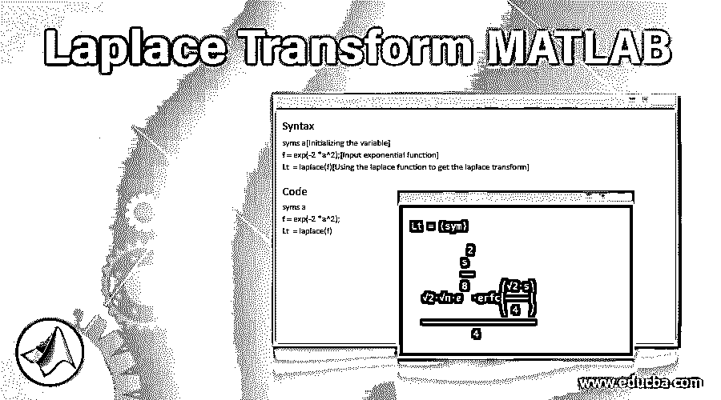
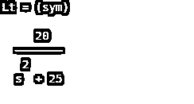
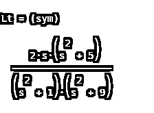
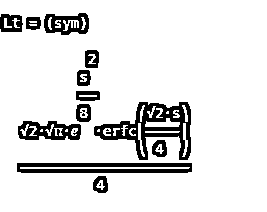
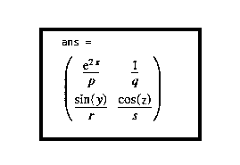

# 拉普拉斯变换 MATLAB

> 原文：<https://www.educba.com/laplace-transform-matlab/>

## 拉普拉斯变换 MATLAB 简介

MATLAB 是一个交互式的编程环境，用于科学计算。它广泛应用于许多需要解决问题、数据分析、算法开发和实验的技术领域。特定学科的软件广泛使用 MATLAB 编写。

在本文中，我们将研究 MATLAB 函数用于计算拉普拉斯变换。在我们进入拉普拉斯函数在 MATLAB 中如何工作的细节之前，让我们刷新一下对拉普拉斯变换的理解。

<small>Hadoop、数据科学、统计学&其他</small>

拉普拉斯变换用于求解微分方程。在拉普拉斯变换中，首先将时域中的微分方程转换或变换成频域中的代数方程。接下来，求解该代数方程，并将结果转换到时域。这将是我们对微分方程的解。简单来说，拉普拉斯变换是一种快速求解微分方程的方法。

**语法**

让我们了解一下 MATLAB 中拉普拉斯函数的语法

`Laplace (f)`

拉普拉斯函数在 MATLAB 中的描述:

*   拉普拉斯(f)返回输入‘f’的拉普拉斯变换。

### 拉普拉斯变换 MATLAB 实现实例

现在让我们借助几个例子来理解拉普拉斯函数

#### 示例#1

在第一个示例中，我们将使用拉普拉斯(f)来计算正弦函数的拉普拉斯变换:让我们将正弦信号定义为:

*   4 * sin (5 * t)

数学上，使用拉普拉斯变换的该信号的输出将是:

*   20/ (s^2 + 25)，考虑到变换是以‘s’为变换变量，以‘t’为自变量。

**语法**

`syms t[Initializing the variable] f = 4*sin(5*t);[Input sine function] Lt = laplace(f)[Using the laplace function to get the laplace transform]`

**代码:**

`syms t
f = 4*sin (5*t);
Lt = laplace (f)`

**输出:**

正如我们所看到的，转换是根据变量' s '进行的，输出是我们所期望的。

#### 实施例 2

下面是一个例子，我们使用拉普拉斯(f)计算余弦信号的拉普拉斯变换:

让我们把余弦信号定义为:

*   cos(t)+cos(3 * t)；

从数学上讲，我们的输出应该是:

*   南^ 2+1+南^ 2 + 9

**语法**

`syms t[Initializing the variable] f = cos (t) + cos (3 *t) ;[Input cos function] Lt = laplace(f)[Using the laplace function to get the laplace transform]`

**代码:**

`syms t
f = cos (t) + cos (3 * t) ;
Lt = laplace (f)`

**输出:**

正如我们所看到的，拉普拉斯变换是根据 r . t . s .计算的，输出与我们预期的一样。

#### 实施例 3

在下一个示例中，我们将使用拉普拉斯(f)计算指数函数的拉普拉斯变换:

让我们将指数函数定义为:

*   exp(-2*a^2)；

从数学上讲，我们的输出应该是:

*   (2^(1/2)*pi^(1/2)* exp(s^2/8)* erfc((2^(1/2)* s)/4))/4

**语法**

`syms a[Initializing the variable] f = exp (-2 *a^2) ;[Input exponential function] Lt  = laplace(f)[Using the laplace function to get the laplace transform]`

**代码:**

`syms a
f = exp (-2 *a^2);
Lt  = laplace (f)`

**输出:**

正如我们所看到的，拉普拉斯变换是根据 r . t . s .计算的，输出与我们预期的一样。

#### 实施例 4

接下来，我们将学习计算矩阵的拉普拉斯变换。在矩阵的情况下，该函数将计算矩阵的单个元素的拉普拉斯变换。

下面是我们使用拉普拉斯(f)计算 2×2 矩阵的拉普拉斯变换的例子:让我们将我们的矩阵定义为:

*   z =[exp(2x)1；sin(y)cos(z)]；

现在，对于矩阵中的每个元素，我们需要传递变换&独立变量。

*   让我们把我们的自变量定义为:变量=[w a；b c]；
*   并将变量转换为:trans from _ Variables =[p q；r s]；

从数学上讲，我们的输出应该是:

*   [ exp (2x) /p，1/q] [ sin (y) /r，cos (z) /s]

**语法**

`syms a b c w p q r s[Initializing the variables] Z = [exp (2x)     1;   sin (y)    cos (z)];[Input matrix with different signals] Variables = [w a; b c];[Independent variables] Transfrom_Variables = [p q; r s];[Transformation variables] laplace(Z,Variables,Transfrom_Variables)`

**代码:**

`syms a b c d w x y z
Z = [exp (2*x) 1; sin (y) cos (z)];
Variables = [w a; b c];
Transfrom_Variables = [p q; r s];
laplace (Z, Variables, Transfrom_Variables)`

**输出:**

正如我们所看到的，我们已经得到了矩阵 z 中每个元素的拉普拉斯变换。

### 结论

拉普拉斯函数在 MATLAB 中用于计算函数的拉普拉斯变换。我们可以计算默认变换变量或我们定义为变换变量的变量的拉普拉斯变换。

### 推荐文章

这是一个拉普拉斯变换的 MATLAB 指南。这里我们讨论一个介绍拉普拉斯变换的 MATLAB，语法，例子，以便更好地理解。您也可以浏览我们的其他相关文章，了解更多信息——

1.  [MATLAB 中的贝塞尔函数](https://www.educba.com/bessel-functions-in-matlab/?source=leftnav)
2.  [Matlab 中的均值函数](https://www.educba.com/mean-function-in-matlab/?source=leftnav)
3.  [Matlab 中的滤波函数](https://www.educba.com/filter-function-in-matlab/?source=leftnav)
4.  [Matlab 中的分段函数](https://www.educba.com/piecewise-function-in-matlab/?source=leftnav)

