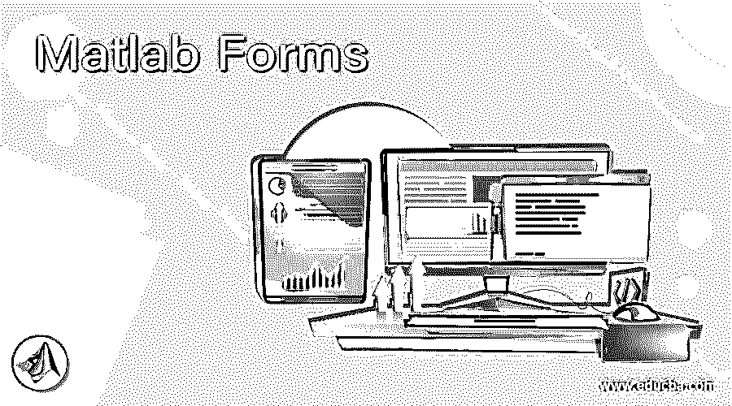
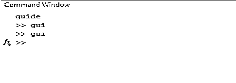
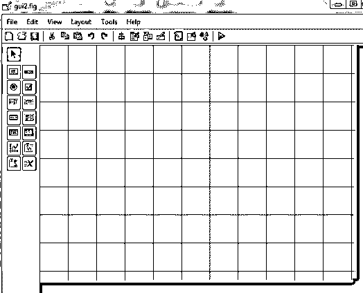
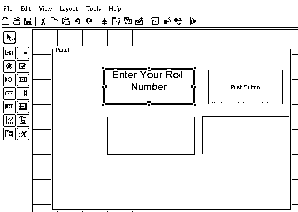
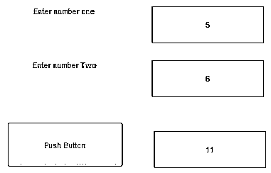

# Matlab 表单

> 原文：<https://www.educba.com/matlab-forms/>

## Matlab 窗体介绍

Matlab 表单用于执行一些操作，并在数据库中存储一些信息。基本上，它用于 Matlab 中的 GUI(图形用户界面)以有效地可视化实现。“向导”命令用于切换或打开 GUI 面板。它有各种块，如按钮、编辑文本、轴、切换按钮、按钮菜单等等。这些块用于各种操作。

**语法:**

<small>Hadoop、数据科学、统计学&其他</small>

*   **向导**

用于打开 GUI 面板的第一个语法是“guide”。这个命令我们需要在命令窗口中编译。

*   **Get()和 Set ( )**

Get 和 set 函数用于获取用户的输入，并在 GUI 上显示结果。

### 如何在 Matlab 中创建表单？

在 Matlab 中创建表单有不同的步骤。让我们考虑一个简单的表单示例，在这个表单中，我们需要关于用户人数的信息。这里我们只接受一个数字形式的输入，我们将在结果端显示这个特定的块。

**步骤 1:** 第一步是使用‘guide’命令，并在命令窗口中编译它。编译完这个命令后，我们需要将文件保存在适当的文件夹中，然后我们将得到一个 GUI 窗口。

第二步: GUI 窗口有各种功能块，如按钮、编辑文本、轴、切换、单选按钮、控件等等。

**步骤 3:** 根据示例要求，我们需要一个文本框来显示输入您的卷号，一个编辑文本框来接受用户的输入。然后有一个按钮，用于获得“按钮”结果的操作，因此我们将在面板上拖动一个按钮。最后需要的块是一个文本框来显示我们的结果。

### 如何在 Matlab 中添加验证？

每个基于 GUI 的应用程序都有一个按钮。该按钮给出 Matlab 编辑器中的操作代码或程序。Matlab 编辑器中有各种内置的函数代码。要访问代码，我们需要右键单击按钮，然后我们会得到像创建功能，删除功能，按键功能，回叫等选项。在得到这些功能后，点击回叫，然后我们将得到一个按钮的代码。

在代码中，我们将使用两个函数获取广告集。这里 get 函数用于接收来自 used 的输入，set 函数用于设置从 blocks 接收的结果。在本例中，get 函数将从卷号中获取一个数值，但是在面板中，我们插入了一个文本框，因此，我们需要将文本转换为数值。然后，设置功能将按原样显示卷数。为了将文本转换成数值，使用一种语法，即“str 2 num”。

### 例子

让我们假设一个两个数相加的简单例子。在本例中，需要两个输入，因此对于两个输入，需要两个编辑文本块，为了更好地可视化和理解，我们将显示输入两个数字的消息，即输入数字 1 和输入数字 2。要把这两个数字相加，我们需要一个按钮。这里按钮用来做额外的操作，最后显示结果，我们需要一个文本块。当我们设置所有的文本块时，标记选项是非常重要的，因为这个标记是在操作中使用的。默认情况下，标签是编辑 1，如果我们使用多个标签，那么它将是编辑 1，编辑 2，等等。

在 Matlab 代码中，我们使用了三个变量 a、b 和 c，a 和 b 是两个输入变量。当我们输入数字 1 时，a 将获取该数字的值，用于该变量的标签是 edit 1。当我们输入数字 2 时，b 将获取该数字的值，用于该变量的标签是 edit 3。变量 c 用于 a 和 b 的相加，因此 set 函数用于得到结果。标签用于变量 c 是编辑 3。Str2num 函数用于将字符串数据转换为数字数据或数值。如果我们只在操作中使用字符串数据，那么就没有必要使用这个函数。

**Matlab 代码:**

`function pushbutton1_Callback(hObject, eventdata, handles)
% hObject handle to pushbutton1 (see GCBO)
a=str2num(get(handles.edit1,'string'));
b=str2num(get(handles.edit2,'string'));
c = a + b ;
set(handles.edit3,'string',c);`

**输出:**

### 结论

在本文中，我们看到了如何在 Matlab 中创建表单。Matlab 表单是图形用户界面的一个例子。通过使用这种方法，我们可以在 Matlab 中创建各种类型的表单。这些表单包括各种功能，如拖放、设置、输入值或文本、从给定的数据库中选择选项、项目符号按钮等。

### 推荐文章

这是一个 Matlab 窗体的指南。在这里，我们讨论了介绍，语法，如何在 Matlab 中创建和添加表格，并分别举例说明。您也可以看看以下文章，了解更多信息–

1.  [Matlab 绘图标题](https://www.educba.com/matlab-plot-title/)
2.  [Matlab 堆积条形图](https://www.educba.com/matlab-stacked-bar/)
3.  [Matlab 符号](https://www.educba.com/matlab-syms/)
4.  [Matlab 编写](https://www.educba.com/matlab-fwrite/)

