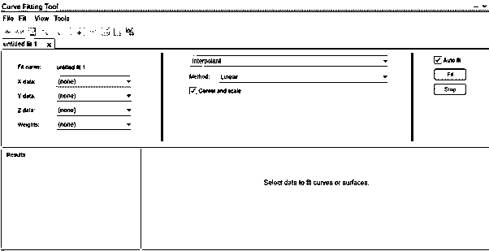
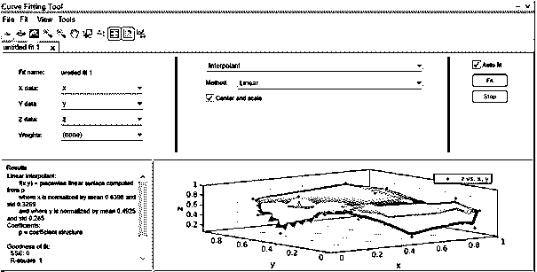
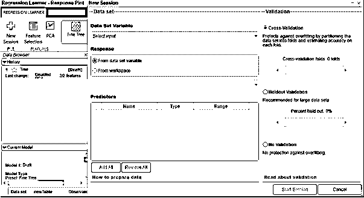
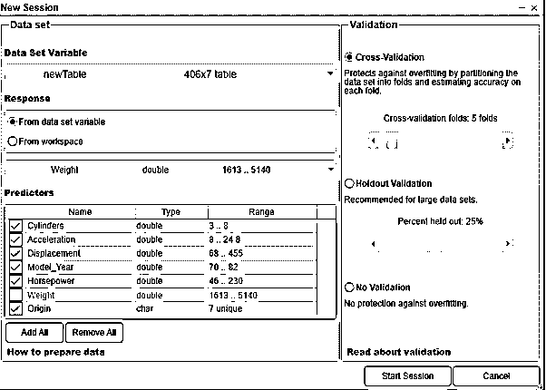
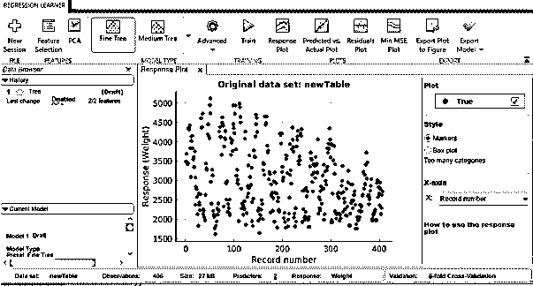
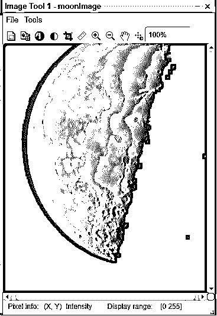

# MATLAB 工具箱

> 原文：<https://www.educba.com/matlab-toolbox/>

## MATLAB 工具箱介绍

在本文中，我们将研究 MATLAB 中的工具箱。MTALB 中的工具箱是建立在 MATLAB 计算环境上的众多函数的集合。

以下是 MATLAB 中的几个工具箱:

<small>Hadoop、数据科学、统计学&其他</small>

1.  '曲线拟合'
2.  回归学习者
3.  '图像处理'

可以使用 MATLAB 功能区中的“应用程序”图标来访问这些工具箱。现在让我们了解一下 MATLAB 中几个工具箱的用法:

### 曲线拟合工具箱

*   曲线拟合工具箱用于在使用插值、回归和平滑时将曲面和曲线拟合到输入数据。
*   这个工具箱为我们提供了函数和一个应用程序来拟合我们的数据曲线。
*   这个工具箱在数据分析方面非常有用，因为它有助于执行 EDA(探索性数据分析)、数据处理和删除异常值

现在让我们通过一个例子来理解曲线拟合工具箱的用法。

#### 例子

在本例中，我们将使用 3 个度量“x”、“y”、“z”，并使用曲线拟合工具箱在其中拟合一条曲线。我们将遵循以下步骤:

1.  使用 rand 函数创建 3 个矩阵
2.  将曲线拟合工具中的“X 数据”、“Y 数据”、“Z 数据”分别设置为我们的输入，“X”、“Y”、“Z”

**代码:**(在命令窗口中执行)

`x = rand (5)
y = rand (5)
z = rand (5)`

[Creating the 3 input matrices]

一旦我们在“命令窗口”中执行上述代码，我们将在“工作区”中创建 3 个变量。

#### 使用曲线拟合工具箱的步骤

**第一步:**点击应用图标

**第二步:**选择“曲线拟合工具”

**第三步:**弹出如下窗口:

**步骤 4:** 现在将弹出窗口中的‘X 数据’、‘Y 数据’、‘Z 数据’分别设置为我们的输入，‘X’、‘Y’、‘Z’。我们可以立即看到，曲线拟合工具箱将创建一条曲线。这条曲线的方程式可以在结果部分看到。我们可以使用曲线顶部的下拉菜单来定制方程。

**输出:**

正如我们在输出中看到的，我们获得了一条曲线，拟合了输入变量‘x’、‘y’和‘z’，这与我们预期的一样。

接下来，让我们学习回归学习工具箱在 MATLAB 中是如何工作的

### 回归学习工具箱

*   回归学习工具箱用于执行回归
*   它用于自动训练模型
*   它还可以用来比较线性回归、支持向量机、回归树之间的不同选项，并将结果可视化

现在让我们通过一个例子来理解回归学习工具箱的用法。

#### 例子

在本例中，我们将使用 MATLAB 提供的内置数据集“carbig”。我们将把这个数据集上传到“回归学习者工具箱”,并探索可能的选项。我们将遵循以下步骤:

*   加载内置数据集“carbig”
*   使用此数据集创建一个表，将其加载到“回归学习者工具箱”中

**代码:**(在命令窗口中执行)

`load carbig`

[Loading the ‘carbig’ dataset into the Workspace]

`newTable = table (Cylinders, Acceleration, Displacement,...
Model_Year, Horsepower, Weight, Origin);`

[Creating the table using the dataset to make it compatible with Regression Learner Toolbox]

一旦我们在“命令窗口”中执行上述代码，我们将在“工作区”中创建“新表”。

#### 使用回归学习工具箱的步骤

**第一步:**点击应用图标

**步骤 2:** 选择“回归学习工具箱”

**第三步:**弹出如下窗口:

**步骤 4:** 点击左侧的新会话，将打开一个新的窗口提示

**步骤 5:** 从“数据集变量”下拉菜单中，选择我们创建的“新表”表

**步骤 6:** 这将加载“预测值”部分下的所有预测值变量

**步骤 7:** 现在我们可以根据我们的要求选择预测变量

**步骤 8:** 点击“开始会话”，开始分析数据

我们可以立即看到回归学习工具箱创建的响应图。现在，根据我们的要求，我们可以训练这些数据，并使用可用的选项获得响应图、残差图、最小均方误差图。

**输出:**

现在让我们通过一个例子来理解图像处理工具箱的使用。

### 图像处理工具箱

下面我们将了解图像处理工具箱:

#### 例子

在本例中，我们将使用 MATLAB 提供的内置图像之一“moon.tiff”。我们将把该数据集上传到“图像处理工具箱”,并探索可能的选项。

**代码:**(在命令窗口中执行)

`moonImage = imread ('moon.tif')`

[Loading the ‘moon.tif’ image into the Workspace]

`imtool (moonImage)`

[Using ‘imtool’ function to start the Image processing toolbox. Alternatively, we can also select it from the APP section]

一旦我们在“命令窗口”中执行上述代码，我们将在“工作区”中获得“月亮图像”。

#### 图像处理工具箱提供的选项

*   像素信息
*   两个像素之间的距离
*   关于图像的详细信息
*   调整对比度
*   作物图像
*   缩放工具
*   滚动条

我们可以使用图像处理工具箱中的上述选项来获取我们的图像的详细信息或进行预处理。也可以使用上述选项进行基本编辑。

**输出:**

正如我们在输出中看到的，我们已经获得了一个月球的图像，可以使用功能区中的图标对其进行处理。

### 结论–MATLAB 工具箱

MATLAB 中的工具箱是众多函数的集合。MATLAB 提供了各种工具箱来执行数据分析、图像处理、曲线拟合等功能。

### 推荐文章

这是一个 MATLAB 工具箱的指南。这里我们讨论 MatLab 中的三个不同的工具箱，并给出例子和输出。您也可以浏览我们的其他相关文章，了解更多信息——

1.  [Matlab 和运算符](https://www.educba.com/matlab-and-operator/)
2.  [Matlab 中的向量](https://www.educba.com/vectors-in-matlab/)
3.  [Matlab 中的 Simulink 是什么？](https://www.educba.com/what-is-simulink-in-matlab/)
4.  [MATLAB 插值](https://www.educba.com/matlab-interpolation/)

