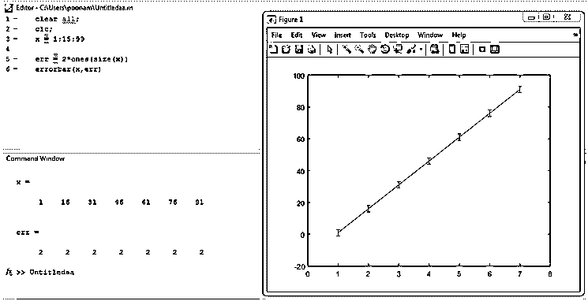
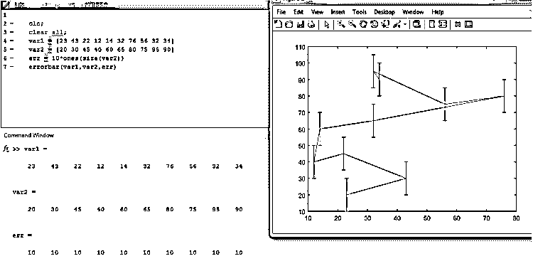
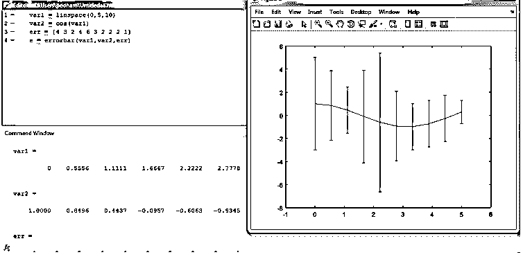
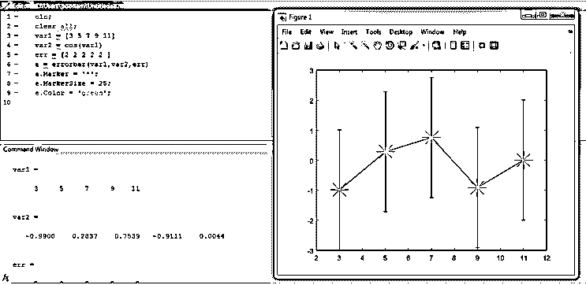

# Matlab Errorbar

> 原文：<https://www.educba.com/matlab-errorbar/>

## Matlab 误差线介绍

误差线是任何图形或曲线图上与误差有关的垂直线或水平线。用多个变量表示误差线有多种方法。误差线有一些属性，如线宽、线宽、颜色、标记和数据。线宽表示误差线的宽度。线的大小决定了误差线的大小。通过使用颜色选项，我们可以将误差线的颜色更改为红色、蓝色、绿色等。标记用于表示绘图和坐标上的标记或点。我们可以根据需要水平或垂直调整误差棒的位置。在这个主题中，我们将学习 Matlab 误差栏。

**语法—**

<small>Hadoop、数据科学、统计学&其他</small>

`errorbar (x ,err)
errorbar (variable, error name)`

`errorbar (var1 ,var2 ,err)
errorbar (variable name 1, variable name2, error name)`

`e = errorbar (var1 ,var2 ,err)
error = errorbar (parameters, error name)`

`Marker = '*'
error name.marker = ‘mark symbol’`

`Marker Size = 25;
error name. Marker size =size`

`Color = 'green';
error name.color = color name`

### 我们为什么使用 Matlab 误差线？

在 Matlab 中，误差线用于在任何图上画垂直线或水平线。用误差线来表示误差。其中我们可以使用各种属性来显示误差图或误差图。我们可以通过多个符号改变标记点，也可以改变标记的大小。示例四中给出了标记符号和尺寸的图示。默认情况下，错误的颜色为蓝色，标记为“*”。

### Matlab 误差线示例

以下是 Matlab 误差栏的例子

#### 示例#1

让我们考虑一个只有一个变量“x”的例子。“x”的值从 1 到 99 不等，统一距离为 15。并且将误差作为 2 的倍数应用于变量 x。

**代码:**

`clear all;
clc ;
x = 1 : 15 : 99
err = 2 * ones(size(x))
errorbar ( x ,err)`

**输出:**

#### 实施例 2

让我们考虑随机值从 10 到 100 变化的两变量 var 1 和 var 2。并且一个误差被应用于关于 8 的倍数中的变量 2 的曲线上。

**代码:**

`Clc ;
clear all;
var1 = [ 23 43 22 12 14 32 76 56 32 34 ] var2 = [ 21 32 45 42 63 65 88 77 94 99 ] err = 8 * ones(size ( var2))
errorbar ( var1,var2,err)`

**输出**:

#### 实施例 3

在这个例子中，我们假设两个不同的连续函数而不是变量。一个函数是存储在 var 1 中的行空间，第二个函数是存储在 var 2 中的三角余弦函数。

**代码:**

`var1 = line space (0, 5, 10)
var2 = cos (var1)
err = [4 3 2 4 6 3 2 2 2 1] e = errorbar (var1, var2, err)`

**输出:**

#### 实施例 4

在本例中，我们使用了误差线的属性。对于标记，我们指定了符号' * '。标记大小为 25，分配给误差线的颜色为绿色。

**代码:**

`Clc ;
clear all ;
var1 = [3 5 7 9 11] var2 = cos (var1)
err = [2 2 2 2 2 ] e = errorbar (var1, var2, err)
e .Marker = ' * ';
e .Marker Size = 25;
e .Color = ' green ';`

**输出:**

### 结论

在本文中，我们已经看到，表示误差图使图形或绘图非常有效。通过使用误差棒，我们可以正确地显示图形的每个坐标上的误差。误差线可以用误差线、误差线或误差图来表示。

### 推荐文章

这是一个 Matlab 误差栏指南。在这里，我们讨论了 Matlab 误差栏的基本概念、例子和输出，以及我们为什么使用它。您也可以看看以下文章，了解更多信息–

1.  [Matlab 彗星()](https://www.educba.com/matlab-comet/)
2.  [Matlab 中的循环](https://www.educba.com/loops-in-matlab/)
3.  [Matlab 中的 3D 绘图](https://www.educba.com/3d-plots-in-matlab/)
4.  [Matlab 计数|如何工作？](https://www.educba.com/matlab-count/)
5.  [Matlab 中的 fmin search |工作和示例](https://www.educba.com/fminsearch-in-matlab/)

