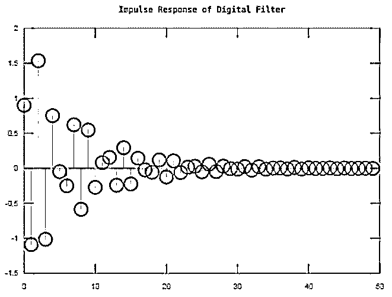
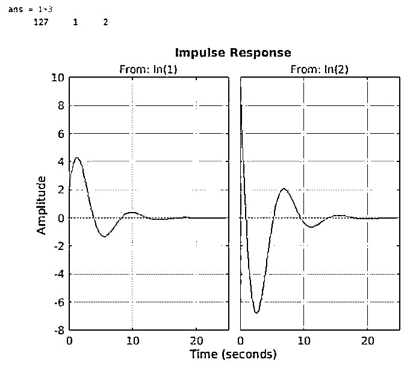

# 脉冲响应 Matlab

> 原文：<https://www.educba.com/impulse-response-matlab/>

## 脉冲响应 Matlab 简介

以下文章概述了脉冲响应 Matlab。系统的脉冲响应δ(t)定义为对系统施加脉冲时产生的输出信号。数字滤波器的脉冲响应是单位脉冲序列的输出。了解系统的脉冲响应和频率响应是非常重要的。脉冲响应δ(t)计算动态系统模型的单位脉冲响应。对于状态空间模型，脉冲响应假设初始状态值为零。脉冲响应用“impulse(sys)”来描绘动态系统。对于数字滤波器的脉冲响应，使用“impz”语句。

### 句法

脉冲响应(动态系统)Matlab 的语法如下所示:

<small>Hadoop、数据科学、统计学&其他</small>

`impulse(sys)`

`impulse(sys,t1)`

`impulse(sys1,sys2,...,sysN,t)`

`[y1,t1] = impulse(sys)`

`Y1 = impulse(sys,t1)`

`[y1,t1,x1,ysd] = impulse(sys)`

脉冲响应(数字滤波器)Matlab 的语法如下所示:

`[h1,t1] = impz(b1,a1)`

`[h1,t1] = impz(sos)`

`[h1,t1] = impz(d)`

`[h1,t1] = impz(**___**,n1,fs1)`

### 脉冲响应 Matlab 怎么做？

在 matlab 中，动态系统的脉冲响应使用“impulse (sys)”语句，数字滤波器使用“impz”。

动态系统脉冲响应的步骤:

*   **步骤 1:** 第一个输入参数是在变量中取的。
*   **第二步:**然后我们用“ss”语句。
*   **第三步:**然后我们用“impulse (sys)”来绘制脉冲响应。

数字滤波系统脉冲响应的步骤:

*   **步骤 1:** 第一个输入参数是在变量中取的。
*   **第二步:**然后我们为过滤器定义一个样本范围。
*   **步骤 3:** 然后我们用“impz”来计算数字滤波器的脉冲响应。
*   **步骤 4:** 使用 stem 绘制脉冲响应。

### 脉冲响应 Matlab 示例

下面是一些例子:

#### 示例#1

让我们看一个例子，在这个例子中，我们首先取一个系统的分子和分母，分子用 num1 表示，分母用 den1 表示。在 num1 中，我们取系数为 0.9 -0.45 0.35 0.02，在 den1 中，我们取系数为 1.0 0.71 -0.46 -0.62。我们还将样本范围定义为 N1 变量，因此 N1 等于 50，这是我们需要的 50 个样本。现在计算脉冲响应，Matlab 上有内置函数 impz，impz 用于计算数字滤波器的脉冲响应。所以现在我们取 impz (num1，den1，n1)，响应存储在 y1 变量中。现在我们用 stem 函数来绘制图形，stem 用于绘制离散时间信号。我们用一个 n2 变量来表示 x 轴的样本范围，取范围从 0 到 50，差值为 1。现在我们取 stem (n2，y1)，其中 n2 是样本数，y1 存储脉冲响应。现在我们得到一个脉冲响应图。

**代码:**

`clc;
clear all;
close all;
N1 = 50;
num1 = [0.9 -0.45 0.35 0.02];
den1 = [1.0 0.71 -0.46 -0.62];
y1 = impz (num1, den1, N1);
n2 = 0 : N1-1;
stem(n2, y1);
title ('Impulse Response of Digital Filter');`

**输出:**

**

** 

#### 实施例 2

让我们看一个例子，在这个例子中我们绘制了一个 2 和阶状态空间模型。我们取 4 个变量 a1、b1、c1 和 d1，这是 Nx 乘 Nx 的实值或复值矩阵。在我们的例子中，a1 是[-0.55，-0.78；0.78，0]，b1 是一个[1，-2；0，2]，c1 是 a [1.96，6.44]，d1 的值为零。而这 4 个变量都是从 ss 函数传过来的，ss 是一个状态空间模型。sys2 = ss (a1，b1，c1，d1)创建以下形式的离散时间状态空间模型对象:x[n+1]=a1x[n]+b1u[n]和 y[n]=c1x[n]+d1u[n]。并将此分配给 sys2。然后我们用一个脉冲函数来绘制响应，脉冲用来绘制动态系统的响应。我们将脉冲响应结果存储到 y1 和 t1 变量中，为此我们将命令设为[y1，t1] = impulse (sys2)，脉冲返回 y1 变量中的输出响应和 t1 变量中的时间向量。这两个变量用于仿真。并且使用大小函数 size (y1)在命令窗口上显示 y1 的大小。并且由于脉冲函数，响应被显示。

**代码:**

`clc;
close all;
clear all;
a1 = [-0.55, -0.78; 0.78,0];b1 = [1,-2;0,2];c1 = [1.96, 6.44];d1 = 0;sys2 = ss(a1, b1, c1, d1);impulse (sys2)[y1, t1] = impulse (sys2);size (y1)grid on`

**输出:**

**

** 

第一个输入通道的脉冲响应如左图所示，第二个输入通道的脉冲响应如右图所示。

### 结论

在本文中我们看到了与脉冲响应 matlab 相关的概念。脉冲响应基本上是用来描绘动态系统的。然后看到了与冲激响应相关的 matlab 语句的语法以及它是如何在 matlab 代码中使用的。我们还看到了一些与脉冲响应 Matlab 语句相关的例子。

### 推荐文章

这是一个脉冲响应 Matlab 指南。这里我们讨论一下入门，如何做脉冲响应的 matlab？和示例。您也可以看看以下文章，了解更多信息–

1.  [震级 Matlab](https://www.educba.com/magnitude-matlab/)
2.  [单元格到字符串 MATLAB](https://www.educba.com/cell-to-string-matlab/)
3.  [Matlab 对象](https://www.educba.com/matlab-object/)
4.  [Matlab 标志](https://www.educba.com/matlab-flag/)

