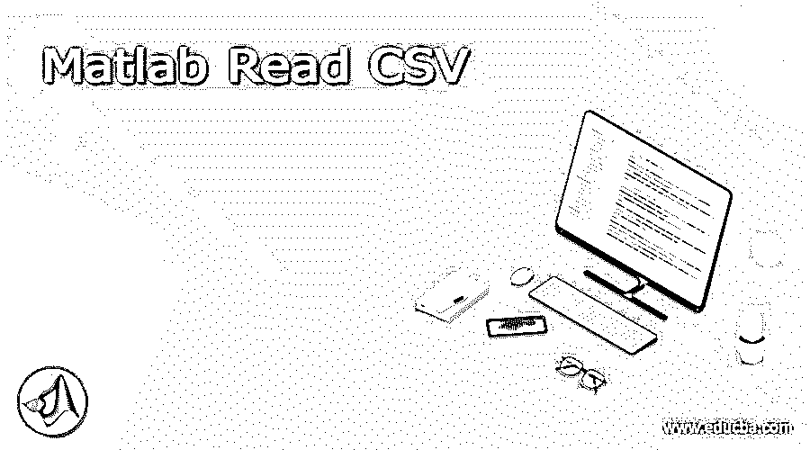
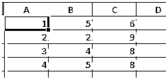
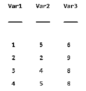
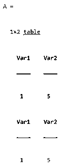
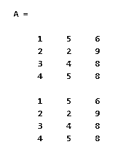
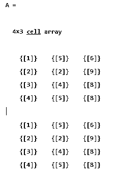

# Matlab 读取 CSV

> 原文：<https://www.educba.com/matlab-read-csv/>

## Matlab 读取 CSV 的定义

Matlab 为用户提供了不同的选项；读取 CSV 是 Matlab 中的选项之一。假设我们需要存储纯文本，并且您熟悉逗号分隔的格式。这时候我们可以使用 CSV 文件格式。基本上，CSV 文件格式是人类可读的，因为它与不同类型的软件应用程序(如 Matlab)兼容。由于这个原因，CSV 文件格式被广泛使用，Matlab 提供了不同类型的预定义函数来读取 CSV 文件中的记录。Matlab 中有几个选项可以用来读取 CSV 文件，根据我们的要求，我们可以使用各自的选项。

**语法:**

<small>Hadoop、数据科学、统计学&其他</small>

M = csvread(指定 csv 文件名)
M = csvread(指定 csv 文件名，行偏移量 1，列偏移量 1)
M = csvread(指定 csv 文件名，行偏移量 1，列偏移量 1，[行偏移量 1 列偏移量 1 行偏移量 2 列偏移量 2])

**解释**

基本上，在 Matlab 中有多种语法来读取 CSV 文件，如图所示。在第一种语法中，我们使用一种简单的语法来读取 CSV 文件，这里 M 用于表示必须包含整数值的数组，指定的 CSV 文件名表示我们需要在 Matlab 中读取的实际文件名。

在第二种语法中，还向数组提供了偏移值。这意味着首行偏移和首列偏移，例如，我们可以在文件中指定起始值 0，0。

在第三种语法中，我们提供了偏移值的范围，这意味着有界值，这意味着行偏移 1 和行偏移 2，我们还提供了列偏移 1 和列偏移 2。例如，我们可以指定范围而不是行值。

### 如何在 Matlab 中读取 CSV？

现在让我们看看如何在 Matlab 中读取 CSV 文件，如下所示。基本上，我们可以使用三种不同的函数来读取 Matlab 中的 CSV 文件，如下所示。

1.使用 readtable()函数读取 CSV 文件:

这是在 Matlab 中读取 CSV 文件的第一种方法。其中 readtable()函数从文件中读取所有记录并将它们保存到表中，该表有一个列名。如果 CSV 文件此时没有任何列标题，readtable()函数将由列的默认变量名指定，并从 var1 开始。
例如:info = readtable(带扩展名的指定 CSV 文件名)

**说明:**

在上面的例子中，我们使用数组名作为信息，然后使用 readtable()函数和指定的 CSV 文件名，如上面的例子所示。

**2。使用 readmatrix()函数读取 CSV 文件:**

这是在 Matlab 中读取 CSV 文件的另一种方式，我们可以将 CSV 文件中的记录读取为矩阵形式。
例如:info = readmatrix(带扩展名的指定 CSV 文件名)

**3。使用 readcell()函数读取 CSV 文件:**

通过使用这个函数，我们将记录从 CSV 文件读入单元格格式。

例如:info = readcell(带扩展名的指定 CSV 文件名)

### 例子

现在让我们看看在 Matlab 中读取 CSV 文件的不同示例，如下所示。首先，我们需要创建一个新的 CSV 文件，这里我们创建了一个 program2.csv 文件，并添加了一些值，如下图所示。

现在创建一个新的脚本，如下所示。

`A = readtable('program2.csv')
disp(A)`

**解释**

在上面的示例中，我们使用 readtable()函数从 program2.csv 文件中读取记录，然后，我们使用 disp()函数显示该数组，如上例所示。这个程序的最终输出用下面的截图来说明。

请参见上面的屏幕截图，它默认采用列名 var1、var2 和 var3。如果我们需要打印特定的范围，那么我们可以使用如下代码。

`A = readtable('program2.csv','range','A1:B1')
disp(A)`

**解释**

在上面的程序中，我们使用了 readtable()函数和一个特定的范围选项，如下所示。在本例中，我们提供了 A1:B1 的指定范围。这个程序的最终输出用下面的截图来说明。

有时我们需要打印记录的指定部分，这时我们可以使用带有不同选项的 readtable()函数。Matlab 提供了 ReadVariableNames()，通过使用这个选项我们可以从 csv 文件中指定第一行。当我们使用这个选项时，我们可以很容易地确定哪个变量被导入或不被导入。现在让我们看看 readmatrix()函数的另一个例子，如下所示。

这里我们使用一个已经创建的 CSV 文件，我们在上面的例子中使用。

`A = readmatrix('program2.csv')
disp(A)`

**解释**

在上面的例子中，我们使用 readmatrix()函数，这里我们传递一个 CSV 文件，即 program2.csv 文件。这里我们也可以使用 detectImportOptions()函数，它用于检测和导入我们需要的指定选项。通过此功能，我们还可以根据需要使用范围选项。这个程序的最终输出用下面的截图来说明。

现在我们来看第三个选项，在 Matlab 中读取 CSV 文件如下。

Matlab 提供了读取 CSV 文件的第三个函数，即 readcell()函数。通过使用该功能，我们可以从 CSV 文件中读取记录并保存为单元格格式。下面我们来看一个例子。

`A = readcell('program2.csv')
disp(A)`

**解释**

在上面的例子中，我们使用 readcell()函数，通过使用这个函数我们可以从 CSV 文件中读取记录并将它们存储到单元格中。这个程序的最终输出用下面的截图来说明。

根据我们的要求，我们可以在函数中提供范围来获取指定的记录。

### 结论

我们希望从这篇文章中你学会 Matlab 阅读 CSV。从上面的文章中，我们已经了解了 read CSV 的基本语法，我们还看到了 read CSV 的不同示例。从这篇文章中，我们了解了如何以及何时使用 Matlab 读取 CSV。

### 推荐文章

这是一个 Matlab 读取 CSV 的指南。这里我们讨论一下定义，语法，如何在 Matlab 中读取 CSV？代码实现示例。您也可以看看以下文章，了解更多信息–

1.  [Matlab 对](https://www.educba.com/matlab-mod/)的影响
2.  [Matlab 布尔型](https://www.educba.com/matlab-boolean/)
3.  [Matlab 块注释](https://www.educba.com/matlab-block-comment/)
4.  [Matlab 单位阶跃函数](https://www.educba.com/matlab-unit-step-function/)

