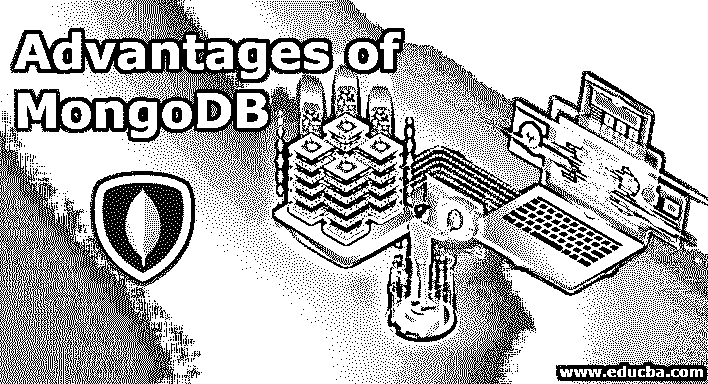

# MongoDB 的优势

> 原文：<https://www.educba.com/advantages-of-mongodb/>

## MongoDB 优势介绍

下面这篇文章 MongoDB 的优点提供了关于 MongoDB 的使用和优点的完整指南。MongoDB 是非关系数据库，易于扩展。它是一个用 C++编写的开源数据库。它支持即席查询处理。它目前被用作脸书、IBM 等组织的后端数据库。它以集合格式存储数据。内容管理、分析、移动应用系统使用 MongoDB。MongoDB 允许您在运行写查询之前读取写操作的结果。它服务于来自索引的所有查询。它最有用的原因是因为它不需要关系和结构化数据概念。这是一个 [NoSQL 数据库](https://www.educba.com/what-is-nosql-database/)。一个单一对象的结构对用户来说是清楚的。

在本主题中，我们将了解 MongoDB 的优势。

<small>Hadoop、数据科学、统计学&其他</small>

### MongoDB 的优势

以下是 MongoDB 的优点

1.  它易于安装，使用和无模式数据库。
2.  由于它是无模式数据库的能力，我们创建的代码定义了模式。
3.  数据以[二进制 JSON 格式](https://www.educba.com/what-is-json/)存储，这是一个键值对，不需要复杂的连接。
4.  它使用 RAM 存储数据；这使得对数据的访问更快。
5.  它可以用于负载平衡。
6.  它支持数据库事务的 ACID(原子性、一致性、隔离性和持久性)属性。
7.  它支持复制；如果主服务器在事务过程中停机，那么辅助服务器将在没有人工干预的情况下处理事务。
8.  它经济高效，因为它降低了硬件和存储成本。
9.  它可以保存大量数据，这将有助于更快的查询处理。
10.  数据跨集群节点存储，因此数据库服务器中不会出现单点故障。
11.  由于动态模式，您可以用较低的成本尝试新事物。你不需要担心在实验之前准备数据。

### 我们为什么使用 MongoDB？

1.  MongoDB 是一个 NoSQL 数据库；它可以以文档格式存储数据。在处理大量数据时，可以灵活使用该数据库，因为它提供了高性能的数据存储解决方案。
2.  它以文档格式存储数据，以更改任意数量的记录，添加或删除表中的现有字段。它可以方便地存储复杂的结构，更准确地获取数据。
3.  建立索引是为了提高数据库中查询或搜索的性能。
4.  它可以存储任何类型、任何大小的数据。
5.  使用了一种动态数据库方案，称为 BSON。
6.  它支持主从工作的复制。主机读取和写入，从机从主机复制数据，并且仅用于读取目的。
7.  自动分片是存在的，如果我们有大量的数据分布在几个服务器上，并且服务器不能处理数据，就会使用自动分片。这不会导致失败。
8.  它支持水平扩展，这将导致大数据分布到几台机器上。

### 我们在哪里使用 MongoDB？

*   如果你要做一个低预算的数据库项目，MongoDB 是最好的 NoSQL 数据库来建立，管理和工作。
*   MongoDB 具有强大的查询处理能力，因此它将有助于找出数据来自何处，并从特定位置提取数据。
*   如果您有一个云托管服务，那么您应该使用安全指南来设置 MongoDB，因为云托管服务是可通过互联网访问的服务器。
*   我们可以使用 MongoDB，而不用担心像强制完整性这样的小细节，并且希望创建一个包含许多文档的数据库。
*   纽约时报在表单构建应用程序中使用 MongoDB。例如照片提交。
*   它用于后端存储。例如，sourceforge.net 站点使用它。
*   Shutterfly 使用 MongoDB 各种持久数据存储需求。
*   它被用于脸书和 Instagram 等社交网站，因为它每分钟产生 1tb 的数据。
*   它用于像 Quora 这样的问答论坛。

### 结论

MongoDB 是设计可伸缩 web 应用程序时推荐的可靠数据库，需要大型数据库来存储大量非结构化数据。如果用户寻求最佳的可用性、更快的处理速度、良好的备份、零信息丢失，那么 MongoDB 是最好的解决方案。最重要的是，它可以免费使用。

### 推荐文章

这是一个关于 MongoDB 优点的指南。在这里，我们将详细讨论 MongoDB 的基本概念、使用它的原因和场合，以及它的优点。你也可以看看下面这篇文章。

1.  [MongoDB 工具](https://www.educba.com/mongodb-tools/)
2.  [MongoDB 命令](https://www.educba.com/mongodb-commands/)
3.  [是 MongoDB NoSQL](https://www.educba.com/mongodb-nosql/)
4.  [如何安装 MongoDB](https://www.educba.com/install-mongodb/)
5.  [MongoDB Limit() |如何工作？](https://www.educba.com/mongodb-limit/)

