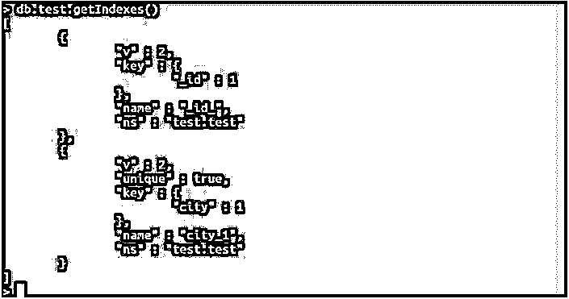

# MongoDB 特性

> 原文：<https://www.educba.com/mongodb-features/>

## MongoDB 特性介绍

MongoDB 是使用最广泛的 NoSQL 数据库之一，它提供了广泛的特性和功能。这些特性是 MongoDB 易于使用并被各大公司改编的原因。我们将学习这些特性，适当的解释和语法，以及任何需要的示例查询。MongoDB 是一个基于文档的跨平台数据库程序。它实现了类似 JSON 的文档。最新的稳定版本是 4.2.5，于 2020 年 3 月 26 日日发布。

下面是一个简单的查询，返回数据库中的收藏列表。

<small>Hadoop、数据科学、统计学&其他</small>

**代码:**

`show dbs`

show DBS 将列出数据库中存在的每个集合或表。

数据以 JSON 文档的形式存储在 MongoDB 的集合中。每个集合都有文档，每个文档都有多个键值对。关键字“_id”是不自觉设置的默认主键，最初被编入索引。

### MongoDB 特性

现在让我们来定义和理解每个特性:

#### 1.特殊查询支持

基本上，当我们处于数据库设计阶段时，我们不知道会执行什么样的查询。因此，当我们说 MongoDB 支持特定查询时，这意味着 MongoDB 支持在建立数据库结构时未知的查询。这是一个让 MongoDB 脱颖而出的惊人特性。即席查询在某种程度上可以提高性能，并且是实时的。

#### 2.索引

数据库最重要的特性之一是索引，它会带来改进。我们可以索引 MongoDB 中的任何字段。创建索引有助于更快地获得搜索结果。可以对文档中的任何字段或关键字进行索引。

**代码:**

`db.test.getIndexes()`

上面的查询将返回为“test”集合创建的每个索引。参考下面附上的截图。

**输出:**

在上面的示例中，我们看到了两个索引。第一个是在默认的自动创建的“_id”上创建的。同时，第二把是带着“城市”钥匙的。

#### 3.复制

简单地说，复制是将数据分布在多个服务器上并保持一切同步的过程。这里介绍主节点和次节点。

工作:每当包含数据的主节点停机或遇到故障时，辅助节点将作为工作的主节点，使数据可用。

该功能对于数据存储和备份非常重要，因为它允许我们在硬件或服务出现故障时进行恢复和还原。由于这种复制，这些数据在不同的位置有多个拷贝。节省了时间，并且由于这一惊人的特性，没有操作停止。

#### 4.无模式数据库

MongoDB 最主要的讨论特性之一是，它是无模式的。这意味着在一个集合中可以有多个文档，具有不同的键，而这些键可能在其他文档中找不到。这是 MongoDB 的数据灵活性背后的主要原因。

我们可以在同一个集合中拥有多个文档或记录，但是具有不同的键值对。查看下面附上的截图，以供参考。

**代码:**

`db.test.find().pretty()`

**输出:**

在上面的例子中，你可以看到我们有两个文档。这两个文档的键略有不同。在第二个记录中，我们没有城市钥匙，但这并不影响。这是通过无模式特性实现的。

#### 5.面向文档

面向文档是帮助 MongoDB 脱颖而出的一个很好的特性。我们有 SQL 的表和行和列结构，我们有键值对的字段，使用 MongoDB。

**代码:**

`db.educba.find().pretty().limit(1)`

**输出:**

在上面的文档中，我们有四个键值，其中 _id 是默认的，并且是自动设置的——这是基于文档的数据库的基本结构。

#### 6.聚合管道

聚合框架是 MongoDB 提供的最有效的特性之一。简单地说，这是一个创建多个操作的管道并获得最终结果的过程。

**代码:**

`db.fun.aggregate([{$match: {"City":"Pune"}},{$sort: {_id:-1}}])`

上述查询将返回城市为 Pune 的文档，并打印排序结果。参考下面附上的截图。

**输出:**

可以根据需要创建聚合管道。在构建管道时，必须仔细考虑最终结果。

#### 7.GridFS

当一个文件超过 BSON 文档限制 16 MB 时，它会被分成多个小块，分别存储在不同的文档中。这些块的大小为 255KB，不包括最后一块。GridFS 代表网格文件系统，它使用两个独立的集合。一个集合用于存储较大文件的块，而第二个集合用于存储元数据。当我们对这个文件执行查询时，GridFS 将收集并一起返回所有的块。GridFS 还实现了索引，这使得查询执行更容易返回文件。

#### 8.分片

当我们遇到大型数据集时，我们可以实现数据分片。也就是说，大型数据集被分割并在多台机器上共享。海量数据可能会导致意想不到的问题，但是分片的实现可能是有用的。分片是数据库分区和跨多台机器分布的过程，而复制是制作数据库的多个副本的过程。数据分布在多个集合中，这些集合被称为“碎片”。

#### 9.高性能

MongoDB 是开源的，是性能最高的数据库之一。随着复制和索引的实现，查询执行和数据提取变得更快。在开发多个应用程序时，检查性能的需求是强制性的。数据库概要分析，它收集针对 MongoDB 实例执行的每个操作的完整数据。DB Profiler 提供的输出可以帮助我们理解低效的查询和操作。

### 结论

面向文档和无模式的结构使得 MongoDB 成为首选。许多其他功能，如聚合管道、分片、复制等。以更好的性能帮助数据库更快地查询结果。利用这些特性实现负载平衡可以提高性能。所有这些特性使得 MongoDB 成为大数据应用程序和实时应用程序的最佳选择之一。

### 推荐文章

这是 MongoDB 特性的指南。在这里，我们讨论 MongoDB 特性的介绍，十大特性以及详细的解释。您也可以浏览我们的其他相关文章，了解更多信息——

1.  [MongoDB 的优势](https://www.educba.com/advantages-of-mongodb/)
2.  [MongoDB GUI 工具](https://www.educba.com/mongodb-gui-tools/)
3.  [MongoDB 工具](https://www.educba.com/mongodb-tools/)
4.  [MongoDB 替代品](https://www.educba.com/mongodb-alternatives/)

