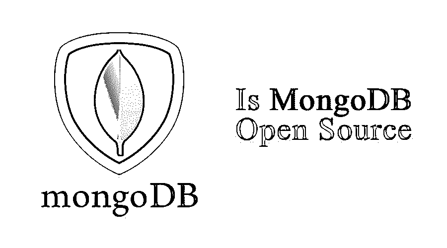

# MongoDB 是开源的吗

> 原文：<https://www.educba.com/mongodb-open-source/>

## MongoDB 是开源的吗？

是的，MongoDB 是开源的。您可以下载 MongoDB 的社区版本，并且不需要支付许可费。我们来详细了解一下 MongoDB 和开源。

### 什么是开源？

开源软件是一个[软件开发社区](https://www.educba.com/what-is-software-development/)，它接受来自开发者的修改、增强或错误修复代码。开源软件或项目的源代码是公开的。任何开发者都可以修改和分享它的设计。您不必为个人或专业使用任何开源软件支付许可费。开源社区庆祝并拥护开放交换原则、软件的快速开发、开发人员的协作参与、精英管理、透明度以及不同项目和产品的面向社区的开发。开源社区的动机和愿景是让程序员和非程序员都受益。开源项目的成功取决于:

<small>Hadoop、数据科学、统计学&其他</small>

1.  提高项目的认知度和采用度。
2.  让您的论坛充满信息、问题和挑战
3.  为分布式社区组织真实活动
4.  扩展对开源软件和开发模型的理解和价值，所有这些都是为了一个共同的目标。

### 什么是 MongoDB？

MongoDB 是一个开源的面向文档的数据库。MongoDB 是一个 NoSQL 数据库。MongoDB 是用 C++写的。MongoDB 是一个免费的跨平台数据库。MongoDB 的不同特性包括:

1.  MongoDB 是一个分布式数据库。
2.  MongoDB 是一个高可用性 NoSQL 数据库。
3.  MongoDB 支持水平缩放。
4.  地理分布是 MongoDB 内置的，易于使用。

MongoDB 以类似 JSON 的灵活格式文档存储数据。这意味着不同文档的字段可能不同，并且数据结构可能会随着时间而改变。MongoDB 架构由集合和文档组成，而不是像关系数据库那样使用表和行。每个数据库包含集合，集合又包含文档。每个文档可以不同于不同数量的字段。每个文档的大小和内容可以互不相同。MongoDB 是一个高度可伸缩和面向性能的数据库。

#### 收藏品

它在 MongoDB 中被称为文档组，类似于关系数据库管理系统表。该集合不强制任何模式，并且存在于单个数据库中。集合中的文档可以是不同的类型。

#### 文档

文档在模式中有 dynamin，它被定义为键值对。MongoDB 中的动态模式意味着同一个集合中的文档不需要有相同的字段集或结构以及集合文档中的公共字段，它可以保存不同类型的数据。

### 开源许可证–MongoDB

并非所有开源产品都共享相同的许可证。不同的软件有不同的许可和协议。MongoDB 创建并拥有其代码的版权。它们是 MongoDB 的两个版本。

#### 企业版

您需要支付商业使用许可证的费用。源代码的版权归公司所有。MongoDB 是典型的后关系现代数据库。他们通过 Ops Manager 增加了安全功能、内存存储引擎、管理、身份验证功能和监控功能。

#### 社区版本

可以免费下载，可以自由工作。你不必为许可证付费。您不能对源代码进行任何更改。

### MongoDB 受益于开源

MongoDB 是 NoSQL 领先的数据库。不同的社区广泛接受 MongoDB 开源。企业版和速成版中的开源产品越来越普遍。由于脸书、谷歌、雅虎的兴趣，易贝公开称赞采用开源产品作为更大规模的优势。除了免费向客户提供支持之外，公司的发展也面临着挑战。MongoDB 开源软件正面迎接这一挑战，他们推出了一个新的咨询部门。他们在方法上做了一些不同的事情，希望能使他们的业务长期盈利和可持续发展。MongoDB 开源围绕其开源核心产品拥有专有的差异化产品。当他们销售订阅时，买方不仅购买支持，还购买这些专有工具的访问权限。这些专有工具使得 MongoDB 更加简单和安全。这就是他们开源带来更多收入的方式。

### 为什么是 MongoDB？

#### 负载平衡

MongoDB 使用分片的概念，通过在多个 MongoDB 实例之间分割数据来进行水平扩展。当数据表的不同部分分布在多个服务器上时，就会发生分片。MongoDB 可以在多个服务器上运行，平衡负载和/或复制数据，以在硬件故障的情况下保持系统正常运行。基于哈希的分片在所有可用的服务器上随机分发新条目。

#### 面向文档

MongoDB 是一种面向 NoSQL 文档的数据库类型。它将数据存储在文档中。这使得 MongoDB 非常灵活，能够适应真实的业务环境和需求。

#### 即席查询

MongoDB 支持按字段搜索、范围查询和正则表达式搜索。可以进行查询以返回文档中的特定字段。

#### 索引

索引支持在 MongoDB 中高效执行查询。可以创建索引来提高 MongoDB 中的搜索性能。MongoDB 可以使用索引来限制它必须检查的文档数量。索引是[特殊的数据结构](https://www.educba.com/what-is-data-structure/)，它存储了集合数据集的一小部分，很容易遍历表单。

#### 复制

MongoDB 中的副本集是一组维护相同数据集的 MongoDB 进程。MongoDB 可以通过副本集为所有生产部署的基础提供高可用性。复制提供了冗余并提高了数据可用性。

### 结论

MongoDB 是一个开源的 NoSQL 数据库。MongoDB 有两个版本。一个是 MongoDB 开源，这个版本作为开源社区的一部分是免费的，但是有一段时间其他版本，你需要付费购买许可。与免费版相比，这个版本有一些先进的功能。MongoDB 开源是领先的 NoSQL 数据库之一，被许多专业人士广泛接受。理想情况下，我可以说开发人员更喜欢 MongoDB 开源。

### 推荐文章

这是 MongoDB 开源的指南。在这里，我们讨论了 MongoDB 的基本概念以及它们从开源中获得的好处。你也可以看看下面的文章:

1.  卡桑德拉是 NoSQL 吗？
2.  [SQL 是微软吗？](https://www.educba.com/is-sql-microsoft/)
3.  [大数据是数据库吗？](https://www.educba.com/is-big-data-a-database/)
4.  [Mongo 数据库面试问题](https://www.educba.com/mongo-database-interview-questions/)

