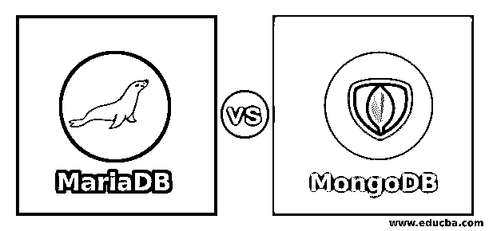

# MariaDB vs MongoDB

> 原文：<https://www.educba.com/mariadb-vs-mongodb/>

## MariaDB 与 MongoDB 的区别

下面的文章提供了 MariaDB vs MongoDB 的概要。为提供 SQL 特性以访问和提供数据而开发的开源软件叫做 MariaDB。它是一个关系数据库，用 C、C++、Perl 和 bash 语言编写。它可以在 Linux，Windows 和 MacOS 中工作。MariaDB 具有 NoSQL 的特性，为关系数据库增加了价值。MongoDB 基于文档，用 C++、Go、JavaScript、Python 编写。这也是一个 NoSQL 数据库，是开源的。文档作为集合存储在数据库中。MongoDB 是流行的数据库之一。云服务在两个数据库中都可用。

### MariaDB 与 MongoDB 的面对面比较(信息图表)

以下是 MariaDB 和 MongoDB 的 8 大区别:

<small>Hadoop、数据科学、统计学&其他</small>

### MariaDB 与 MongoDB 的主要区别

让我们讨论一下 MariaDB 和 MongoDB 之间的一些主要区别:

*   虽然 MongoDB 比 MariaDB 更受欢迎，但 MariaDB 具有可用性、性能和安全性，并且可以在其他数据库中工作。另外，MariaDB 是基于列数据库的。MongoDB 作为云服务执行，并且具有适当的基础设施。这使得 MongoDB 在任何资源较少的应用程序中都能很好地工作。此外，它在商店中仅具有文档的服务中可用。
*   MariaDB 与 Azure 一起工作，具有高可用性，并且云存储适合用户。安全性是作为 Azure 用户提供的，在系统中很容易使用。此外，MariaDB 拥有自己的云服务，便于其开发人员使用。MongoDB 用于 AWS、Azure 和 GCP 云中，因为它可以轻松地与任何云服务集成。它在系统中很容易获得，但它没有像 MariaDB 那样拥有自己的云服务。
*   MariaDB 基本上是一个关系数据库模型，而 MongoDB 基本上是一个文档存储。MongoDB 还作为可用文档的搜索引擎，并作为普通的关系数据库工作。与其他数据库相比，MongoDB 是最好的文档存储。MariaDB 的二级存储是文档存储和图形 DBMS。存储引擎用于图形，它们可以存储在数据库中。
*   MariaDB 中提供了 XML 支持，可以用 XML 格式存储、访问和检索。MongoDB 不允许这个特性，只能访问文档。
*   MariaDB 中使用了 SQL 查询，这些查询使数据库能够轻松地使用 SQL 命令。SQL 查询也在 MongoDB 中使用，但是用户不能使用这些查询。它们作为只读查询提供，并通过 MongoDB 连接器用于商业智能。这些命令有助于构建数据库，以便与其他数据库集成并共享数据。
*   MariaDB 中使用了不同的 API 来保证数据的正常工作和可用性。这些 API 是用于安全系统工作的 ADO.NET、JDBC、ODBC 和本地 API。这些 API 帮助数据库管理数据，并使它们在用户需要时可用。MongoDB 没有 API，只使用 JSON 格式的协议。MongoDB 没有 MariaDB 复杂，这个协议有助于正确管理数据。
*   这两个数据库都支持大多数编程语言。虽然 MariaDB 不支持 Matlab 和 shell 语言。MongoDB 拥有支持系统中所有语言的庞大基础。

### MariaDB 与 MongoDB 对比表

我们来讨论一下 MariaDB 与 MongoDB 的顶级对比:

| **马里亚布** | **MongoDB** |
| 脚本在整个系统中是一致的，当查询失败时，它提供了即时的一致性。 | 脚本在系统中提供了与可用脚本的即时和最终一致性，使它们能够轻松工作。 |
| 数据库中有许多可用的分区方法，如水平分区和分片。分片是通过集群或存储引擎完成的。这有助于避免数据库中不需要的数据，并与必要的数据相关。 | 分区方法使得文档总是工作的，并且知道数据库中需要的文档。分片是这里使用的方法。使用这种方法可以很好地整理文档。 |
| 可用的复制方法有主对主和主对从复制。任何复制成员都可以编辑数据，并且数据库在该系统中运行良好。 | 唯一可用的主到从复制方法是，除了组中的服务器之外，任何人都不能更新数据。 |
| 在系统中管理缓存，并且在系统中检查负载，并且只有当缓存不可用时，才从服务器加载数据。这使得数据库的工作变得容易。 | 不会从缓存中加载数据，因为它不会从系统中管理缓存。 |
| 数据处理需要时间，并且不具备地图简化功能。 | 数据处理很容易，因为 map reduce 有助于一次性轻松处理大量数据。在 map reduce 的帮助下提供了正确的结果。 |
| 系统中使用外键，以便将数据从一个表链接到另一个表。这有助于从任何表中获取数据。 | 数据库中不使用外键，因此不容易链接表。通过直接从表中调用数据，可以从其他表中获取数据。 |
| 原子性、一致性、隔离性和持久性是数据库中使用的事务级别，这个概念称为 ACID。 | 在数据库中使用了 ACID 概念和快照隔离，以便在系统中提供数据完整性一致的数据视图。 |
| 使用 SQL base 的用户会发现 MariaDB 很容易使用，因为它有许多相似的查询，工作方式也与 SQL 相似。使用 SQL 标准向用户提供权限。 | 它的工作方式与 SQL 不同，但它根据用户的系统角色为用户提供访问权限。 |

### 结论

许多人都熟悉 SQL 概念。这些数据库使系统变得更容易，并且可用于处理商店中的大量数据。管理数据不需要编程语言，因为 MariaDB 和 MongoDB 使用户很容易工作。可用性和一致性是这些数据库与众不同的特征。此外，使用这些数据库也很容易。

### 推荐文章

这是 MariaDB vs MongoDB 的指南。这里我们讨论信息图和比较表的主要区别。您也可以看看以下文章，了解更多信息–

1.  [MongoDB vs SQL server](https://www.educba.com/mongodb-vs-sql-server/)
2.  [MongoDB vs SQL](https://www.educba.com/mongodb-vs-sql/)
3.  [MongoDB vs 甲骨文](https://www.educba.com/mongodb-vs-oracle/)
4.  [MongoDB vs Cassandra](https://www.educba.com/mongodb-vs-cassandra/)

